# llama-cli 推論パイプライン技術解説 — ユーザー入力からテキスト出力までの全工程

- **実施日時**: 2026年2月7日 22:00
- **対象ブランチ**: `feature/rdma-backend`
- **対象コミット**: `76bf9b9ae`

| 項目 | 値 |
|------|-----|
| 対象ファイル数 | 10 |
| Mermaid図 | 18枚 |
| 対象アーキテクチャ | Llama系 (Transformer Decoder) |

---

## 目次

1. [背景と目的](#1-背景と目的)
2. [全体アーキテクチャ概要](#2-全体アーキテクチャ概要)
3. [llama-cli エントリポイントと起動シーケンス](#3-llama-cli-エントリポイントと起動シーケンス)
4. [モデルロード](#4-モデルロード)
5. [コンテキスト作成とバックエンドスケジューラ](#5-コンテキスト作成とバックエンドスケジューラ)
6. [対話ループとバッチ処理](#6-対話ループとバッチ処理)
7. [llama_decode: 推論の心臓部](#7-llama_decode-推論の心臓部)
8. [計算グラフの構築](#8-計算グラフの構築)
9. [バックエンドスケジューリングとグラフ分割](#9-バックエンドスケジューリングとグラフ分割)
10. [KVキャッシュ](#10-kvキャッシュ)
11. [サンプリング](#11-サンプリング)
12. [推論の全体フロー (まとめ)](#12-推論の全体フローまとめ)

---

## 1. 背景と目的

### llama.cpp の概要

llama.cpp は C/C++ で実装された軽量な LLM 推論エンジンである。ggml テンソルライブラリをベースに、CPU・CUDA・Metal・Vulkan など多様なバックエンドで効率的な推論を実現する。量子化 (Q4_K_M, IQ2_M 等) により、コンシューマ GPU でも数十億パラメータ規模のモデルを実行できる。

### llama-cli の位置付け

`llama-cli` は llama.cpp が提供する対話型 CLI ツールである。内部的には HTTP サーバー (`server_context`) と同じ推論エンジンを使用しており、以下の特徴を持つ:

- チャットテンプレートによる対話フォーマット
- ストリーミングトークン出力
- マルチモーダル入力 (画像・音声)
- 思考 (reasoning) トークンの表示
- スペキュレーティブデコーディング対応

### 本ドキュメントの目的

本ドキュメントは、`llama-cli` がユーザー入力を受け取ってからテキスト出力を生成するまでの推論パイプラインを、ソースコードレベルで詳細に解説する。対象読者は llama.cpp の内部構造を理解したい開発者である。

### 主要ソースファイル一覧

| ファイル | 役割 |
|---------|------|
| `tools/cli/cli.cpp` | llama-cli エントリポイント |
| `tools/server/server-context.cpp` | サーバーコンテキスト (推論ループ) |
| `common/common.cpp` | 共通ユーティリティ (モデルロード等) |
| `src/llama-context.cpp` | llama_context, decode, process_ubatch |
| `src/llama-model.cpp` | モデルロード, グラフ構築, レイヤー割当 |
| `src/llama-sampling.cpp` | サンプリングパイプライン |
| `src/llama-kv-cache.cpp` / `src/llama-kv-cache.h` | KVキャッシュ管理 |
| `src/llama-batch.cpp` | バッチ管理・分割 |
| `ggml/src/ggml-backend.cpp` | バックエンドスケジューラ |
| `include/llama.h` | 公開API定義 |

---

## 2. 全体アーキテクチャ概要

### レイヤー構造

llama-cli の推論パイプラインは、5つの主要レイヤーで構成される:

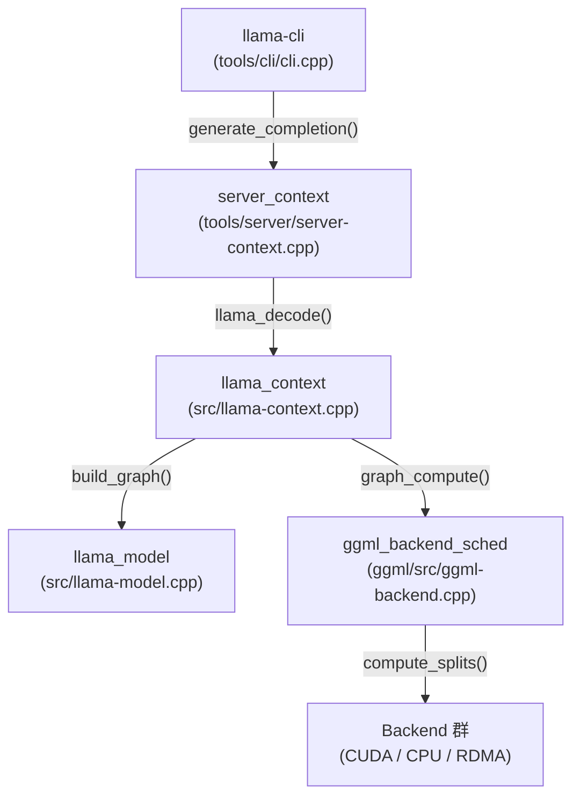

各レイヤーの責務:

| レイヤー | 責務 | 主要クラス/関数 |
|---------|------|----------------|
| CLI | ユーザーI/O、対話管理 | `cli_context`, `generate_completion()` |
| Server Context | タスクキュー、スロット管理、バッチ構築 | `server_context`, `update_slots()` |
| Context | デコード制御、グラフ再利用、メモリ管理 | `llama_context`, `decode()`, `process_ubatch()` |
| Model | 計算グラフ構築、レイヤー→デバイスマッピング | `llama_model`, `build_graph()` |
| Scheduler | グラフ分割、バックエンド割り当て、実行 | `ggml_backend_sched`, `split_graph()` |

### コンポーネント間の呼び出し関係

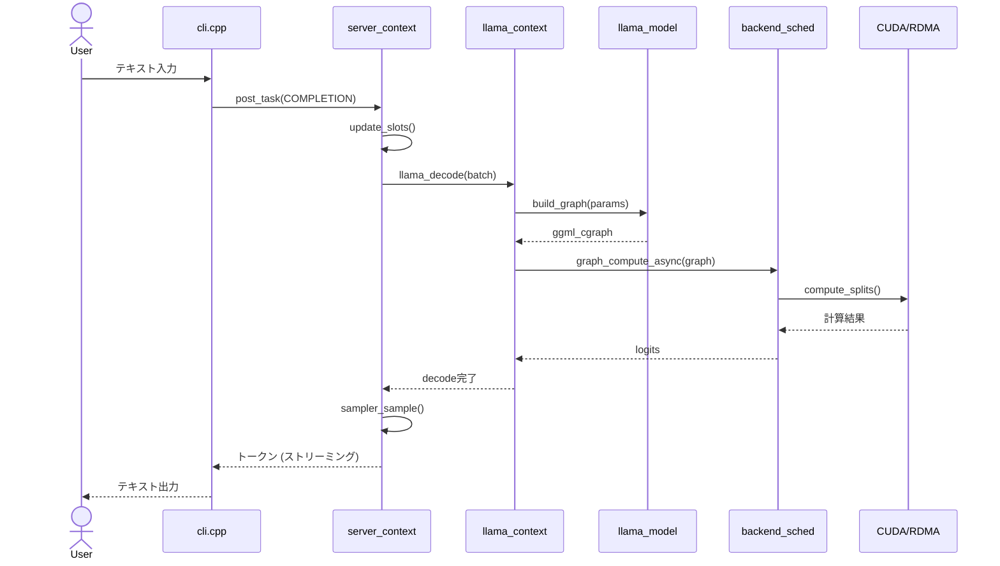

---

## 3. llama-cli エントリポイントと起動シーケンス

### main() 関数

`tools/cli/cli.cpp:189` に定義される `main()` 関数は、以下のフェーズで実行される:

1. **コマンドライン引数パース** (L194): `common_params_parse()` で全パラメータを解析
2. **バックエンド初期化** (L209): `llama_backend_init()` で ggml バックエンドを初期化
3. **モデルロード** (L234): `ctx_server.load_model(params)` でモデルとコンテキストを作成
4. **推論スレッド起動** (L243-245): `ctx_server.start_loop()` を別スレッドで開始
5. **対話ループ** (L287-408): ユーザー入力の受け付けと応答生成

```mermaid
sequenceDiagram
    participant Main as main()
    participant Parse as common_params_parse
    participant Backend as llama_backend_init
    participant Model as load_model
    participant Thread as inference_thread
    participant Loop as 対話ループ

    Main->>Parse: コマンドライン引数解析
    Parse-->>Main: params
    Main->>Backend: ggml バックエンド初期化
    Main->>Model: モデル & コンテキスト作成
    Model-->>Main: 完了
    Main->>Thread: start_loop() [別スレッド]
    Note over Thread: タスクキュー監視開始
    Main->>Loop: 対話ループ開始
    loop ユーザー入力ごと
        Loop->>Thread: post_task(COMPLETION)
        Thread-->>Loop: トークンストリーム
    end
```

### cli_context 構造体

`cli_context` (`cli.cpp:50-187`) は CLI の状態を管理する構造体で、以下を保持する:

| メンバ | 型 | 用途 |
|--------|-----|------|
| `ctx_server` | `server_context` | 推論エンジン本体 |
| `chat_msgs` | `vector<common_chat_msg>` | 対話履歴 |
| `params_base` | `server_task::params_t` | デフォルトサンプリングパラメータ |

### server_context ベースの設計

llama-cli は独立した推論エンジンを持たず、内部的に `server_context` を使用する。これは HTTP サーバー (`llama-server`) と同一の推論エンジンであり、以下の利点がある:

- 推論ロジックの一元化 (CLI と HTTP サーバーで同一コード)
- タスクキューによる非同期処理
- スロットベースの並行推論管理
- ストリーミング結果配信

---

## 4. モデルロード

### common_init_from_params

`common/common.cpp:1214` に定義される `common_init_from_params()` が、モデルロードの起点となる:

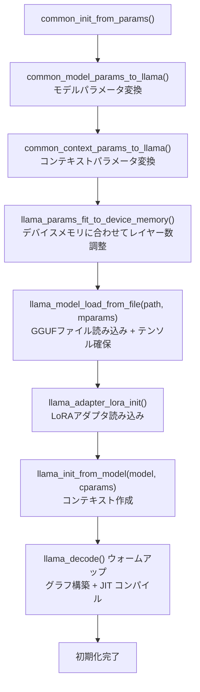

### モデルロードの詳細

1. **GGUFファイル読み込み** (`llama_model_load_from_file`):
   - GGUF ヘッダからモデルアーキテクチャ、ハイパーパラメータを読み込み
   - テンソルメタデータ (名前、型、サイズ) を解析
   - 各テンソルを適切なバックエンドバッファに割り当て

2. **レイヤーとデバイスの対応付け** (`llama-model.cpp:2479-2558`, `get_layer_buft_list`):
   - `-ngl` (GPU レイヤー数) と `-sm layer` (分割方式) に基づいて、各レイヤーをデバイスに割り当て
   - `i_gpu_start` (GPU 開始レイヤー) と `act_gpu_layers` (GPU レイヤー数) を算出
   - 各レイヤーの重みテンソルが対応するデバイスのバッファに配置される

```
Layer 0-2:   CUDA0 (ローカル GPU 0)
Layer 3-5:   CUDA1 (ローカル GPU 1)
...
Layer 30-33: RDMA0 (リモート GPU 0)
Layer 34-37: RDMA1 (リモート GPU 1)
```

3. **コンテキスト作成** (`llama_init_from_model`, `common.cpp:1183`):
   - `llama_context` を作成し、バックエンドスケジューラを初期化
   - KVキャッシュ用のメモリを確保
   - 計算グラフの初回構築 + アロケーション (ウォームアップ)

### レイヤー→デバイスマッピング

`get_layer_buft_list` ラムダ (`llama-model.cpp:2535-2545`) がレイヤーIDからデバイスへのマッピングを担当する:

```
入力: layer_id (0 ~ n_layer-1)
      splits[] (デバイスごとの分割比率)
      n_devices (デバイス数)

処理:
  1. layer_id < i_gpu_start → CPU に割り当て
  2. それ以外 → splits[] に基づいて GPU/RDMA デバイスを決定
     layer_gpu = upper_bound(splits, (il - i_gpu_start) / act_gpu_layers)

出力: {device, buft_list} (デバイスとバッファタイプリスト)
```

---

## 5. コンテキスト作成とバックエンドスケジューラ

### llama_context の構成要素

`llama_context` (`src/llama-context.cpp`) は推論の中核オブジェクトで、以下を管理する:

| 構成要素 | 説明 |
|---------|------|
| `model` | ロード済みモデルへの参照 |
| `sched` | `ggml_backend_sched` — バックエンドスケジューラ |
| `memory` | KVキャッシュ (llama_kv_cache) |
| `balloc` | バッチアロケータ (llama_batch_allocr) |
| `backends[]` | 利用可能なバックエンド一覧 |
| `gf_res_prev` | 前回のグラフ結果 (再利用判定用) |
| `n_reused` | グラフ再利用カウンタ |

### ggml_backend_sched の初期化

`ggml_backend_sched` (`ggml/src/ggml-backend.cpp`) はグラフの分割と実行を担当するスケジューラで、以下の構造を持つ:

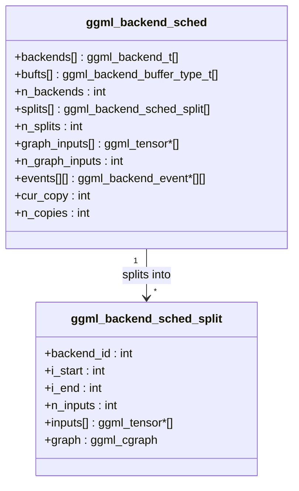

### バックエンドの優先順位

スケジューラは以下の優先順位でバックエンドを選択する:

1. **GPU バックエンド** (CUDA, Metal, Vulkan): 最高優先。計算能力が最も高い
2. **RDMA バックエンド**: GPU と同等に扱われる。リモート GPU にレイヤーを割り当て
3. **CPU バックエンド**: 最低優先。GPU/RDMA が処理できない演算のフォールバック

優先順位は `backends[]` 配列のインデックスで決定される。インデックスが小さいほど高優先であり、Pass 3 の昇格処理で活用される。

---

## 6. 対話ループとバッチ処理

### cli_context の対話ループ

`cli.cpp:287` からの対話ループは、以下のサイクルで動作する:

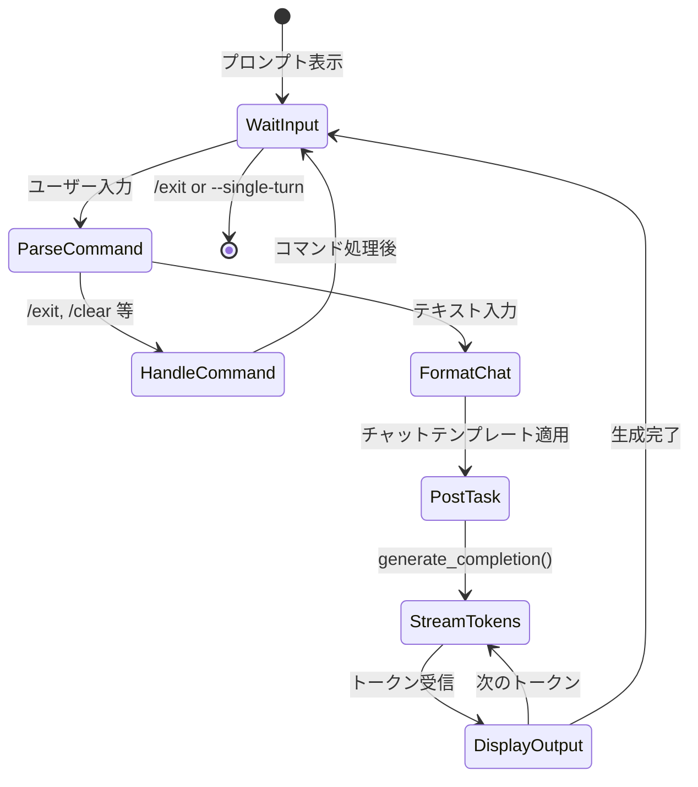

### generate_completion() の流れ

`cli_context::generate_completion()` (`cli.cpp:71-150`) がテキスト生成を制御する:

1. **タスク作成** (L76-91):
   - `SERVER_TASK_TYPE_COMPLETION` タスクを生成
   - チャットテンプレートでフォーマットしたプロンプト、サンプリングパラメータを設定
   - タスクキューに投入 (`rd.post_task()`)

2. **ストリーミング受信** (L96-146):
   - `rd.next(should_stop)` で結果を逐次受信
   - `server_task_result_cmpl_partial`: 部分的なトークン (thinking / content)
   - `server_task_result_cmpl_final`: 生成完了シグナル

3. **結果の返却** (L149):
   - 累積されたテキストを呼び出し元に返す

### server_context::update_slots() — メイン推論ループ

`tools/server/server-context.cpp:1924-2837` の `update_slots()` がトークン生成の中核である。推論スレッド上で繰り返し呼ばれ、以下のフェーズで動作する:

**フェーズ1: バッチ構築** (L1943-2574)

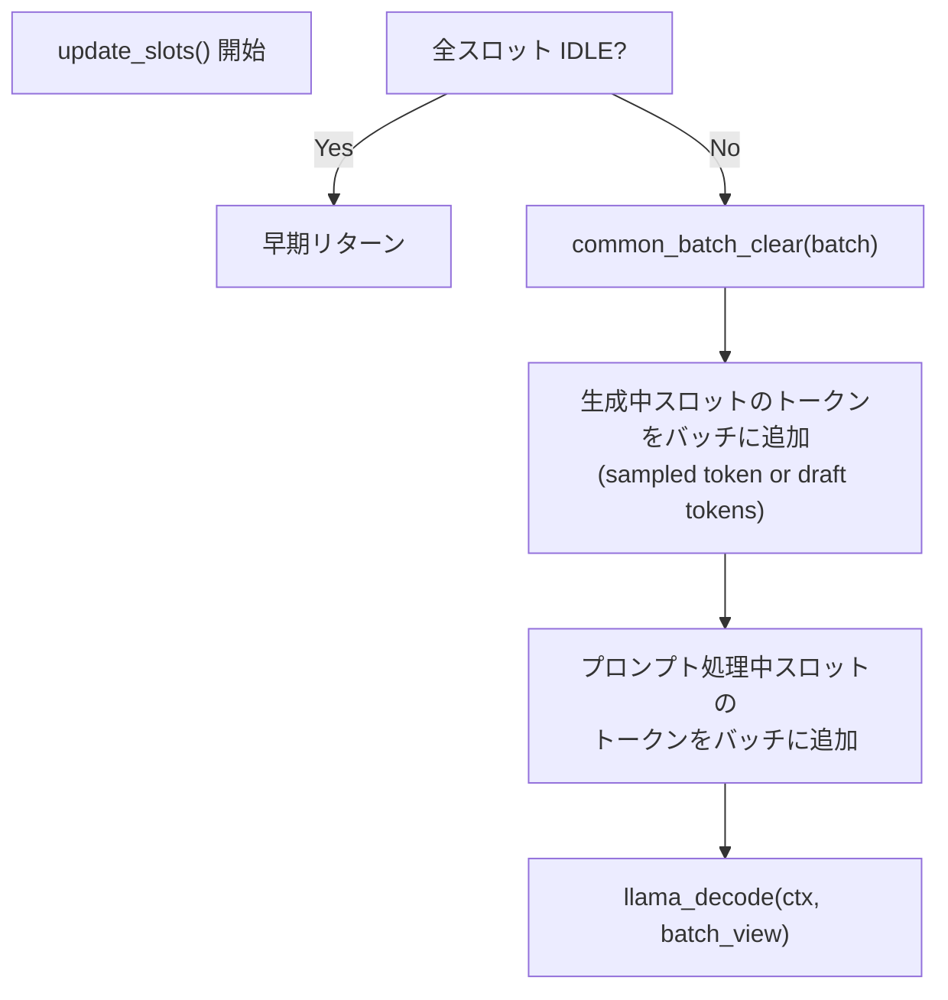

- 生成中 (GENERATING) スロット: 直前にサンプリングしたトークンをバッチに追加
- プロンプト処理中 (PROCESSING_PROMPT) スロット: プロンプトトークンを `n_batch` 分ずつバッチに追加
- KVキャッシュの再利用判定 (プロンプトキャッシュ)

**フェーズ2: デコードと結果処理** (L2596-2834)

- `llama_decode(ctx, batch_view)` を呼び出し (L2612)
- プロンプト処理完了 (DONE_PROMPT → GENERATING): サンプリング開始
- 生成中 (GENERATING): `common_sampler_sample()` (L2740) でトークンをサンプリング
- `process_token()` (L1177-1306) で停止条件をチェック

### llama_batch の構造

`include/llama.h:231-240` で定義:

```
llama_batch {
    n_tokens:  int32_t       — バッチ内のトークン数
    token:     llama_token*  — トークンID配列
    embd:      float*        — 埋め込み配列 (token と排他)
    pos:       llama_pos*    — 各トークンの位置
    n_seq_id:  int32_t*      — 各トークンのシーケンス数
    seq_id:    llama_seq_id**— シーケンスID (2D配列)
    logits:    int8_t*       — 出力フラグ (1=logits計算対象)
}
```

### Prefill vs Generation の違い

| 特性 | Prefill (プロンプト処理) | Generation (トークン生成) |
|------|------------------------|--------------------------|
| バッチサイズ | 大 (n_batch, 通常512-2048) | 小 (1トークン/スロット) |
| KVキャッシュ | 書き込み (全トークン格納) | 読み込み + 1トークン追記 |
| 計算量 | O(n² × d) | O(n × d) |
| ボトルネック | 計算 (Compute bound) | メモリ帯域 (Memory bound) |
| RDMA転送量 | 大 (全重みテンソル) | 小 (アクティベーションのみ) |

### スペキュレーティブデコーディング

通常の Generation では1トークンずつ逐次生成するため、ターゲットモデルの forward pass がボトルネックになる。**スペキュレーティブデコーディング**は、小型の**ドラフトモデル**で複数トークンを先読み (投機的に生成) し、ターゲットモデルで一括検証することで生成速度を向上させる手法である。

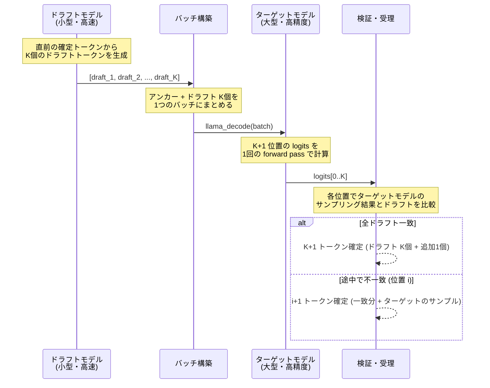

#### 動作の流れ

1. **ドラフト生成** (`common_speculative_draft`, `common/speculative.cpp:958`):
   - ドラフトモデルが最大 K 個 (通常 8 個) のトークンを高速に生成
   - 信頼度 (`p_min`) が閾値を下回ると途中で打ち切り
   - ドラフトモデル以外にも N-gram ベースの予測が利用可能

2. **バッチ構築** (`server-context.cpp:2057-2079`):
   - アンカートークン (直前の確定トークン) + ドラフト K 個を1つのバッチに追加
   - 全トークンに `logits=true` を設定し、各位置の logits を取得

3. **一括検証** (`llama_decode`):
   - ターゲットモデルが1回の forward pass で全 K+1 位置の logits を計算
   - 通常の逐次生成では K+1 回の forward pass が必要なところを1回に削減

4. **受理判定** (`common_sampler_sample_and_accept_n`, `common/sampling.cpp:521`):
   - 各位置でターゲットモデルの logits からサンプリングし、ドラフトトークンと比較
   - 一致すれば次の位置に進む。不一致が発生した時点で停止
   - 全ドラフトが一致した場合、さらに1トークン追加サンプリング

5. **状態更新** (`server-context.cpp:2799-2811`):
   - 受理されたトークンを KV キャッシュに反映
   - 不一致以降のドラフトトークンは KV キャッシュから削除 (`llama_memory_seq_rm`)
   - 受理されたトークンを全てクライアントに出力

#### 性能への影響

- **最良ケース**: ドラフト K 個が全て一致 → K+1 トークン/forward pass (K+1倍の速度向上)
- **最悪ケース**: 最初のドラフトが不一致 → 1 トークン/forward pass (通常と同等)
- ドラフトモデルの品質とターゲットモデルの類似度が受理率を決定する
- `slot.n_draft_accepted / slot.n_draft_total` で受理率を追跡

#### 対応するドラフト方式

| 方式 | 説明 |
|------|------|
| `DRAFT` | 小型ドラフトモデルによる生成 (`--model-draft` で指定) |
| `NGRAM_SIMPLE` | N-gram 統計に基づく予測 |
| `NGRAM_CACHE` | N-gram キャッシュルックアップ |

---

## 7. llama_decode: 推論の心臓部

### llama_decode 関数

`llama_decode` (`src/llama-context.cpp:3493-3501`) は公開APIで、内部の `llama_context::decode()` に委譲する薄いラッパーである:

```cpp
int32_t llama_decode(llama_context * ctx, llama_batch batch) {
    return ctx->decode(batch);  // L3496
}
```

戻り値:
- `0`: 成功
- `1`: KVスロット不足 (バッチが大きすぎる)
- `2`: 中断 (未処理の ubatch あり)
- `-1`: 無効な入力バッチ
- `< -1`: 致命的エラー

### llama_context::decode の内部フロー

`src/llama-context.cpp:1472` に定義される `decode()` は、以下のステップで実行される:

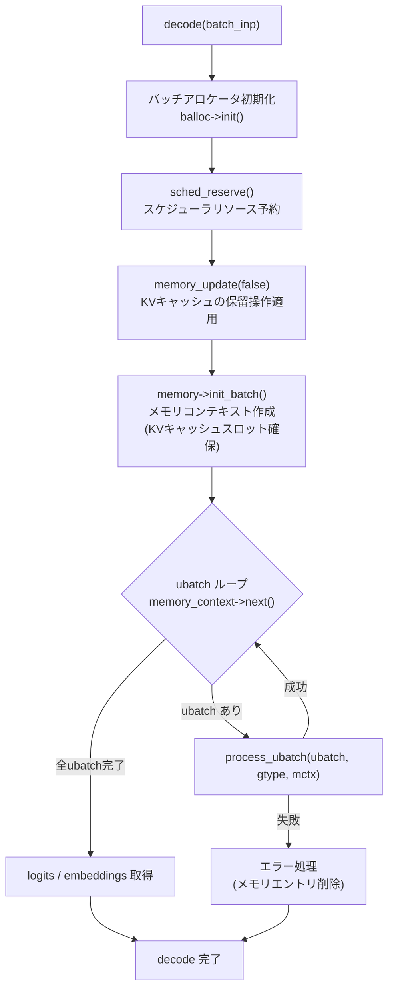

### process_ubatch — グラフ再利用と計算実行

`process_ubatch` (`src/llama-context.cpp:1120-1181`) は単一の micro-batch を処理する関数で、**グラフ再利用の最適化**が核心である:

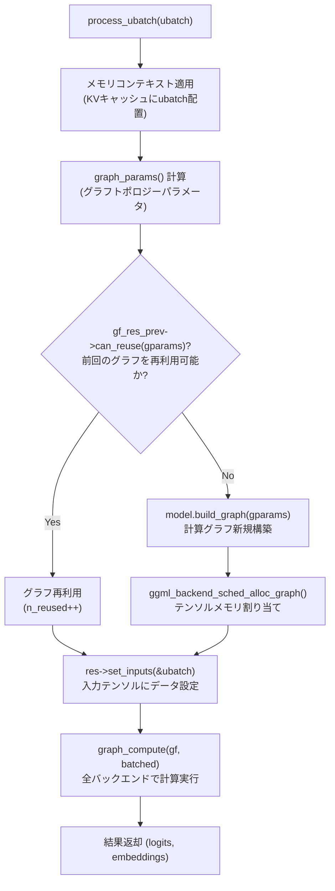

グラフ再利用の条件 (`can_reuse`, `llama-graph.h:534-595`):
- `n_tokens`, `n_seqs`, `seq_ids` が一致
- `n_outputs` が一致
- `embeddings`, `causal_attn`, `arch`, `gtype` が一致
- `cvec`, `loras`, `cross` 状態が一致

**重要**: トークン生成フェーズでは ubatch のトポロジーが毎回同一 (1トークン × 1シーケンス) であるため、**ほぼ毎回グラフが再利用される**。これにより、高価なグラフ構築 + スケジューラアロケーションをスキップできる。

### graph_compute

`llama_context::graph_compute` (`src/llama-context.cpp:2118-2144`) は計算グラフの実行を担当する:

1. スレッドプール設定 (バッチ/非バッチモード)
2. 全バックエンドにスレッド数を通知
3. **`ggml_backend_sched_graph_compute_async(sched, gf)`** で非同期実行

この関数呼び出しが、CUDA バックエンドでの GPU 計算や、RDMA バックエンドでのリモート推論を実際にトリガーする。

---

## 8. 計算グラフの構築

### llama_model::build_graph

`llama_model::build_graph` (`src/llama-model.cpp:7624-7851`) は、モデルアーキテクチャに応じた計算グラフを構築する分岐点である:

```cpp
ggml_cgraph * llama_model::build_graph(const llm_graph_params & params) const {
    std::unique_ptr<llm_graph_context> llm;
    switch (arch) {
        case LLM_ARCH_LLAMA:
            llm = std::make_unique<llm_build_llama<false>>(*this, params);
            break;
        case LLM_ARCH_QWEN2:
            // ... Qwen2 固有のグラフビルダー
        // 他のアーキテクチャ (BERT, Phi3, GPT-NeoX 等)
    }
}
```

### Transformer ブロック構造

Llama 系アーキテクチャ (`llm_build_llama`, `src/models/llama.cpp:4-165`) の計算グラフは、以下のブロック構造を持つ:

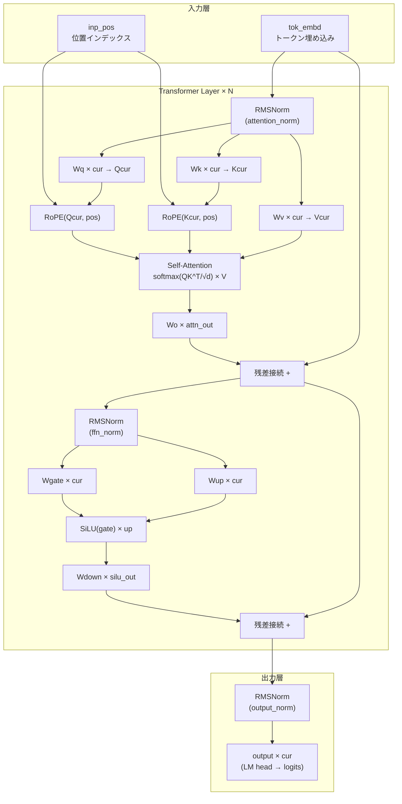

### レイヤーごとの処理

`llm_build_llama` のコンストラクタ (`models/llama.cpp:13-165`) が実際のグラフ構築を行う:

1. **入力セットアップ** (L13-29):
   - `build_inp_embd(model.tok_embd)`: トークン埋め込み
   - `build_inp_pos()`: 位置インデックス
   - `build_attn_inp_kv()`: KVキャッシュ用アテンション入力
   - `build_inp_out_ids()`: 出力対象トークンID

2. **レイヤーループ** (L31-146): `for (int il = 0; il < n_layer; ++il)`
   - **Attention** (L46-94):
     - Q/K/V 射影 (`build_lora_mm`)
     - RoPE (Rotary Position Embedding)
     - `build_attn()` でスケーリングドットプロダクトアテンション
   - **FFN** (L104-137):
     - 標準FFN: Gate + Up + SiLU + Down
     - MoE FFN: 専門家ルーティング + トップK選択
   - **残差接続** (L138, L145): 各サブブロックの出力を入力に加算

3. **出力層** (L149-162):
   - 最終 RMSNorm
   - LM head 射影 (vocabulary サイズへの線形変換)
   - `ggml_build_forward_expand(gf, cur)` でグラフ確定

### ggml_cgraph の構造

ggml の計算グラフは **有向非巡回グラフ (DAG)** で、以下の構造を持つ:

| フィールド | 説明 |
|-----------|------|
| `nodes[]` | トポロジカルソート済みの演算ノード列 |
| `leafs[]` | 入力テンソル (重み、入力データ) |
| `n_nodes` | ノード数 |
| `n_leafs` | リーフ数 |

各ノード (`ggml_tensor`) は:
- `op`: 演算種別 (MUL_MAT, ADD, ROPE, SOFT_MAX 等)
- `src[0..9]`: 入力テンソルへのポインタ
- `ne[4]`, `nb[4]`: テンソルの形状とストライド
- `data`: テンソルデータへのポインタ

---

## 9. バックエンドスケジューリングとグラフ分割

### 5パスアルゴリズム

`ggml_backend_sched_split_graph` (`ggml/src/ggml-backend.cpp:923-1280`) は、計算グラフのノードをバックエンドに割り当てる5パスのアルゴリズムを実装する:

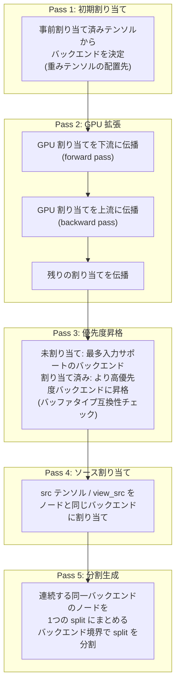

各パスの詳細:

| パス | 行番号 | 処理内容 | 判定基準 |
|------|--------|---------|---------|
| Pass 1 | L942-977 | リーフとノードの初期バックエンド割り当て | テンソルの現在のバッファ配置 |
| Pass 2 | L979-1057 | GPU 割り当てを双方向に伝播 | `supports_op()` + CPU はスキップ |
| Pass 3 | L1059-1118 | 高優先度バックエンドへの昇格 | `supports_op()` + `supports_buft()` |
| Pass 4 | L1120-1150 | ソーステンソルの割り当て | view_src / dst のバックエンド |
| Pass 5 | L1152-1280 | split 構造体の生成 | バックエンドID の変化点 |

### compute_splits — 分割ごとの実行

`ggml_backend_sched_compute_splits` (`ggml-backend.cpp:1443-1610`) が各 split を順次実行する:

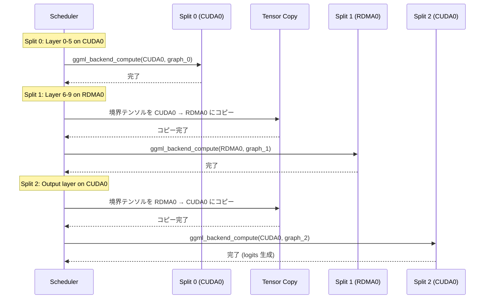

各 split の実行手順:

1. **入力テンソルのコピー** (L1457-1573):
   - 前の split のバックエンドから、現在の split のバックエンドにテンソルをコピー
   - `ggml_backend_tensor_copy()` でクロスバックエンド転送
   - MoE モデルでは使用される expert のみをコピー (最適化)

2. **split グラフの計算** (L1578-1592):
   - `ggml_backend_compute(split_backend, &split->graph)` で実行
   - イベント記録 (非同期同期用)

3. **コピーバッファのサイクル** (L1596):
   - `cur_copy = (cur_copy + 1) % n_copies` でピンポンバッファを切り替え

### supports_op / supports_buft による互換性チェック

各バックエンドは `supports_op()` と `supports_buft()` を実装し、特定の演算やバッファタイプをサポートするかを報告する:

- **CUDA バックエンド**: ほぼ全演算をサポート。自デバイスのバッファのみサポート
- **RDMA バックエンド**: CUDA と同じ演算をサポート (サーバー側で CUDA が実行)。`strcmp` で自デバイス名を厳密一致
- **CPU バックエンド**: 全演算をサポート (フォールバック先)

---

## 10. KVキャッシュ

### KVキャッシュの役割

KVキャッシュは Self-Attention の Key と Value テンソルを蓄積し、過去のトークンの再計算を回避する。Transformer の各レイヤーが独立した K/V テンソルペアを保持する。

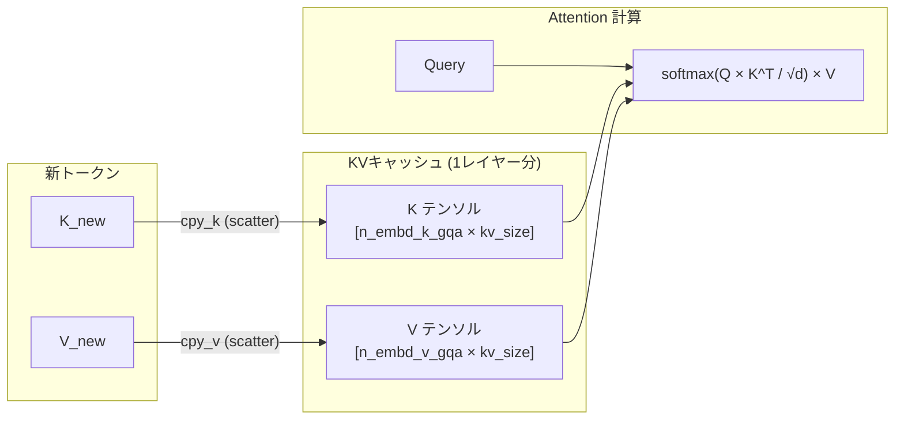

### リングバッファ方式

KVキャッシュはリングバッファで実装される (`src/llama-kv-cache.h:206-250`):

| 構成要素 | 型 | 説明 |
|---------|-----|------|
| `v_cells[n_stream]` | `vector<llama_kv_cells>` | 各ストリームのセル配列 |
| `v_heads[n_stream]` | `vector<uint32_t>` | 各ストリームの書き込みヘッド位置 |
| `kv_size` | `uint32_t` | リングバッファサイズ |

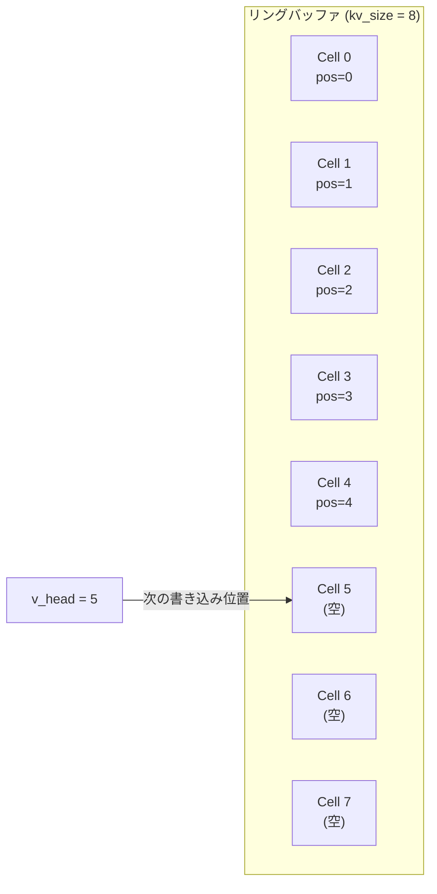

### スロット管理

`find_slot()` (`llama-kv-cache.cpp:704-900`) がリングバッファから空きスロットを探索する:

1. 各シーケンスについて、対応するストリームのセル配列をスキャン
2. 連続した空きセルが必要数見つかるまで `v_head` から順にチェック
3. `v_head` がバッファ末尾に達したら先頭に戻る (リング動作)
4. スロットが見つかったら `slot_info` として返却

`prepare()` (`llama-kv-cache.cpp:562-626`) はトランザクショナルな確保を行う:
- 全 ubatch のスロットを仮確保 → 全て成功したらコミット → 失敗したらロールバック

### コンテキストサイズ (-c) との関係

`-c` オプションは KVキャッシュのサイズを決定する:
- `-c 2048`: 最大2048トークンのコンテキストを保持
- コンテキストが満杯になると、コンテキストシフト (古いトークンを破棄) が発生
- メモリ使用量: `2 × n_layer × n_embd × kv_size × sizeof(float16)` (FP16の場合)

### Prefill と Generation での更新パターン

| 操作 | Prefill | Generation |
|------|---------|------------|
| KV書き込み | N トークン分を一括書き込み | 1トークンを追記 |
| KV読み出し | 書き込んだ全トークンを参照 | 全蓄積トークンを参照 |
| リングバッファ | head が N 進む | head が 1 進む |
| メモリパターン | Sequential write | Random read + 1 write |

---

## 11. サンプリング

### サンプリングパイプライン

`llama_sampler_sample` (`src/llama-sampling.cpp:806-873`) が logits からトークンを選択する:

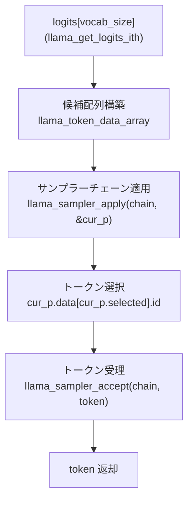

### サンプラーチェーンアーキテクチャ

`llama_sampler_chain` (`llama-sampling.cpp:626-724`) はコンポジットパターンで実装され、複数のサンプラーを順次適用する:

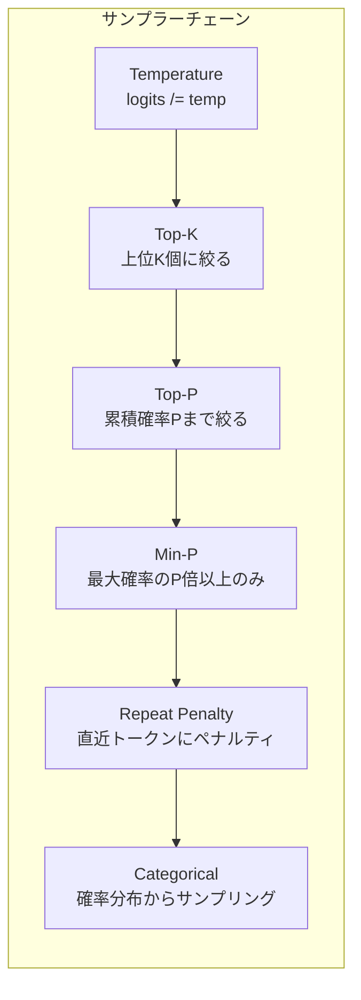

各サンプラーの動作:

| サンプラー | 入力 | 出力 | 効果 |
|-----------|------|------|------|
| Temperature | logits配列 | スケーリングされたlogits | 多様性の制御 (高temp=多様, 低temp=決定的) |
| Top-K | 候補配列 | 上位K個に絞った配列 | 低確率トークンの除外 |
| Top-P | ソート済み配列 | 累積確率P以内の候補 | 動的な候補数制限 |
| Min-P | 候補配列 | 最大確率のP倍以上のみ | 最低品質閾値 |
| Repeat Penalty | 候補配列 | ペナルティ適用済み | 繰り返しの抑制 |
| Categorical | 確率分布 | 選択トークンID | 最終的なサンプリング |

### チェーンの Apply 処理

`llama_sampler_chain_apply()` (`llama-sampling.cpp:642-662`):

```
for each sampler in chain.samplers:
    if sampler.is_backend: skip (バックエンドサンプラーは先行処理済み)
    if sampler.iface->apply == nullptr: skip
    llama_sampler_apply(sampler, &cur_p)
    // cur_p が in-place で変更される
```

各サンプラーは `cur_p` (候補配列) を直接変更する。フィルタリング (Top-K等) はサイズを縮小し、Categorical は `cur_p.selected` を設定する。

### トークナイゼーションとデトークナイゼーション

- **トークナイゼーション**: ユーザー入力テキスト → `llama_tokenize()` → トークンID列
  - チャットテンプレート適用後のテキストをトークン化
  - BPE / SentencePiece / Unigram 等のモデル固有トークナイザ

- **デトークナイゼーション**: トークンID → `llama_token_to_piece()` → テキスト片
  - ストリーミング出力時に1トークンずつ変換
  - 不完全な UTF-8 バイト列の処理 (バッファリング)

---

## 12. 推論の全体フロー (まとめ)

### End-to-End シーケンス

ユーザーがテキストを入力してから出力テキストを受け取るまでの完全なフロー:

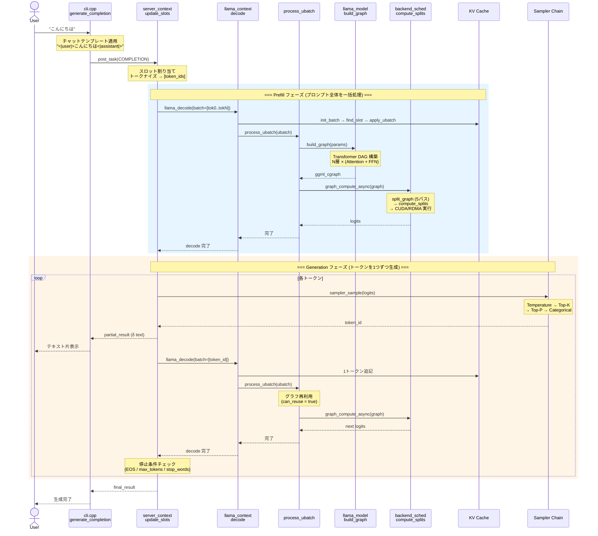

### 各フェーズの処理時間の支配要因

| フェーズ | 支配要因 | 主要オーバーヘッド |
|---------|---------|------------------|
| テキスト入力 → トークナイズ | CPU (BPE/SPM) | 無視できる程度 |
| Prefill | GPU 計算 (QKV + Attention + FFN) | RDMA: 重みテンソル転送 |
| Generation (per token) | メモリ帯域 (KV読み出し) | RDMA: graph_compute 通信 |
| サンプリング | CPU (Top-K ソート + 確率計算) | 無視できる程度 |
| デトークナイズ → テキスト出力 | CPU (テーブル参照) | 無視できる程度 |

### 最適化のポイント

1. **グラフ再利用** (`process_ubatch`): Generation フェーズでほぼ毎回発動。グラフ構築 + スケジューラアロケーションをスキップ
2. **KVキャッシュ**: 過去トークンの Q/K/V 再計算を完全に回避
3. **スケジューラの5パス**: レイヤー単位でバックエンドに最適分配、クロスバックエンド転送を最小化
4. **RDMA バックエンド固有**: グラフキャッシュ (delta update / pure recompute) でリモート通信を数十バイトに削減
5. **バッチ処理**: Prefill で多数トークンを一括計算し、GPU 利用率を最大化
