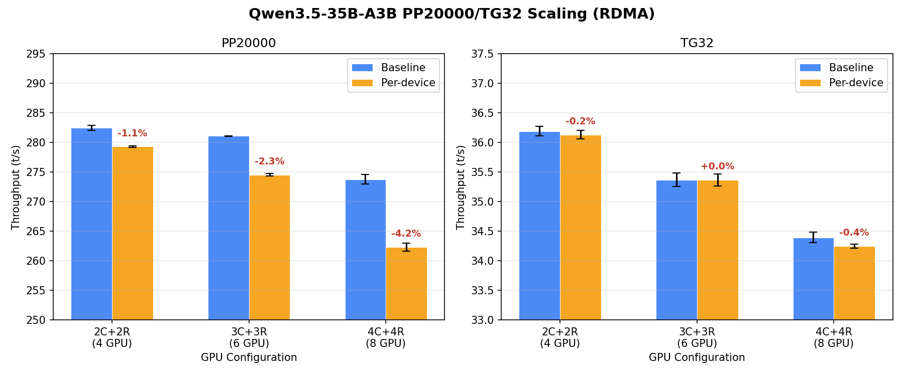

# パイプライン並列化 スケーリングベンチマーク (pp20000, Qwen3.5-35B-A3B)

- **実施日時**: 2026年3月4日 12:08
- **ワークツリー**: `.worktree/pipeline-splits` (branch: `feature/pipeline-splits`)
- **コミット**: `d7e8c45da` (build 8264)

## 前提・目的

パイプライン並列化 (`GGML_RDMA_PARALLEL=1`) の効果が GPU 数に応じてどうスケールするかを検証する。

- **背景**: 前回の Qwen3.5 4GPU (2C+2R) ベンチマーク (pp128) では **PP +25.9%** (189→238 t/s) の改善を確認（[前回レポート](2026-03-03_145744_pipeline_perdevice_combined_benchmark.md)）。ただし pp128 は 1 ubatch のためパイプライン重畳の余地がなく、改善は per-device 接続によるサーバー側並列計算のみだった。
- **目的**: pp20000 (~40 ubatch) でパイプライン重畳の効果を検証し、GPU 数 (4→6→8) でのスケーリングを確認する。
- **前提条件**: `feature/pipeline-splits` ブランチの `GGML_RDMA_PIPELINE` + `GGML_RDMA_PER_DEVICE_CONN` が動作していること。

## 発見されたバグ

実験の事前正確性テストにおいて、以下の 2 つの重大なバグが発見された。

### Bug 1: パイプライン並列化が pp20000 でクラッシュ

`GGML_RDMA_PIPELINE=1` を有効にすると、pp20000 (多数の ubatch を処理するケース) で CUDA エラーが発生しクラッシュする。pp128 (1 ubatch) では発生しない。

- **症状**: `ggml_cuda_mul_mat_id` での CUDA error → abort
- **影響範囲**: `GGML_RDMA_PIPELINE=1` 単独、および `GGML_RDMA_PARALLEL=1` (combined) の両方
- **再現条件**: pp20000 以上の大きなプロンプト (多数の ubatch が生成されるケース)
- **GDR 依存**: GDR 無効 (`GGML_RDMA_GDR_BUDGET_GB=0`) でも発生 → GDR レースコンディションとは別の問題
- **推定原因**: パイプライン化された ubatch の per-copy context buffers が大量の ubatch チャンク (10 chunks × 4 copies) で正しく管理されていない可能性

### Bug 2: Combined モード (pipeline + per-device) が 3+ RDMA デバイスでゴミ出力

`GGML_RDMA_PARALLEL=1` を有効にすると、3 台以上の RDMA デバイスを使用する構成で出力が破損する。2 RDMA デバイスでは正常。

- **症状**: 意味のないゴミ文字列を出力 (例: `尸 and，耍羨尸 尸 intents也是...`)
- **クラッシュはしない** — スループットは向上するが出力が破損
- **切り分け結果**:

| 構成 | per-device のみ | pipeline のみ | 両方 (PARALLEL=1) |
|:----:|:---------:|:--------:|:----------:|
| 2C+2R (4GPU, 2 RDMA) | OK | OK | OK |
| 3C+3R (6GPU, 3 RDMA) | OK | OK | **ゴミ出力** |
| 4C+4R (8GPU, 4 RDMA) | OK | OK | **ゴミ出力** |

- **GDR 依存**: GDR 無効でも発生 → GDR とは無関係
- **推定原因**: per-device 接続 (複数の RDMA 接続) + パイプライン非同期ディスパッチの組み合わせで、3+ 接続時にデータ競合が発生

### ベンチマーク計画の変更

上記バグにより、当初計画の `GGML_RDMA_PARALLEL=1` (combined) でのスケーリングベンチマークは実行不可能。代替として **baseline vs per-device 単独** (`GGML_RDMA_PER_DEVICE_CONN=1`) の A/B 比較を全 3 構成で実施した。

## ベンチマーク結果

### 条件

| パラメータ | 値 |
|-----------|-----|
| モデル | Qwen3.5-35B-A3B (UD-Q4_K_M, 19.8GB) |
| プロンプト | pp20000, tg32 |
| 共通フラグ | `-ngl 999 -sm layer -fa 1 -r 1 -o csv` |
| A (baseline) | 環境変数なし |
| B (per-device) | `GGML_RDMA_PER_DEVICE_CONN=1` |
| 繰り返し | ABABAB × 3ペア |

### GPU 構成

| Config | CUDA_VISIBLE_DEVICES | RDMA devices | GPU 合計 |
|:------:|:-------------------:|:------------:|:--------:|
| 2C+2R | 0,1 | RDMA0, RDMA1 | 4 |
| 3C+3R | 0,1,2 | RDMA0, RDMA1, RDMA2 | 6 |
| 4C+4R | 0,1,2,3 | RDMA0, RDMA1, RDMA2, RDMA3 | 8 |

### PP20000 結果

| Config | Baseline (t/s) | Per-device (t/s) | 差分 |
|:------:|:--------------:|:----------------:|:----:|
| 2C+2R (4GPU) | 282.46 ± 0.40 | 279.30 ± 0.10 | **-1.1%** |
| 3C+3R (6GPU) | 281.10 ± 0.04 | 274.54 ± 0.20 | **-2.3%** |
| 4C+4R (8GPU) | 273.75 ± 0.79 | 262.32 ± 0.69 | **-4.2%** |

### TG32 結果

| Config | Baseline (t/s) | Per-device (t/s) | 差分 |
|:------:|:--------------:|:----------------:|:----:|
| 2C+2R (4GPU) | 36.19 ± 0.08 | 36.13 ± 0.05 | -0.2% |
| 3C+3R (6GPU) | 35.37 ± 0.12 | 35.37 ± 0.10 | +0.0% |
| 4C+4R (8GPU) | 34.40 ± 0.09 | 34.25 ± 0.04 | -0.4% |

### 生データ

**2C+2R (4 GPU):**

| Run | Baseline PP | Per-device PP | Baseline TG | Per-device TG |
|:---:|:-----------:|:-------------:|:-----------:|:-------------:|
| 1 | 282.35 | 279.21 | 36.17 | 36.13 |
| 2 | 282.14 | 279.27 | 36.12 | 36.06 |
| 3 | 282.91 | 279.41 | 36.28 | 36.20 |

**3C+3R (6 GPU):**

| Run | Baseline PP | Per-device PP | Baseline TG | Per-device TG |
|:---:|:-----------:|:-------------:|:-----------:|:-------------:|
| 1 | 281.14 | 274.68 | 35.46 | 35.43 |
| 2 | 281.05 | 274.31 | 35.40 | 35.42 |
| 3 | 281.11 | 274.63 | 35.24 | 35.25 |

**4C+4R (8 GPU):**

| Run | Baseline PP | Per-device PP | Baseline TG | Per-device TG |
|:---:|:-----------:|:-------------:|:-----------:|:-------------:|
| 1 | 274.46 | 262.77 | 34.46 | 34.23 |
| 2 | 272.89 | 261.51 | 34.43 | 34.29 |
| 3 | 273.90 | 262.67 | 34.29 | 34.23 |

### スケーリンググラフ



## 分析

### Per-device 単独の効果

Per-device 接続単独では PP 性能が**悪化**する。悪化幅は GPU 数増加に伴い拡大:

- 4 GPU: -1.1%
- 6 GPU: -2.3%
- 8 GPU: -4.2%

これは予想通りの結果。Per-device 接続は接続数を N 倍に増やすため、接続管理のオーバーヘッドが増加する。Qwen3.5 MoE はコンピュート律速（RDMA 通信時間は全体の 3.3%）のため、通信並列化の恩恵よりオーバーヘッドが大きい。

TG32 は全構成で ±0.4% 以内と実質的に変化なし。

### Baseline のスケーリング特性

GPU 数に対する baseline スループットの変化:

| 指標 | 4GPU → 6GPU | 4GPU → 8GPU |
|:----:|:-----------:|:-----------:|
| PP20000 | -0.5% | -3.1% |
| TG32 | -2.3% | -4.9% |

GPU 数を増やしても PP/TG は微減傾向。Qwen3.5-35B-A3B (MoE, 3B active) は GPU あたりの計算量が少なく、GPU 追加による並列化の恩恵が薄い。各 GPU のレイヤー数が減る一方、通信オーバーヘッドが増加するため、スループットは緩やかに低下する。

### pp128 vs pp20000 の比較 (2C+2R)

| 指標 | pp128 baseline | pp20000 baseline | 変化 |
|:----:|:-------------:|:----------------:|:----:|
| PP (t/s) | ~189 | ~282 | **+49.2%** |

pp20000 では多数の ubatch がバッチ処理され、GPU 利用率が向上するため PP スループットが大幅に増加する。

### 前回実験 (pp128 combined +25.9%) との対比

前回の pp128 combined (`GGML_RDMA_PARALLEL=1`) で観測された +25.9% 改善は、per-device 接続によるサーバー側デバイス並列計算が主因だった。今回の pp20000 ではそのメカニズムに加えてパイプライン重畳が期待されたが:

1. **パイプラインが pp20000 でクラッシュ** → パイプライン重畳の効果は測定不能
2. **Per-device 単独はオーバーヘッド** → サーバー側並列計算の恩恵なし（pipeline なしでは逐次ディスパッチのまま）

pp128 では combined mode で +25.9% だったが、その改善は per-device + pipeline の**シナジー**（パイプラインが非同期ディスパッチを行い、per-device 接続がサーバー側並列計算を可能にする）であり、どちらか一方だけでは効果が出ない。

## 結論

1. **パイプライン並列化は pp20000 で使用不可** — 多数の ubatch を処理するケースで CUDA error クラッシュが発生するバグがある
2. **Combined モードは 3+ RDMA デバイスで使用不可** — 出力が破損するレースコンディションがある
3. **Per-device 単独は逆効果** — PP で -1.1%～-4.2% の性能低下、GPU 数増加で悪化
4. **Qwen3.5 MoE はコンピュート律速** — GPU 数増加でもスループットは殆ど変わらず微減

### 今後の課題

- [ ] **Bug 1 修正**: パイプラインの per-copy context buffers が大量チャンクで正しく動作するよう修正
- [ ] **Bug 2 修正**: Combined モード + 3+ RDMA デバイスでのデータ競合を調査・修正
- [ ] **通信律速モデルでの検証**: GLM-4.7 (通信律速) での per-device + pipeline combined 効果測定

## 再現方法

### ビルド・デプロイ

```bash
bash /home/ubuntu/projects/llama.cpp/.worktree/pipeline-splits/scripts/rdma-build.sh local
bash scripts/gpu-lock.sh run bash /home/ubuntu/projects/llama.cpp/.worktree/pipeline-splits/scripts/rdma-deploy.sh
bash /home/ubuntu/projects/llama.cpp/.worktree/pipeline-splits/scripts/rdma-server.sh start
```

### 正確性テスト (例: 3C+3R combined → ゴミ出力の再現)

```bash
bash scripts/gpu-lock.sh run GGML_RDMA_PARALLEL=1 CUDA_VISIBLE_DEVICES=0,1,2 GGML_RDMA_SERVERS=192.168.100.2:50051 \
  /home/ubuntu/projects/llama.cpp/.worktree/pipeline-splits/build/bin/llama-cli \
  --model /home/ubuntu/.cache/llama.cpp/unsloth_Qwen3.5-35B-A3B-GGUF_Qwen3.5-35B-A3B-UD-Q4_K_M.gguf \
  -dev 'CUDA0,CUDA1,CUDA2,RDMA0[192.168.100.2:50051],RDMA1[192.168.100.2:50051],RDMA2[192.168.100.2:50051]' \
  -ngl 999 -sm layer -fa 1 -p '日本語で美しい詩を書いてください。' -n 128 --log-file /tmp/llama-cli.log
```

### ベンチマーク (例: 2C+2R baseline)

```bash
bash scripts/gpu-lock.sh run CUDA_VISIBLE_DEVICES=0,1 GGML_RDMA_SERVERS=192.168.100.2:50051 \
  /home/ubuntu/projects/llama.cpp/.worktree/pipeline-splits/build/bin/llama-bench \
  -m /home/ubuntu/.cache/llama.cpp/unsloth_Qwen3.5-35B-A3B-GGUF_Qwen3.5-35B-A3B-UD-Q4_K_M.gguf \
  -dev 'CUDA0/CUDA1/RDMA0[192.168.100.2:50051]/RDMA1[192.168.100.2:50051]' \
  -ngl 999 -sm layer -fa 1 -r 1 -p 20000 -n 32 -o csv
```

Per-device 条件では `GGML_RDMA_PER_DEVICE_CONN=1` を追加。

## 環境情報

| 項目 | 1号機 | 2号機 |
|------|-------|-------|
| Git commit | `c1ca6d5fd (dirty) (feature/rdma-backend)` | — |
| NVIDIA Driver | 535.288.01 | 535.288.01 |
| GPU | 7x Tesla P100-PCIE-16GB | 4x Tesla P100-PCIE-16GB |
| GPU 温度 (max) | 29°C | 32°C |
| 電力制限 | 180.00W | 180.00W |
| SM 周波数 (max) | 1328 MHz | 1328 MHz |
| Persistence Mode | Enabled | Enabled |
| nvidia-peermem | loaded | loaded |
| IB デバイス | mlx5_0 (Active, 100) | mlx5_0 (Active, 100) |
| P2P トポロジ | NODE/NV/PHB/PIX/PXB/SYS | NODE/NV/PHB/PIX/PXB/SYS |
| ACS | disabled | disabled |
| IOMMU | disabled | disabled |
| rdma-server | — | running (PID 1326737) |

GGML_RDMA 環境変数: (none)
