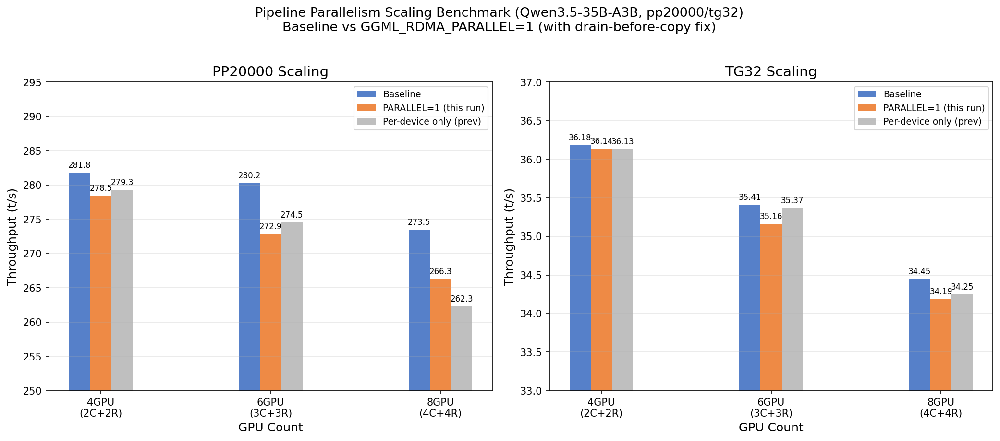

# パイプライン並列化 スケーリングベンチマーク (pp20000) — バグ修正後の再実施

- **実施日時**: 2026年3月4日 18:08
- **ワークツリー**: `.worktree/pipeline-splits` (branch: `feature/pipeline-splits`)
- **コミット**: `01348a528` (build 8265)

## 前提・目的

前回のスケーリングベンチマーク ([report/2026-03-04_120833](2026-03-04_120833_pipeline_scaling_pp20000_benchmark.md)) では、2つの重大なバグにより `GGML_RDMA_PARALLEL=1` (pipeline + per-device combined) での A/B 比較が不可能だった:

- **Bug 1**: パイプラインが pp20000 でクラッシュ (多数 ubatch の gallocr バッファ再利用問題)
- **Bug 2**: Combined モードが 3+ RDMA デバイスでゴミ出力 (`pipeline_wait` のサーバー側同期が破綻)

両バグが修正されたため、当初計画の **baseline vs GGML_RDMA_PARALLEL=1** のスケーリングベンチマークを実施する。

- **Bug 1 修正**: `a423ade64` — chunked dispatch 削除、per-ubatch sync 追加
- **Bug 2 修正**: `01348a528` — `drain_pending_compute` (client-side sync) を cross-connection deferred copy 前に実行

### 注意点

Bug 2 修正 (`drain_pending_compute`) によりサーバー側デバイス間並列性は失われている。pp128 で観測された +25.9% の改善 ([前回の combined ベンチマーク](2026-03-03_145744_pipeline_perdevice_combined_benchmark.md)) はサーバー側並列計算が主因だったため、同等の改善は期待できない。ただしパイプライン重畳 (pp20000 = ~40 ubatch) の効果は残る可能性がある。

## 正確性テスト (事前確認)

バグ修正後の正確性を全構成で確認:

| テスト | 結果 | 備考 |
|:------:|:----:|:----:|
| 3C+3R combined llama-cli | **OK** | pp=51.1, tg=35.1 t/s |
| 4C+4R combined llama-cli | **OK** | pp=25.5, tg=34.7 t/s |
| 2C+2R combined pp20000 llama-bench | **OK** | 274.7 t/s, クラッシュなし |

Bug 1, Bug 2 ともに修正を確認。

## ベンチマーク結果

### 条件

| パラメータ | 値 |
|-----------|-----|
| モデル | Qwen3.5-35B-A3B (UD-Q4_K_M, 19.8GB) |
| プロンプト | pp20000, tg32 |
| 共通フラグ | `-ngl 999 -sm layer -fa 1 -r 1 -o csv` |
| A (baseline) | 環境変数なし |
| B (combined) | `GGML_RDMA_PARALLEL=1` |
| 繰り返し | ABAB × 3ペア |

### GPU 構成

| Config | CUDA_VISIBLE_DEVICES | RDMA devices | GPU 合計 |
|:------:|:-------------------:|:------------:|:--------:|
| 2C+2R | 0,1 | RDMA0, RDMA1 | 4 |
| 3C+3R | 0,1,2 | RDMA0, RDMA1, RDMA2 | 6 |
| 4C+4R | 0,1,2,3 | RDMA0, RDMA1, RDMA2, RDMA3 | 8 |

### PP20000 結果

| Config | Baseline (t/s) | PARALLEL=1 (t/s) | 差分 | p値 |
|:------:|:--------------:|:----------------:|:----:|:---:|
| 2C+2R (4GPU) | 281.78 | 278.46 | **-1.18%** | 0.018 |
| 3C+3R (6GPU) | 280.24 | 272.86 | **-2.64%** | 0.013 |
| 4C+4R (8GPU) | 273.50 | 266.30 | **-2.63%** | 0.004 |

### TG32 結果

| Config | Baseline (t/s) | PARALLEL=1 (t/s) | 差分 | p値 |
|:------:|:--------------:|:----------------:|:----:|:---:|
| 2C+2R (4GPU) | 36.18 | 36.14 | -0.11% | 0.219 |
| 3C+3R (6GPU) | 35.41 | 35.16 | -0.71% | 0.089 |
| 4C+4R (8GPU) | 34.45 | 34.19 | -0.73% | 0.024 |

### 生データ

**2C+2R (4 GPU):**

| Run | Baseline PP | PARALLEL PP | Baseline TG | PARALLEL TG |
|:---:|:-----------:|:-----------:|:-----------:|:-----------:|
| 1 | 281.78 | 277.92 | 36.15 | 36.12 |
| 2 | 282.19 | 278.53 | 36.15 | 36.14 |
| 3 | 281.35 | 278.91 | 36.25 | 36.17 |

**3C+3R (6 GPU):**

| Run | Baseline PP | PARALLEL PP | Baseline TG | PARALLEL TG |
|:---:|:-----------:|:-----------:|:-----------:|:-----------:|
| 1 | 279.72 | 270.67 | 35.50 | 35.20 |
| 2 | 280.49 | 273.54 | 35.48 | 35.12 |
| 3 | 280.52 | 274.37 | 35.25 | 35.16 |

**4C+4R (8 GPU):**

| Run | Baseline PP | PARALLEL PP | Baseline TG | PARALLEL TG |
|:---:|:-----------:|:-----------:|:-----------:|:-----------:|
| 1 | 273.80 | 266.77 | 34.43 | 34.22 |
| 2 | 272.79 | 266.31 | 34.44 | 34.11 |
| 3 | 273.91 | 265.83 | 34.47 | 34.25 |

### スケーリンググラフ



## 分析

### 前回 (per-device 単独) との比較

| Config | 前回 per-device 単独 | 今回 PARALLEL=1 (combined) |
|:------:|:-------------------:|:-------------------------:|
| 4GPU | -1.1% | **-1.2%** |
| 6GPU | -2.3% | **-2.6%** |
| 8GPU | -4.2% | **-2.6%** |

- 4GPU, 6GPU: ほぼ同等の悪化幅。pipeline 重畳の効果は観測されない
- 8GPU: 前回 -4.2% → 今回 -2.6% と悪化幅が縮小。pipeline 重畳が per-device オーバーヘッドの一部を相殺している可能性があるが、依然としてマイナス

### drain-before-copy の影響

Bug 2 修正 (`drain_pending_compute`) は `cpy_tensor_async` で cross-connection deferred copy を行う前に、全 pending compute をクライアント側で同期する。これにより:

1. **サーバー側デバイス並列性の喪失**: 前回 pp128 で +25.9% を生んだメカニズムが無効化
2. **パイプライン重畳のみ残存**: ubatch 間のディスパッチ重畳は動作するが、サーバー側 GPU 計算はすべて逐次実行

Qwen3.5 MoE はコンピュート律速 (GPU 計算が全体の 94.8%) であるため、パイプライン重畳のみではオーバーヘッドを上回る改善が得られない。

### pp128 combined +25.9% との対比

| 条件 | pp128 (前回) | pp20000 (今回) |
|:----:|:-----------:|:-------------:|
| サーバー側並列計算 | **あり** (drain-before-copy なし) | **なし** (drain-before-copy あり) |
| パイプライン重畳 | 不可能 (1 ubatch) | 可能 (~40 ubatch) |
| 結果 | **+25.9%** | **-1.2% ～ -2.6%** |

pp128 の +25.9% はサーバー側デバイス並列計算が主因であり、パイプライン重畳の寄与は限定的。drain-before-copy でこの並列性が失われた今、combined モードは per-device 接続のオーバーヘッドのみが残る。

## 結論

1. **バグ修正は成功** — pp20000 クラッシュ (Bug 1) と 3+ RDMA ゴミ出力 (Bug 2) の両方が解消
2. **PARALLEL=1 は pp20000 で逆効果** — PP で -1.2%～-2.6%、per-device 接続のオーバーヘッドが支配的
3. **パイプライン重畳の効果は限定的** — Qwen3.5 MoE (コンピュート律速) では ubatch 間の重畳によるスループット改善は観測されない
4. **pp128 +25.9% の再現にはサーバー側並列性の回復が必要** — drain-before-copy に代わる、per-device 単位の同期メカニズムが必要

### 今後の課題

- [ ] **Per-device write fencing**: `drain_pending_compute` の全デバイス同期ではなく、per-device 単位のクライアント側同期を実装し、サーバー側デバイス並列性を回復する
- [ ] **通信律速モデルでの検証**: GLM-4.7 (通信律速) では pipeline 重畳の効果がより大きい可能性 — 要検証

## 再現方法

### ビルド・デプロイ

```bash
bash /home/ubuntu/projects/llama.cpp/.worktree/pipeline-splits/scripts/rdma-build.sh local
bash scripts/gpu-lock.sh run bash /home/ubuntu/projects/llama.cpp/.worktree/pipeline-splits/scripts/rdma-deploy.sh
bash /home/ubuntu/projects/llama.cpp/.worktree/pipeline-splits/scripts/rdma-server.sh restart
```

### 正確性テスト (例: 4C+4R combined)

```bash
bash scripts/gpu-lock.sh run bash -c 'GGML_RDMA_PARALLEL=1 CUDA_VISIBLE_DEVICES=0,1,2,3 GGML_RDMA_SERVERS=192.168.100.2:50051 \
  /home/ubuntu/projects/llama.cpp/.worktree/pipeline-splits/build/bin/llama-cli \
  -m /home/ubuntu/.cache/llama.cpp/unsloth_Qwen3.5-35B-A3B-GGUF_Qwen3.5-35B-A3B-UD-Q4_K_M.gguf \
  -dev "CUDA0,CUDA1,CUDA2,CUDA3,RDMA0[192.168.100.2:50051],RDMA1[192.168.100.2:50051],RDMA2[192.168.100.2:50051],RDMA3[192.168.100.2:50051]" \
  -ngl 999 -sm layer -fa 1 -p "Hello, world!" -n 50 --no-warmup --log-file /tmp/llama-cli.log'
```

### ベンチマーク (例: 2C+2R ABAB)

```bash
bash scripts/gpu-lock.sh run bash -c 'CUDA_VISIBLE_DEVICES=0,1 GGML_RDMA_SERVERS=192.168.100.2:50051 \
  /home/ubuntu/projects/llama.cpp/.worktree/pipeline-splits/build/bin/llama-bench \
  -m /home/ubuntu/.cache/llama.cpp/unsloth_Qwen3.5-35B-A3B-GGUF_Qwen3.5-35B-A3B-UD-Q4_K_M.gguf \
  -dev "CUDA0/CUDA1/RDMA0[192.168.100.2:50051]/RDMA1[192.168.100.2:50051]" \
  -ngl 999 -sm layer -fa 1 -r 1 -p 20000 -n 32 -o csv'
```

PARALLEL=1 条件では `GGML_RDMA_PARALLEL=1` を追加。

## 環境情報

| 項目 | 1号機 | 2号機 |
|------|-------|-------|
| Git commit | `c1ca6d5fd (dirty) (feature/rdma-backend)` | — |
| NVIDIA Driver | 535.288.01 | 535.288.01 |
| GPU | 7x Tesla P100-PCIE-16GB | 4x Tesla P100-PCIE-16GB |
| GPU 温度 (max) | 34°C | 34°C |
| 電力制限 | 180.00W | 180.00W |
| SM 周波数 (max) | 1328 MHz | 1328 MHz |
| Persistence Mode | Enabled | Enabled |
| nvidia-peermem | loaded | loaded |
| IB デバイス | mlx5_0 (Active, 100) | mlx5_0 (Active, 100) |
| P2P トポロジ | NODE/NV/PHB/PIX/PXB/SYS | NODE/NV/PHB/PIX/PXB/SYS |
| ACS | disabled | disabled |
| IOMMU | disabled | disabled |
| rdma-server | — | running (PID 1353504) |

GGML_RDMA 環境変数: (none)
