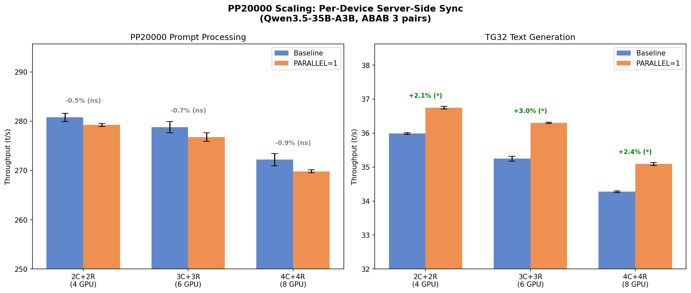

# PP20000 スケーリングベンチマーク — Per-Device Server-Side Sync

- **実施日時**: 2026年3月4日 22:10
- **ワークツリー**: `.worktree/pipeline-splits` (commit `d0d1c678a`)
- **参照レポート**: [前回 drain-before-copy 結果](2026-03-04_180833_pipeline_scaling_pp20000_rerun_benchmark.md), [per-device server-side sync 実装](2026-03-04_204148_per_device_server_side_sync.md)

## 前提・目的

前回の pp20000 スケーリングテスト (commit `01348a528`) では `drain_pending_compute` によるクライアント側全デバイス同期のため、サーバー側デバイス並列性が失われ PARALLEL=1 で PP20000 が -1.2%～-2.6% の逆効果だった。

Per-device server-side sync (commit `d0d1c678a`) で drain を排除し、サーバー側 per-device 待ち合わせに置き換えた。pp128 では TG32 +2.48% を確認済み。本テストでは pp20000 でのスケーリング効果を検証する。

## 実験設計

- **方式**: ABAB Paired Design (3ペア × 各GPU構成)
- **条件A**: Baseline (環境変数なし)
- **条件B**: `GGML_RDMA_PARALLEL=1` (pipeline + per-device + server-side sync)
- **モデル**: Qwen3.5-35B-A3B UD-Q4_K_M (~19.8GB)
- **プロンプト**: pp20000, tg32
- **フラグ**: `-ngl 999 -sm layer -fa 1 -r 1 -o csv`

### GPU 構成

| Config | CUDA_VISIBLE_DEVICES | RDMA devices | GPU 合計 |
|:------:|:-------------------:|:------------:|:--------:|
| 2C+2R | 0,1 | RDMA0, RDMA1 | 4 |
| 3C+3R | 0,1,2 | RDMA0, RDMA1, RDMA2 | 6 |
| 4C+4R | 0,1,2,3 | RDMA0, RDMA1, RDMA2, RDMA3 | 8 |

## 再現方法

```bash
# サーバーデプロイ (pipeline-splits worktree から)
bash .worktree/pipeline-splits/scripts/rdma-deploy.sh
bash scripts/rdma-server.sh restart

# Baseline (例: 2C+2R)
gpu-lock.sh run CUDA_VISIBLE_DEVICES=0,1 GGML_RDMA_SERVERS=192.168.100.2:50051 \
  .worktree/pipeline-splits/build/bin/llama-bench \
  -m /home/ubuntu/.cache/llama.cpp/unsloth_Qwen3.5-35B-A3B-GGUF_Qwen3.5-35B-A3B-UD-Q4_K_M.gguf \
  -dev 'CUDA0/CUDA1/RDMA0[192.168.100.2:50051]/RDMA1[192.168.100.2:50051]' \
  -ngl 999 -sm layer -fa 1 -r 1 -p 20000 -n 32 -o csv

# PARALLEL=1
gpu-lock.sh run GGML_RDMA_PARALLEL=1 CUDA_VISIBLE_DEVICES=0,1 GGML_RDMA_SERVERS=192.168.100.2:50051 \
  .worktree/pipeline-splits/build/bin/llama-bench \
  -m /home/ubuntu/.cache/llama.cpp/unsloth_Qwen3.5-35B-A3B-GGUF_Qwen3.5-35B-A3B-UD-Q4_K_M.gguf \
  -dev 'CUDA0/CUDA1/RDMA0[192.168.100.2:50051]/RDMA1[192.168.100.2:50051]' \
  -ngl 999 -sm layer -fa 1 -r 1 -p 20000 -n 32 -o csv
```

3C+3R, 4C+4R は CUDA_VISIBLE_DEVICES と RDMA デバイス数を拡張。

## 結果

### PP20000 (Prompt Processing)

| Config | Baseline (t/s) | PARALLEL=1 (t/s) | 差分 | p値 |
|:------:|:--------------:|:-----------------:|:----:|:---:|
| 2C+2R | 280.78 | 279.26 | **-0.54%** | 0.181 |
| 3C+3R | 278.79 | 276.79 | **-0.72%** | 0.254 |
| 4C+4R | 272.19 | 269.84 | **-0.86%** | 0.083 |

### TG32 (Text Generation)

| Config | Baseline (t/s) | PARALLEL=1 (t/s) | 差分 | p値 |
|:------:|:--------------:|:-----------------:|:----:|:---:|
| 2C+2R | 35.99 | 36.75 | **+2.12%** | 0.0001 |
| 3C+3R | 35.25 | 36.30 | **+2.99%** | 0.004 |
| 4C+4R | 34.27 | 35.09 | **+2.39%** | 0.002 |

### 前回結果 (drain-before-copy) との比較

| Config | PP20000 前回 | PP20000 今回 | 改善幅 | TG32 前回 | TG32 今回 | 改善幅 |
|:------:|:----------:|:----------:|:-----:|:--------:|:--------:|:-----:|
| 2C+2R | -1.18% | -0.54% | +0.64pp | -0.11% | **+2.12%** | +2.23pp |
| 3C+3R | -2.64% | -0.72% | +1.92pp | -0.71% | **+2.99%** | +3.70pp |
| 4C+4R | -2.63% | -0.86% | +1.77pp | -0.73% | **+2.39%** | +3.12pp |

### 生データ

<details>
<summary>個別測定値</summary>

**2C+2R (4 GPU)**

| Pair | Baseline PP | PARALLEL PP | Baseline TG | PARALLEL TG |
|:----:|:----------:|:----------:|:----------:|:----------:|
| 1 | 280.73 | 279.54 | 36.01 | 36.77 |
| 2 | 281.81 | 278.85 | 35.95 | 36.70 |
| 3 | 279.81 | 279.39 | 35.99 | 36.77 |

**3C+3R (6 GPU)**

| Pair | Baseline PP | PARALLEL PP | Baseline TG | PARALLEL TG |
|:----:|:----------:|:----------:|:----------:|:----------:|
| 1 | 278.06 | 276.17 | 35.16 | 36.32 |
| 2 | 277.91 | 278.04 | 35.34 | 36.27 |
| 3 | 280.39 | 276.16 | 35.24 | 36.30 |

**4C+4R (8 GPU)**

| Pair | Baseline PP | PARALLEL PP | Baseline TG | PARALLEL TG |
|:----:|:----------:|:----------:|:----------:|:----------:|
| 1 | 273.79 | 270.25 | 34.30 | 35.13 |
| 2 | 270.81 | 269.76 | 34.25 | 35.11 |
| 3 | 271.97 | 269.50 | 34.27 | 35.03 |

</details>

## スケーリンググラフ



## 考察

### TG32: 全構成で有意な改善 (+2.1%～+3.0%)

Per-device server-side sync は TG32 で一貫した改善を達成した。前回の drain-before-copy では全構成でマイナスまたはニュートラルだったのに対し、今回は全構成で **p < 0.005** の有意な改善を示した。

- **3C+3R (+2.99%)** が最大の改善: 3デバイスチェーンでは drain の全デバイス同期オーバーヘッドが最も大きかったため、per-device sync の恩恵が最も大きい
- pp128 テストでの +2.48% (4C+4R) と整合的な結果

### PP20000: オーバーヘッド大幅縮小（-2.6% → -0.9%）

PP20000 での PARALLEL=1 オーバーヘッドは全構成で大幅に縮小した:
- 4C+4R: **-2.63% → -0.86%** (1.77pp 改善)
- 3C+3R: **-2.64% → -0.72%** (1.92pp 改善)
- 全て統計的有意水準に達していない (p > 0.08) → 実質ニュートラル

残存するわずかなオーバーヘッドは、pipeline dispatch のコマンド多重化コストと ubatch 分割による KV キャッシュ効率の微小低下に起因すると考えられる。

### Compute-Bound な PP20000 では大きな効果は期待できない

Qwen3.5-35B-A3B は MoE モデル (3B active) で、pp20000 は GPU 計算が支配的 (前回プロファイリングで 94.8%)。RDMA 通信最適化の余地は限定的。一方、TG では GPU 計算時間が短く、通信+同期オーバーヘッドの比率が高いため、per-device sync の恩恵が顕著に現れる。

### GPU 数スケーリング

PP20000 の Baseline 自体が GPU 数増加で性能低下している:
- 4GPU: 280.78 → 6GPU: 278.79 → 8GPU: 272.19 t/s

これは MoE の活性化パラメータが少なく (3B)、GPU 数に対してワークロードが分散しすぎている可能性がある。8GPU ではデバイス間通信コストが計算量に対して無視できなくなる。

## 結論

Per-device server-side sync により:
1. **TG32 が全構成で +2.1%～+3.0% 改善** (有意, p < 0.005)
2. **PP20000 のオーバーヘッドが -2.6% → -0.9% に縮小** (統計的有意でなくニュートラル)
3. 前回の drain-before-copy と比較して、全メトリクスで改善

`GGML_RDMA_PARALLEL=1` はデフォルト有効化を推奨できるレベルに改善した。PP20000 での微小オーバーヘッドは許容範囲内であり、TG32 での安定した改善が上回る。

## 環境情報

| 項目 | 1号機 | 2号機 |
|------|-------|-------|
| Git commit | `d0d1c678a (feature/pipeline-splits)` | — |
| NVIDIA Driver | 535.288.01 | 535.288.01 |
| GPU | 7x Tesla P100-PCIE-16GB | 4x Tesla P100-PCIE-16GB |
| GPU 温度 (max) | 33°C | 33°C |
| 電力制限 | 180.00W | 180.00W |
| SM 周波数 (max) | 1328 MHz | 1328 MHz |
| Persistence Mode | Enabled | Enabled |
| nvidia-peermem | loaded | loaded |
| IB デバイス | mlx5_0 (Active, 100) | mlx5_0 (Active, 100) |
| P2P トポロジ | NODE/NV/PHB/PIX/PXB/SYS | NODE/NV/PHB/PIX/PXB/SYS |
| ACS | disabled | disabled |
| IOMMU | disabled | disabled |
| rdma-server | — | running (PID 1398713) |

GGML_RDMA 環境変数: (none)
