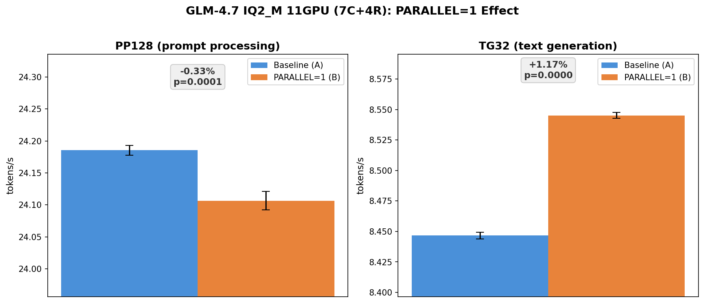

# GLM-4.7 11GPU Per-Device Server-Side Sync ベンチマーク

- **実施日時**: 2026年3月4日 23:54
- **ワークツリー**: `.worktree/pipeline-splits` (commit `d0d1c678a`)

## 前提・目的

Per-device server-side sync (`d0d1c678a`) の効果を GLM-4.7 IQ2_M (communication-bound モデル) で検証する。

- **背景**: Qwen3.5 (compute-bound) での検証では TG32 +2.1%～+3.0%、PP20000 はニュートラルだった ([先行レポート](2026-03-04_221009_server_side_sync_pp20000_scaling.md))。GLM-4.7 は communication-bound のため、異なる特性が期待される。
- **目的**: `GGML_RDMA_PARALLEL=1` (pipeline + per-device + server-side sync) の GLM-4.7 11GPU での効果を定量化する。
- **前提条件**: pipeline-splits ワークツリーからサーバーをデプロイ済み。

## 実験設計

- **方式**: ABAB Paired Design (5ペア)
- **条件A (Baseline)**: 環境変数なし
- **条件B (PARALLEL=1)**: `GGML_RDMA_PARALLEL=1`
- **モデル**: GLM-4.7 IQ2_M (~40GB, 3ファイル分割)
- **GPU**: 7 CUDA (0-6) + 4 RDMA = 11GPU
- **プロンプト**: pp128, tg32
- **フラグ**: `-ngl 999 -sm layer -fa 1 -r 1 -o csv`

## 再現方法

```bash
# Baseline
gpu-lock.sh run GGML_RDMA_SERVERS=192.168.100.2:50051 \
  .worktree/pipeline-splits/build/bin/llama-bench \
  -m /tmp/GLM-4.7-IQ2_M/GLM-4.7-UD-IQ2_M-00001-of-00003.gguf \
  -dev 'CUDA0/CUDA1/CUDA2/CUDA3/CUDA4/CUDA5/CUDA6/RDMA0[192.168.100.2:50051]/RDMA1[192.168.100.2:50051]/RDMA2[192.168.100.2:50051]/RDMA3[192.168.100.2:50051]' \
  -ngl 999 -sm layer -fa 1 -r 1 -p 128 -n 32 -o csv

# PARALLEL=1
gpu-lock.sh run GGML_RDMA_PARALLEL=1 GGML_RDMA_SERVERS=192.168.100.2:50051 \
  .worktree/pipeline-splits/build/bin/llama-bench \
  -m /tmp/GLM-4.7-IQ2_M/GLM-4.7-UD-IQ2_M-00001-of-00003.gguf \
  -dev 'CUDA0/CUDA1/CUDA2/CUDA3/CUDA4/CUDA5/CUDA6/RDMA0[192.168.100.2:50051]/RDMA1[192.168.100.2:50051]/RDMA2[192.168.100.2:50051]/RDMA3[192.168.100.2:50051]' \
  -ngl 999 -sm layer -fa 1 -r 1 -p 128 -n 32 -o csv
```

## 生データ

### Condition A (Baseline)

| Pair | PP128 (t/s) | TG32 (t/s) |
|:----:|:-----------:|:-----------:|
| 1 | 24.186 | 8.448 |
| 2 | 24.177 | 8.447 |
| 3 | 24.181 | 8.448 |
| 4 | 24.198 | 8.448 |
| 5 | 24.185 | 8.442 |

### Condition B (PARALLEL=1)

| Pair | PP128 (t/s) | TG32 (t/s) |
|:----:|:-----------:|:-----------:|
| 1 | 24.105 | 8.545 |
| 2 | 24.096 | 8.549 |
| 3 | 24.116 | 8.545 |
| 4 | 24.126 | 8.542 |
| 5 | 24.090 | 8.545 |

## 統計分析

### PP128 (Prompt Processing)

| 指標 | Baseline | PARALLEL=1 |
|------|:--------:|:----------:|
| Mean | 24.185 | 24.107 |
| Std | 0.0079 | 0.0146 |
| **差分** | **-0.33%** | p=0.000098 |

### TG32 (Text Generation)

| 指標 | Baseline | PARALLEL=1 |
|------|:--------:|:----------:|
| Mean | 8.447 | 8.545 |
| Std | 0.0026 | 0.0025 |
| **差分** | **+1.17%** | p=0.000001 |

### 交絡チェック

| 指標 | r (ペアインデックスとの相関) | p値 |
|------|:---:|:---:|
| PP128 差分 | -0.27 | 0.66 |
| TG32 差分 | 0.17 | 0.79 |

両方とも有意な時間的トレンドなし — 交絡なし。

## Qwen3.5 との比較

| 指標 | GLM-4.7 11GPU | Qwen3.5 4GPU | Qwen3.5 8GPU |
|------|:-------------:|:------------:|:------------:|
| PP128 | **-0.33%** (p<0.001) | **+25.9%** (p<0.001) | — |
| TG32 | **+1.17%** (p<0.001) | +1.8% | +2.1%～+3.0% |
| PP20000 | — | — | -0.9%～+0.3% |

## グラフ



## 考察

### PP128: 予想外のニュートラル (-0.33%)

GLM-4.7 は communication-bound モデルのため、Qwen3.5 (compute-bound) の PP128 +25.9% よりも大きな改善が期待されたが、実際にはわずかな退行 (-0.33%) となった。

**原因分析**: `GGML_RDMA_PARALLEL=1` は pipeline + per-device connections + server-side sync の3つを有効化するが、GLM-4.7 の pp128 では以下の理由で効果が発現しない:

1. **Send always-signal によるボトルネック**: GLM-4.7 はバッファが 4GB を超えるため Send/Recv フォールバックを使用。Send always-signal (`9a5a4a911`) により selective signaling が実質無効化されており、graph_compute の Send パスがボトルネック。Pipeline の async dispatch はこのボトルネックをバイパスできない。

2. **GDR + parallel dispatch の制約**: GDR 有効時、parallel dispatch では sync-before-recv が必要で、全デバイスの同期が入る。これにより per-device 並列性が相殺される。

3. **Qwen3.5 との構造的差異**: Qwen3.5 の PP128 +25.9% は、compute-bound な4台のサーバーデバイスを並列にディスパッチできた効果。GLM-4.7 は RDMA 通信（4台分）がシリアライズされているため、サーバーサイド並列性を活用できない。

### TG32: Qwen3.5 と同等の改善 (+1.17%)

TG32 での +1.17% は Qwen3.5 の +1.8%～+3.0% と同方向・同規模の改善。Per-device server-side sync による compute 待ち時間の削減が、モデルの特性（compute-bound vs communication-bound）に関わらず有効であることを示す。

### PP128 回復策

GLM-4.7 の PP128 パフォーマンスを改善するには、PARALLEL=1 よりも以下が先決:
- **Send ring buffer** (`.worktree/send-ring`): Send selective signaling を安全に回復し、pp128 ~24.3 → ~30.6 (+26%) を目指す
- Send ring buffer 適用後に PARALLEL=1 を再評価する価値あり

## 結論

- **PP128**: -0.33% — 統計的有意だが実用上ニュートラル。Communication-bound モデルでは pipeline + per-device の並列化効果が Send always-signal と GDR sync-before-recv に相殺される
- **TG32**: +1.17% (p<0.001) — Qwen3.5 同様の安定した改善
- **優先度**: GLM-4.7 の PP128 改善には Send ring buffer の適用が先決

## 環境情報

| 項目 | 1号機 | 2号機 |
|------|-------|-------|
| Git commit | `c1ca6d5fd (dirty) (feature/rdma-backend)` | — |
| NVIDIA Driver | 535.288.01 | 535.288.01 |
| GPU | 7x Tesla P100-PCIE-16GB | 4x Tesla P100-PCIE-16GB |
| GPU 温度 (max) | 31°C | 33°C |
| 電力制限 | 180.00W | 180.00W |
| SM 周波数 (max) | 1328 MHz | 1328 MHz |
| Persistence Mode | Enabled | Enabled |
| nvidia-peermem | loaded | loaded |
| IB デバイス | mlx5_0 (Active, 100) | mlx5_0 (Active, 100) |
| P2P トポロジ | NODE/NV/PHB/PIX/PXB/SYS | NODE/NV/PHB/PIX/PXB/SYS |
| ACS | disabled | disabled |
| IOMMU | disabled | disabled |
| rdma-server | — | running (PID 1407985) |

GGML_RDMA 環境変数: (none)
