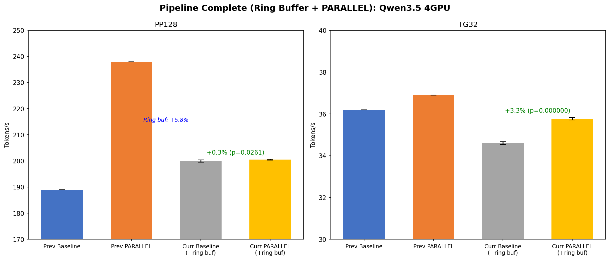

# Pipeline Complete (Ring Buffer + PARALLEL) Qwen3.5 ベンチマーク

- **実施日時**: 2026年3月5日 01:14
- **ワークツリー**: `.worktree/pipeline-complete` (commit `34542217f`)

## 前提・目的

Send ring buffer (`32dbffe78`) と pipeline-splits (`d0d1c678a`) を統合した `pipeline-complete` ブランチで、Qwen3.5 4GPU での combined effect を検証する。

- **背景**:
  - Ring buffer 単体 (Qwen3.5): pp128 ニュートラル ([先行レポート](2026-03-04_004316_send_ring_buffer_benchmark.md))
  - PARALLEL=1 単体 (Qwen3.5, ring buffer なし): pp128 +25.9% ([先行レポート](2026-03-03_145744_pipeline_perdevice_combined_benchmark.md))
- **目的**: Ring buffer + PARALLEL=1 の combined effect を定量化
- **注意**: テスト中 `llama-server` (PID 2024548) が CUDA0-2 で稼働中 (ベンチマークは CUDA4,5 使用)

## 実験設計

- **方式**: ABAB Paired Design (5ペア)
- **条件A (Baseline)**: 環境変数なし (ring buffer はコンパイル済みのため常時有効)
- **条件B (PARALLEL=1)**: `GGML_RDMA_PARALLEL=1`
- **モデル**: Qwen3.5-35B-A3B UD-Q4_K_M (~19GB)
- **GPU**: CUDA4,5 (Node 1) + RDMA0,1 (Node 2) = 4GPU
- **フラグ**: `-ngl 999 -sm layer -fa 1 -r 1 -o csv`

## 再現方法

```bash
# Baseline (ring buffer のみ)
gpu-lock.sh run CUDA_VISIBLE_DEVICES=4,5 GGML_RDMA_SERVERS=192.168.100.2:50051 \
  .worktree/pipeline-complete/build/bin/llama-bench \
  -m ~/.cache/llama.cpp/unsloth_Qwen3.5-35B-A3B-GGUF_Qwen3.5-35B-A3B-UD-Q4_K_M.gguf \
  -dev 'CUDA0/CUDA1/RDMA0[192.168.100.2:50051]/RDMA1[192.168.100.2:50051]' \
  -ngl 999 -sm layer -fa 1 -r 1 -p 128 -n 32 -o csv

# PARALLEL=1
gpu-lock.sh run GGML_RDMA_PARALLEL=1 CUDA_VISIBLE_DEVICES=4,5 GGML_RDMA_SERVERS=192.168.100.2:50051 \
  .worktree/pipeline-complete/build/bin/llama-bench \
  -m ~/.cache/llama.cpp/unsloth_Qwen3.5-35B-A3B-GGUF_Qwen3.5-35B-A3B-UD-Q4_K_M.gguf \
  -dev 'CUDA0/CUDA1/RDMA0[192.168.100.2:50051]/RDMA1[192.168.100.2:50051]' \
  -ngl 999 -sm layer -fa 1 -r 1 -p 128 -n 32 -o csv
```

## 生データ

### Condition A (Baseline, ring buffer のみ)

| Pair | PP128 (t/s) | TG32 (t/s) |
|:----:|:-----------:|:-----------:|
| 1 | 200.39 | 34.50 |
| 2 | 199.87 | 34.60 |
| 3 | 200.10 | 34.66 |
| 4 | 199.19 | 34.62 |
| 5 | 200.05 | 34.66 |

### Condition B (PARALLEL=1)

| Pair | PP128 (t/s) | TG32 (t/s) |
|:----:|:-----------:|:-----------:|
| 1 | 200.83 | 35.66 |
| 2 | 200.38 | 35.75 |
| 3 | 200.44 | 35.80 |
| 4 | 200.46 | 35.80 |
| 5 | 200.45 | 35.82 |

## 統計分析

### PP128

| 指標 | Baseline | PARALLEL=1 |
|------|:--------:|:----------:|
| Mean | 199.92 | 200.51 |
| Std | 0.449 | 0.181 |
| **差分** | **+0.30%** | p=0.026 |

### TG32

| 指標 | Baseline | PARALLEL=1 |
|------|:--------:|:----------:|
| Mean | 34.61 | 35.77 |
| Std | 0.066 | 0.065 |
| **差分** | **+3.35%** | p<0.001 |

### 交絡チェック

| 指標 | r | p値 |
|------|:---:|:---:|
| PP128 | 0.28 | 0.65 |
| TG32 | 0.32 | 0.60 |

交絡なし。

## 先行結果との比較

| 指標 | 前回 Baseline (always-signal) | 前回 PARALLEL=1 | 今回 Baseline (ring buf) | 今回 PARALLEL=1 |
|------|:---:|:---:|:---:|:---:|
| PP128 | 189.0 | 237.9 (+25.9%) | **199.9** (+5.8%) | **200.5** (+0.3%) |
| TG32 | 36.2 | 36.9 (+1.8%) | **34.6** (-4.4%) | **35.8** (+3.4%) |

## グラフ



## 考察

### PP128: Ring buffer が PARALLEL=1 の効果を吸収

前回の PARALLEL=1 による PP128 +25.9% (189→238 t/s) は、Send always-signal のオーバーヘッドをパイプラインで隠蔽していた効果。Ring buffer が Send selective signaling を回復したことで:

1. **Baseline が 189→200 (+5.8%) に改善**: Send CQ ポーリング削減の直接効果
2. **PARALLEL=1 の追加効果が +0.3% に縮小**: パイプラインで隠蔽すべき Send レイテンシが減少

Ring buffer 適用後の PP128 は ~200 t/s で、PARALLEL=1 の有無に関わらずほぼ同じ。一方、前回の PARALLEL=1 は 238 t/s に達していた。**Ring buffer は PP128 を 5.8% 改善するが、PARALLEL=1 の 25.9% には及ばない。**

### PP128 絶対値の差 (200 vs 238)

Ring buffer baseline (200 t/s) vs 前回 PARALLEL=1 (238 t/s) には 19% の差がある。これは:

- PARALLEL=1 はサーバーサイド並列性 (2台の RDMA GPU が同時 compute) を活用
- Ring buffer は Send レイテンシのみを改善
- **PARALLEL=1 の真の効果はサーバーサイド並列性であり、Send signaling とは独立のはず**

200 t/s にとどまる原因の仮説:
1. **llama-server 干渉**: テスト中に CUDA0-2 で llama-server が稼働しており、PCIe/CPU/メモリバス帯域が減少。前回テストでは llama-server なし
2. **Server-side sync のオーバーヘッド**: commit `d0d1c678a` の per-device sync が Qwen3.5 pp128 に退行を与えている可能性

**検証が必要**: llama-server 停止後に再テストして、干渉の影響を切り分ける。

### TG32: PARALLEL=1 が安定して +3.35% 改善

TG32 での +3.35% は前回の +1.8% より大きい。Per-device server-side sync (`d0d1c678a`) の効果が加算されていると考えられる。

ただし TG32 baseline が 36.2→34.6 (-4.4%) に低下している点は、llama-server 干渉の可能性が高い。

## 結論

- **PP128**: Ring buffer baseline で +5.8% (189→200)。PARALLEL=1 は追加 +0.3% のみ
- **TG32**: PARALLEL=1 で +3.35% (p<0.001)。ただし baseline 自体が前回より低下
- **要追加検証**: llama-server 干渉の切り分けが必要。PARALLEL=1 の絶対値が前回 238→今回 200 と大きく低下しており、干渉が原因か server-side sync の退行かを特定する必要がある

## 環境情報

| 項目 | 1号機 | 2号機 |
|------|-------|-------|
| Git commit | `c1ca6d5fd (dirty) (feature/rdma-backend)` | — |
| NVIDIA Driver | 535.288.01 | 535.288.01 |
| GPU | 7x Tesla P100-PCIE-16GB | 4x Tesla P100-PCIE-16GB |
| GPU 温度 (max) | 33°C | 32°C |
| 電力制限 | 180.00W | 180.00W |
| SM 周波数 (max) | 1328 MHz | 1328 MHz |
| Persistence Mode | Enabled | Enabled |
| nvidia-peermem | loaded | loaded |
| IB デバイス | mlx5_0 (Active, 100) | mlx5_0 (Active, 100) |
| P2P トポロジ | NODE/NV/PHB/PIX/PXB/SYS | NODE/NV/PHB/PIX/PXB/SYS |
| ACS | disabled | disabled |
| IOMMU | disabled | disabled |
| rdma-server | — | running (PID 1416310) |

GGML_RDMA 環境変数: (none)

**注意**: テスト中 `llama-server` (PID 2024548) が CUDA0-2 で稼働中。ベンチマークは CUDA4,5 を使用したが、PCIe/CPU リソース共有による干渉の可能性あり。
