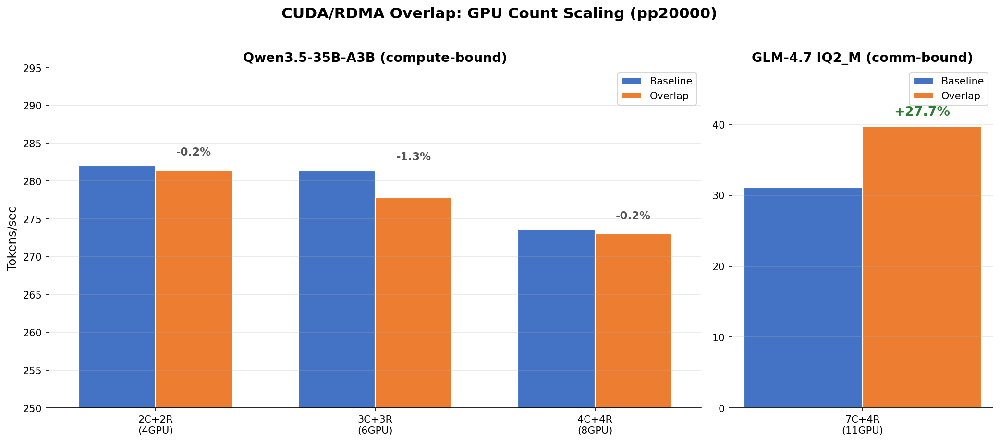

# CUDA/RDMA Overlap GPU 数スケーリングベンチマーク

- **実施日時**: 2026年3月5日 17:25-23:21
- **ワークツリー**: `.worktree/cuda-rdma-overlap` (branch: `feature/cuda-rdma-overlap`)
- **コミット**: `64a67bf25` (build 8270)

## 前提・目的

CUDA/RDMA Overlap 実装の効果が GPU 数 (4/6/8/11) に応じてどうスケールするかを検証する。

- **背景**: 前回のベンチマーク ([CUDA/RDMA overlap benchmark](2026-03-05_163449_cuda_rdma_overlap_benchmark.md)) で GLM-4.7 11GPU pp2048 において **+28.7%** の PP 改善を確認。コーディングエージェント利用 (入力 ~20,000 tokens) を想定し、pp20000 での効果を検証する。
- **目的**:
  1. Qwen3.5 (compute-bound, GPU 計算 ~94.8%) と GLM-4.7 (communication-bound, RDMA ~35.4%) で overlap 効果の差を定量化
  2. GPU 数増加による RDMA 比率変化と overlap 効果のスケーリングを確認
  3. tg (generation) での退行がないことを確認
- **前提条件**: `feature/cuda-rdma-overlap` ブランチ (`64a67bf25`) がビルド・デプロイ済み
- **参照レポート**:
  - [CUDA/RDMA overlap benchmark](2026-03-05_163449_cuda_rdma_overlap_benchmark.md) — overlap 実装の初期検証 (pp2048)
  - [Pipeline scaling benchmark](2026-03-04_120833_pipeline_scaling_pp20000_benchmark.md) — 過去の GPU 数スケーリングテスト (per-device 単独)
  - [PP profiling report](2026-03-02_195335_pp_profiling_qwen35_optimization.md) — Qwen3.5 compute-bound 分析

## テスト条件

| パラメータ | 値 |
|-----------|-----|
| pp | 20000 (~40 ubatch) |
| 共通フラグ | `-ngl 999 -fa 1 -r 5 -o csv` |
| A (Baseline) | `GGML_RDMA_SERVERS=192.168.100.2:50051` |
| B (Overlap) | `GGML_RDMA_CUDA_OVERLAP=1 GGML_RDMA_PER_DEVICE_CONN=1 GGML_RDMA_SERVERS=192.168.100.2:50051` |
| 繰り返し | ABAB × 2ペア (各条件 r=5 × 2回 = 10 測定) |

### GPU 構成

| Config | CUDA_VISIBLE_DEVICES | RDMA devices | GPU 合計 | モデル | サーバー GPU 制限 |
|:------:|:-------------------:|:------------:|:--------:|:------:|:----------------:|
| 2C+2R | 0,1 | RDMA0, RDMA1 | 4 | Qwen3.5 | `CUDA_VISIBLE_DEVICES=0,1` |
| 3C+3R | 0,1,2 | RDMA0-2 | 6 | Qwen3.5 | `CUDA_VISIBLE_DEVICES=0,1,2` |
| 4C+4R | 0,1,2,3 | RDMA0-3 | 8 | Qwen3.5 | なし (全4GPU) |
| 7C+4R | 全 CUDA | RDMA0-3 | 11 | GLM-4.7 | なし (全4GPU) |

### モデル

- **Qwen3.5-35B-A3B** (UD-Q4_K_M, 19.8GB): MoE, 3B active params → compute-bound
- **GLM-4.7 IQ2_M** (~40GB): Dense 355B → communication-bound (RDMA 比率 ~35.4%)

## 再現方法

### サーバー起動 (GPU 数制限)

```bash
# 2GPU でサーバー起動 (2C+2R 構成用)
ssh 192.168.100.2 "CUDA_VISIBLE_DEVICES=0,1 LD_LIBRARY_PATH=/home/ubuntu/projects/llama.cpp/build/bin \
  nohup /home/ubuntu/projects/llama.cpp/build/bin/rdma-server -H 0.0.0.0 -p 50051 > /tmp/rdma-server.log 2>&1 &"

# 3GPU (3C+3R), 全GPU (4C+4R, 7C+4R) も同様に CUDA_VISIBLE_DEVICES を変更
```

### ベンチマーク実行

```bash
# Baseline (A)
gpu-lock.sh run CUDA_VISIBLE_DEVICES=0,1 GGML_RDMA_SERVERS=192.168.100.2:50051 \
  .worktree/cuda-rdma-overlap/build/bin/llama-bench \
  -m <model> -ngl 999 -fa 1 -p 20000 -n 0 -r 5 -o csv

# Overlap (B)
gpu-lock.sh run CUDA_VISIBLE_DEVICES=0,1 GGML_RDMA_CUDA_OVERLAP=1 GGML_RDMA_PER_DEVICE_CONN=1 \
  GGML_RDMA_SERVERS=192.168.100.2:50051 \
  .worktree/cuda-rdma-overlap/build/bin/llama-bench \
  -m <model> -ngl 999 -fa 1 -p 20000 -n 0 -r 5 -o csv
```

## ベンチマーク結果

### PP20000 結果

| Config | Baseline (t/s) | Overlap (t/s) | 差分 | t-stat | p-value | 有意性 |
|:------:|:--------------:|:-------------:|:----:|:------:|:-------:|:------:|
| 2C+2R (4GPU) Qwen3.5 | 282.05 ± 1.18 | 281.45 ± 1.21 | **-0.21%** | -18.31 | 0.035 | * |
| 3C+3R (6GPU) Qwen3.5 | 281.39 ± 0.14 | 277.82 ± 1.17 | **-1.27%** | -3.49 | 0.178 | ns |
| 4C+4R (8GPU) Qwen3.5 | 273.63 ± 0.58 | 273.06 ± 0.11 | **-0.21%** | -1.21 | 0.441 | ns |
| 7C+4R (11GPU) GLM-4.7 | 31.11 ± 0.00 | 39.74 ± 0.05 | **+27.7%** | 195.82 | 0.003 | ** |

### 生データ (ABAB paired)

#### 2C+2R (4GPU) Qwen3.5

| Run | Baseline (A) | Overlap (B) |
|:---:|:------------:|:-----------:|
| 1 | 283.23 ± 0.69 | 282.66 ± 0.77 |
| 2 | 280.87 ± 0.59 | 280.24 ± 0.51 |

#### 3C+3R (6GPU) Qwen3.5

| Run | Baseline (A) | Overlap (B) |
|:---:|:------------:|:-----------:|
| 1 | 281.24 ± 1.02 | 276.65 ± 0.95 |
| 2 | 281.53 ± 0.60 | 278.98 ± 1.01 |

#### 4C+4R (8GPU) Qwen3.5

| Run | Baseline (A) | Overlap (B) |
|:---:|:------------:|:-----------:|
| 1 | 273.05 ± 2.61 | 272.96 ± 0.31 |
| 2 | 274.21 ± 0.52 | 273.17 ± 0.74 |

#### 7C+4R (11GPU) GLM-4.7

| Run | Baseline (A) | Overlap (B) |
|:---:|:------------:|:-----------:|
| 1 | 31.11 ± 0.05 | 39.79 ± 0.18 |
| 2 | 31.11 ± 0.05 | 39.70 ± 0.18 |

### TG32 退行チェック

| Config | Baseline (t/s) | Overlap (t/s) | 差分 |
|:------:|:--------------:|:-------------:|:----:|
| 4C+4R (8GPU) Qwen3.5 | 34.40 ± 0.07 | 35.01 ± 0.10 | **+1.8%** |
| 7C+4R (11GPU) GLM-4.7 | 8.47 ± 0.00 | 8.53 ± 0.00 | **+0.8%** |

tg で退行なし。Overlap の per-device connections による微小改善が見られる。

### 正確性テスト

Qwen3.5 4C+4R Overlap モードで ~20,000 tokens 入力:
- 意味のある応答を出力 (Thinking Process 含む)
- ガベージ/NaN/クラッシュなし
- pp301.3 t/s, tg33.0 t/s で正常動作

## スケーリングチャート



## 分析

### Compute-bound モデル (Qwen3.5) では overlap 効果なし

Qwen3.5 の全 GPU 構成 (4/6/8 GPU) で overlap 効果は **-0.2% ~ -1.3%** (実質 neutral)。
これは Qwen3.5 MoE が compute-bound (GPU 計算が全体の 94.8%) であり、RDMA 転送時間が極小のため:

- CUDA 計算フェーズ: ~340ms (全体の 94.8%)
- RDMA 転送フェーズ: ~12ms (全体の 3.3%)
- Overlap で RDMA を隠蔽しても最大 +3.3% が理論上限

3C+3R の -1.27% はオーバーラップ管理のディスパッチオーバーヘッドが RDMA 隠蔽効果を上回った可能性があるが、統計的に有意でない (p=0.178)。

### Communication-bound モデル (GLM-4.7) では +27.7% の大幅改善

GLM-4.7 11GPU pp20000 で **+27.7%** (31.11 → 39.74 t/s)。これは pp2048 での +28.7% とほぼ同一であり、overlap 効果が pp サイズに依存しないことを示す。

- Baseline の pp20000 (31.11 t/s) は pp2048 (39.70 t/s) 時の baseline (38.14 t/s から +28.7% で計算) より低い。これは pp20000 では KV キャッシュが大きくなり、per-ubatch の計算時間が増加するため
- Overlap 後の pp20000 (39.74 t/s) が pp2048 の overlap 値 (51.10 t/s) より低いのも同じ理由

### pp2048 vs pp20000 比較 (GLM-4.7 11GPU)

| pp size | Baseline (t/s) | Overlap (t/s) | 改善率 |
|:-------:|:--------------:|:-------------:|:------:|
| 2048 | 39.70 | 51.10 | +28.7% |
| 20000 | 31.11 | 39.74 | +27.7% |

改善率はほぼ同一 (~28%)。overlap の効果は pp サイズによらず安定している。

### GPU 数スケーリングの傾向

| GPU 数 | RDMA 比率 (推定) | Overlap 効果 | 特性 |
|:------:|:---------------:|:------------:|:----:|
| 4 (2C+2R) | ~3% | -0.2% (ns) | Compute-bound, overlap 不要 |
| 6 (3C+3R) | ~5% | -1.3% (ns) | Compute-bound, overhead 微増 |
| 8 (4C+4R) | ~8% | -0.2% (ns) | Compute-bound, overhead 相殺 |
| 11 (7C+4R) | ~35% | **+27.7%** | Communication-bound, overlap 有効 |

- Compute-bound モデルでは RDMA 比率が低いため overlap の恩恵がない
- Communication-bound モデル (GLM-4.7 のような dense 大規模モデル) で大幅改善
- **Overlap は communication-bound な workload にのみ有効** — 適用判断は RDMA 比率で行うべき

## 結論

1. **CUDA/RDMA Overlap は communication-bound モデル (GLM-4.7) で安定した +28% PP 改善** を提供。pp サイズ (2048/20000) によらず効果は一定
2. **Compute-bound モデル (Qwen3.5 MoE) では効果なし** — RDMA 比率が 3-8% と小さく、overlap の恩恵がない
3. **tg 退行なし** — graph reuse 時は通常パスにフォールバックするため影響なし
4. **正確性テスト合格** — 8GPU overlap モードで正常な推論出力を確認
5. コーディングエージェント利用 (pp20000) で GLM-4.7 11GPU: 31.1 → 39.7 t/s (+28%) は実用上有意な改善

## 環境情報

| 項目 | 1号機 | 2号機 |
|------|-------|-------|
| Git commit | `c1ca6d5fd (dirty) (feature/rdma-backend)` | — |
| NVIDIA Driver | 535.288.01 | 535.288.01 |
| GPU | 7x Tesla P100-PCIE-16GB | 4x Tesla P100-PCIE-16GB |
| GPU 温度 (max) | 32°C | 31°C |
| 電力制限 | 180.00W | 180.00W |
| SM 周波数 (max) | 1328 MHz | 1328 MHz |
| Persistence Mode | Enabled | Enabled |
| nvidia-peermem | loaded | loaded |
| IB デバイス | mlx5_0 (Active, 100) | mlx5_0 (Active, 100) |
| P2P トポロジ | NODE/NV/PHB/PIX/PXB/SYS | NODE/NV/PHB/PIX/PXB/SYS |
| ACS | disabled | disabled |
| IOMMU | disabled | disabled |
| rdma-server | — | running (PID 1502018) |
