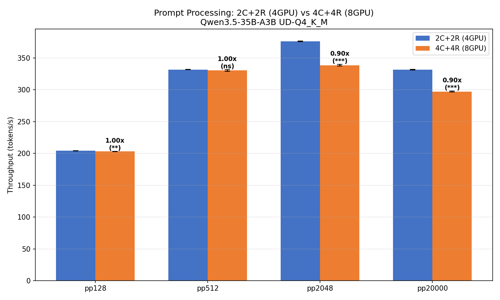
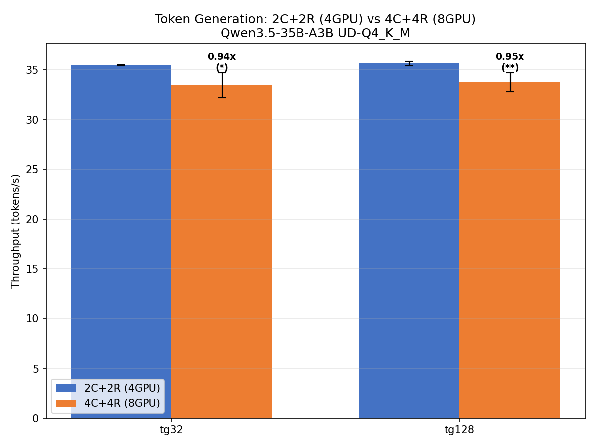
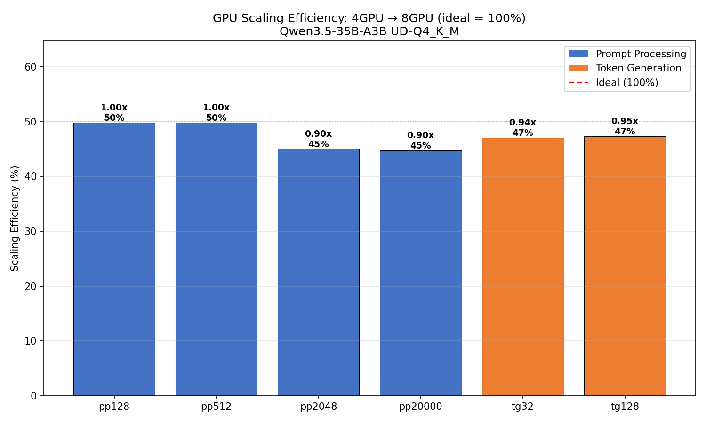

# Qwen3.5 MoE GPU スケーリング: 2C+2R (4GPU) vs 4C+4R (8GPU)

- **実施日時**: 2026年3月6日 20:52
- **ワークツリー**: `.worktree/qwen35-pp-opt` (branch: `feature/qwen35-pp-optimization`)

## 前提・目的

GPU 数を倍増 (4GPU → 8GPU) した場合の Qwen3.5 MoE モデルにおけるスケーリング効率を ABAB Paired Design で定量化する。

- **背景**: RDMA サーバーオーバーヘッド分析で 4C vs 2C+2R (同一 GPU 数) の比較は完了したが、4GPU → 8GPU の制御されたスケーリングデータが存在しなかった
- **目的**: GPU 倍増時の実スケーリング効率を制御された実験で測定
- **前提条件**: Node 2 で rdma-server が全 4 GPU で起動済み

### 参照レポート

- [RDMA サーバーオーバーヘッド分析](2026-03-06_091203_rdma_server_overhead_analysis.md) — 4C vs 2C+2R (同一 GPU 数) 比較

## 実験設計

### テスト条件

| 条件 | Node 1 CUDA | Node 2 RDMA | 合計 GPU |
|------|------------|-------------|---------|
| **A: 2C+2R** | CUDA4,5 | RDMA0,1 | 4 |
| **B: 4C+4R** | CUDA0,1,2,3 | RDMA0,1,2,3 | 8 |

- **モデル**: Qwen3.5-35B-A3B UD-Q4_K_M (MoE, 3B active / 35B total)
- **メトリクス**: pp128, pp512, pp2048, pp20000, tg32, tg128
- **ABAB × 5 pairs**, 各条件 repetitions=3
- **統計**: 対応あり t 検定
- **設定**: `-ngl 999 -sm layer -fa 1`

### 注意事項

- 条件 A と B で Node 1 の CUDA デバイスが異なる (4,5 vs 0,1,2,3)
- 条件 B は `-dev` フラグ不要 — RDMA_SERVERS が自動で 4 RDMA デバイスを検出
- 条件 A は `-dev` フラグ必須 — RDMA デバイスを 2 つに制限
- サーバーは全 4 GPU で起動したまま、クライアント側で制御

## 再現方法

1. RDMA サーバーが起動していることを確認
   ```bash
   bash scripts/rdma-server.sh status
   ```

2. ベンチマーク実行
   ```bash
   gpu-lock.sh run bash .worktree/qwen35-pp-opt/scripts/bench-2c2r-vs-4c4r.sh
   ```

3. 分析
   ```bash
   python3 /tmp/analyze-2c2r-vs-4c4r.py
   ```

## 結果

### サマリテーブル

| Metric | 2C+2R (4GPU) | 4C+4R (8GPU) | Δ% | Scale | Eff% | p-value | Sig |
|--------|:------------:|:------------:|:---:|:-----:|:----:|:-------:|:---:|
| pp128 | 204.17 | 203.26 | **-0.4%** | 1.00x | 49.8% | 0.0028 | ** |
| pp512 | 331.84 | 330.42 | **-0.4%** | 1.00x | 49.8% | 0.1569 | ns |
| pp2048 | 376.09 | 338.61 | **-10.0%** | 0.90x | 45.0% | <0.001 | *** |
| pp20000 | 331.90 | 297.25 | **-10.4%** | 0.90x | 44.8% | <0.001 | *** |
| tg32 | 35.49 | 33.44 | **-5.8%** | 0.94x | 47.1% | 0.0231 | * |
| tg128 | 35.64 | 33.73 | **-5.4%** | 0.95x | 47.3% | 0.0061 | ** |

*Scale = 8GPU / 4GPU, Eff% = Scale / 2.0 × 100% (理想 = 100%)*

### グラフ







### ペア別生データ

| Pair | pp128 A | pp128 B | pp2048 A | pp2048 B | tg32 A | tg32 B |
|:----:|:-------:|:-------:|:--------:|:--------:|:------:|:------:|
| 1 | 204.27 | 203.60 | 376.94 | 340.81 | 35.49 | 31.16 |
| 2 | 204.10 | 202.97 | 375.49 | 338.71 | 35.48 | 33.92 |
| 3 | 203.92 | 203.16 | 375.73 | 338.08 | 35.48 | 34.11 |
| 4 | 204.16 | 203.51 | 375.77 | 338.28 | 35.42 | 33.95 |
| 5 | 204.40 | 203.05 | 376.50 | 337.17 | 35.55 | 34.04 |

## 分析

### 主要な知見

1. **8GPU は 4GPU よりすべてのメトリクスで遅い** — GPU 倍増の効果はゼロまたは負
2. **PP スケーリングは pp サイズに依存**: pp128/512 はほぼ同等 (-0.4%)、pp2048/20000 は **-10%** の大幅劣化
3. **TG は一律 -5~6%** — RDMA コマンドラウンドトリップの増加が原因

### 原因分析

#### PP 劣化 (pp2048/pp20000 で -10%)

Qwen3.5 MoE (3B active) は**compute-bound** モデル。4GPU でも GPU 計算能力は十分で、8GPU に増やしても:

- **分割オーバーヘッドの増加**: 8 デバイス分の layer-split コーディネーション
- **PCIe 帯域競合の悪化**: Node 1 で CUDA0-3 の 4 デバイスが同一 PCIe スイッチ (PIX) を共有。先行実験 ([RDMA サーバーオーバーヘッド分析](2026-03-06_091203_rdma_server_overhead_analysis.md)) で 4C (CUDA3-6) が 2C+2R より pp2048 で -15.8% 劣ることを確認済み
- **RDMA 逐次処理のレイテンシ増加**: 4 RDMA デバイス (vs 2) の逐次 set_tensor/graph_compute が合計レイテンシを増大

pp128/512 で劣化が小さいのは、小バッチではデバイス間転送量が小さく、オーバーヘッドが相対的に無視できるため。

#### TG 劣化 (-5~6%)

TG は各デバイスが 1 トークンずつ逐次処理するため、GPU 数増加 = 逐次ステップ増加。MoE の TG ではほとんどのエキスパートが inactive で各デバイスの計算量はごくわずかだが、RDMA コマンドの固定レイテンシ (~1ms/device) が支配的。

### MoE モデルの GPU スケーリング特性

| アスペクト | 4GPU | 8GPU | 影響 |
|-----------|------|------|------|
| Active パラメータ | 3B | 3B | 変化なし |
| デバイス当たり計算量 | 十分少ない | さらに少ない | 改善余地なし |
| コーディネーションコスト | 低 | 高 (2倍) | 性能劣化 |
| RDMA ラウンドトリップ | 2回 | 4回 | TG 劣化 |

**MoE モデルでは GPU 数を増やしても性能は向上しない** — active パラメータが小さいため、GPU 追加はオーバーヘッドだけを増やす。これは dense モデル (GLM-4.7 等) とは対照的で、dense モデルではデバイス当たりの計算量が大きく GPU 追加の恩恵がある。

## 結論

- Qwen3.5 MoE (3B active / 35B total) は **4GPU が最適構成** — 8GPU にスケールしても性能は向上しない
- PP は pp サイズに応じて -0.4% ~ -10.4% 劣化、TG は一律 -5~6% 劣化
- MoE モデルの GPU スケーリングは active パラメータ量に制約される
- GPU 追加が有効なのは **dense モデル** (GLM-4.7) や、**active パラメータが大きい MoE** (Qwen3.5-122B-A10B 等) に限られる

## 環境情報

| 項目 | 1号機 | 2号機 |
|------|-------|-------|
| Git commit | `e7e7cabb7 (dirty) (feature/rdma-backend)` | — |
| NVIDIA Driver | 535.288.01 | 535.288.01 |
| GPU | 7x Tesla P100-PCIE-16GB | 4x Tesla P100-PCIE-16GB |
| GPU 温度 (max) | 32°C | 35°C |
| 電力制限 | 180.00W | 180.00W |
| SM 周波数 (max) | 1328 MHz | 1328 MHz |
| Persistence Mode | Enabled | Enabled |
| nvidia-peermem | loaded | loaded |
| IB デバイス | mlx5_0 (Active, 100) | mlx5_0 (Active, 100) |
| rdma-server | — | running (PID 1508539) |
