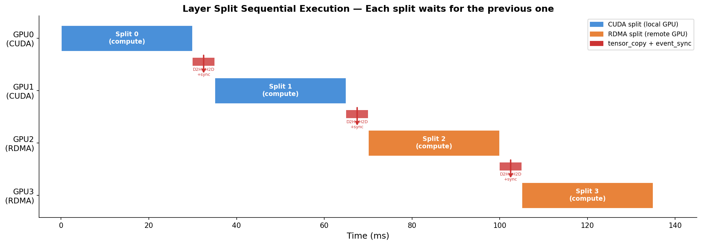
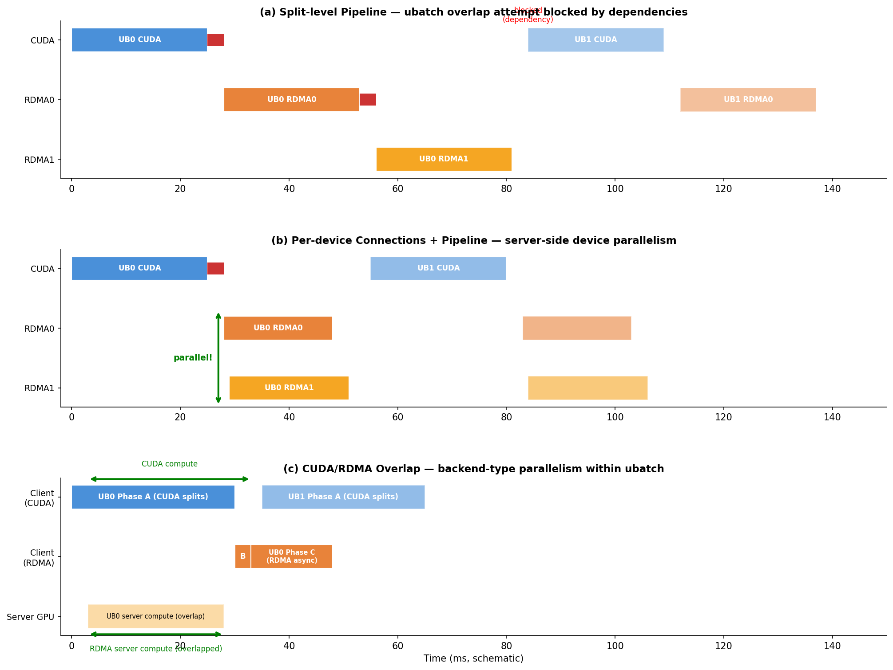
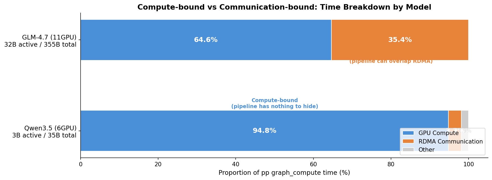
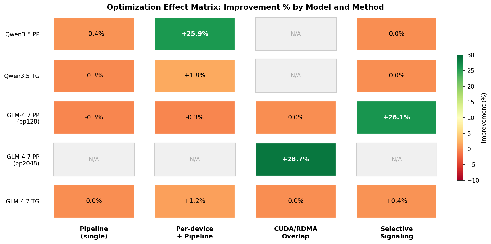

# パイプライン並列の仕組みと MoE モデルへの適用限界 — 技術解説

- **作成日時**: 2026年3月6日 23:50
- **ワークツリー**: N/A（分析レポート）

## 前提・目的

本プロジェクトでは、RDMA バックエンドのマルチ GPU 推論において、3 種類のパイプライン並列手法を実装・検証してきた。いずれも特定の条件下では大幅な性能改善を達成したが、MoE モデルでは期待した効果が得られないケースが多い。

本レポートでは、各手法の仕組みと効果の差が生じる原因を体系的に整理し、どの最適化がどのモデル・条件で有効かを明確にする。

### 参照レポート

- [Layer split シリアル化分析](2026-02-19_090721_ggml_backend_sched_bottleneck_analysis.md)
- [Qwen3.5 PP プロファイリング](2026-03-02_195335_pp_profiling_qwen35_optimization.md)
- [Per-device + Pipeline 結合効果](2026-03-03_145744_pipeline_perdevice_combined_benchmark.md)
- [CUDA/RDMA Overlap 実装・結果](2026-03-05_163449_cuda_rdma_overlap_benchmark.md)
- [RDMA サーバーオーバーヘッド分析](2026-03-06_091203_rdma_server_overhead_analysis.md)
- [2C2R vs 4C4R GPU スケーリング](2026-03-06_205212_2c2r_vs_4c4r_gpu_scaling.md)

---

## 1. パイプライン並列とは

### 一般概念

パイプライン並列は、CPU の命令パイプラインと同じ着想に基づく。一つの処理を複数のステージに分割し、ステージ間をオーバーラップさせることで、単位時間あたりのスループットを向上させる。

LLM の分散推論では、モデルをデバイスに分割する方法として主に 3 つのアプローチがある:

| 分割方式 | 概要 | 適用場面 |
|---------|------|---------|
| **データ並列** | 同じモデルを複数デバイスにコピーし、異なるバッチを処理 | 学習時。推論では通常不使用 |
| **テンソル並列** | 1 つのレイヤーの行列演算を複数デバイスで分割 | NVLink 等の高速インターコネクト必須 |
| **レイヤー並列 (パイプライン並列)** | モデルのレイヤーをデバイスに順番に割り当て | インターコネクトが遅い環境でも有効 |

本プロジェクトでは P100 (NVLink なし) を使用しているため、**レイヤー並列のみ**を採用している。テンソル並列 (row split) は全条件でレイヤー並列に劣ることを実測で確認済み。

本レポートで扱う「パイプライン並列」は、レイヤー並列の基盤の上で **通信と計算のオーバーラップ** を実現する 3 つの手法を指す。

---

## 2. llama.cpp のマルチ GPU 実行モデル

### Layer split の仕組み

llama.cpp はモデルの計算グラフ (ggml_cgraph) を `ggml_backend_sched_split_graph()` によってデバイスごとの **split** に分割する。各 split は 1 デバイスで実行される部分グラフであり、Layer 0-2 → GPU0、Layer 3-5 → GPU1 のようにレイヤー単位で割り当てられる。

### Split 間のデータ依存

Layer i の出力テンソルは Layer i+1 の入力となる。split 境界では以下の処理が発生する:

1. **tensor_copy**: 前のデバイスの出力を次のデバイスにコピー
2. **event_synchronize**: 前のデバイスの計算完了を待機

P100 (NVLink なし) では GPU 間の直接転送ができないため、tensor_copy は必ず **D2H (Device→Host) + H2D (Host→Device)** の 2 段階になる。

### 逐次実行ループ

`ggml_backend_sched_compute_splits()` は split を順番に実行する。前の split の計算が完了し、出力テンソルがコピーされるまで、次の split は開始できない。



この逐次性がマルチ GPU 推論の根本的なボトルネックであり、本プロジェクトのパイプライン手法はいずれもこの逐次性の緩和を目指している。

---

## 3. P100 固有の制約

### NVLink なし

Tesla P100 (PCIe 版) は NVLink を搭載していない。GPU 間のデータ転送は必ず CPU メモリを経由する:

```
GPU_A → PCIe → CPU Memory → PCIe → GPU_B
```

NVLink 搭載 GPU であれば `cudaMemcpyPeer` で直接転送 (150-300 GB/s) できるが、P100 では PCIe 3.0 x16 の片方向 ~12 GB/s が上限となる。

### PCIe 帯域共有

1号機の GPU 配置では、GPU3-6 が同一 PCIe スイッチ (PIX) 配下にある。4 GPU 全てが PIX の場合、大バッチの prompt 処理で帯域を奪い合い、スケーリング効率が低下する。

一方、2 ノード構成 (2C+2R) では Node 1 と Node 2 で独立したメモリサブシステムを使用するため、PCIe 競合が緩和される。実測で pp2048 が 4C (同一ノード) より 2C+2R (分散) で **+15.8%** 高速になったのはこの効果による。

### Row split vs Layer split 実測

7 GPU での比較 (gpt-oss-20b Q4_K_M):

| 分割方式 | pp512 (t/s) | tg (t/s) |
|---------|:-----------:|:--------:|
| Layer split | **+64%** | **+51%** |
| Row split | baseline | baseline |

Row split は GPU 数増加で性能が劣化 (負のスケーリング) するのに対し、Layer split は 99% のスケーリング効率を維持する。P100 環境では Layer split 一択である。

---

## 4. 本プロジェクトの 3 つのパイプライン手法



### 4.1 Split-level Pipeline (ubatch 単位の非同期ディスパッチ)

**仕組み**: 通常の逐次実行では、ubatch 0 の全 split が完了してから ubatch 1 のグラフ構築・実行が始まる。Split-level Pipeline は複数 ubatch のグラフを**事前構築**し、ubatch N の RDMA split 実行中に ubatch N+1 のディスパッチを開始する。

**実装上の課題**: `split_graph()` が内部の共有 `context_buffer` を上書きするため、事前構築した ubatch のテンソル構造体が破壊される。解決策として **per-copy context buffer** を導入し、各コピースロットに独立したバッファを持たせた。

**単体効果**:

| モデル | PP 変化 | TG 変化 |
|-------|:------:|:------:|
| Qwen3.5 4GPU | +0.4% | -0.3% |

実質ゼロ。Layer split のデータ依存チェーンにより、ubatch N の最終 split が完了するまで ubatch N+1 の最初の split は開始できない。`pipeline_wait` がブロッキングのタイミングを drain→send に移動するだけで、合計時間は不変。

### 4.2 Per-device Connections + Pipeline Combined

**仕組み**: RDMA デバイスごとに独立した QueuePair (QP) を持ち、サーバー側で複数デバイスの `graph_compute` を**並列実行**する。Pipeline と組み合わせることで、クライアントが複数デバイスへの命令を非同期にディスパッチし、サーバーが各デバイスのスレッドで同時に計算を進める。

**効果**:

| モデル | PP 変化 | TG 変化 |
|-------|:------:|:------:|
| Qwen3.5 4GPU | **+25.9%** | +1.8% |
| GLM-4.7 11GPU | -0.33% | +1.17% |

Qwen3.5 では劇的な改善だが、GLM-4.7 ではほぼ効果なし。この差の原因はセクション 5 で詳述する。

### 4.3 CUDA/RDMA Overlap (バックエンド種別オーバーラップ)

**仕組み**: 1 ubatch 内の split を 3 つのフェーズに分離する:

- **Phase A**: CUDA split のみ実行 (ローカル GPU 計算)
- **Phase B**: deferred writes のフラッシュ (RDMA バッファ転送)
- **Phase C**: RDMA split の非同期ディスパッチ (リモート GPU 計算開始)

Phase C のディスパッチ後、サーバー側でリモート GPU が計算している間に、次の ubatch の Phase A (CUDA 計算) を並行して実行する。

**効果**:

| 条件 | PP 変化 | 備考 |
|-----|:------:|------|
| GLM-4.7 pp2048 (4 ubatch) | **+28.7%** | CUDA 3366ms と RDMA 1846ms のオーバーラップ |
| GLM-4.7 pp128 (1 ubatch) | 0% | ubatch が 1 つのため overlap 不可 |
| GLM-4.7 pp128 -ub 64 (2 ubatch) | 0% | -ub 64 のオーバーヘッド (+17%) が利得を相殺 |
| GLM-4.7 tg32 | 0% | graph reuse により overlap 無効化 |

Overlap は `per-device connections` を前提とする。単一接続では Phase C が 662ms (サーバー FIFO がブロック) になるのに対し、per-device 接続では 20ms で完了する。

---

## 5. MoE モデルでパイプライン効果が出ない理由

### 5.1 Active パラメータ密度の違い

MoE (Mixture of Experts) モデルは、各トークンに対して全パラメータのうち一部の Expert のみを活性化する。モデルの「全体サイズ」と「実際に計算されるサイズ」が大きく異なる:

| モデル | 全体パラメータ | Active パラメータ | Active 比率 | GPU 数 | Active/GPU |
|-------|:----------:|:-----------:|:-------:|:-----:|:---------:|
| Qwen3.5 | 35B | **3B** | 8.6% | 4 | 0.75B |
| GLM-4.7 | 355B | **32B** | 9.0% | 11 | 2.9B |

Active/GPU が小さいほど各デバイスの計算時間が短くなり、通信コストの相対的な割合が大きくなる。ただし GLM-4.7 は全体サイズが大きいため、Active パラメータが多くても VRAM 容量の制約から多くの GPU が必要になり、結果的に通信量も増加する。

### 5.2 Compute-bound vs Communication-bound



プロファイリングの結果、2 つのモデルで時間内訳が大きく異なることが判明した:

**Qwen3.5 (6GPU)**: GPU compute が **94.8%**、RDMA 通信が 3.3%。サーバー側 GPU 計算が支配的で、通信は誤差の範囲。

**GLM-4.7 (11GPU)**: CUDA splits が 64.6%、RDMA splits が 35.4%。通信（RDMA コマンド往復 + サーバー計算待ち）が全体の 1/3 以上を占める。

パイプライン並列は本質的に **通信をオーバーラップで隠蔽する手法** である。Compute-bound なモデルでは隠蔽すべき通信がほとんどなく、パイプラインの効果が出ない。

では Per-device + Pipeline が Qwen3.5 で +25.9% を達成したのはなぜか? これはパイプラインによる通信隠蔽ではなく、**サーバー側デバイス並列化**による効果である。単一接続ではサーバーが複数デバイスの計算要求を逐次処理するが、per-device 接続では各デバイスのスレッドが同時に `graph_compute` を実行できる。Qwen3.5 は各デバイスの計算が軽い (0.75B active/GPU) ため、コマンド発行遅延の隠蔽効果が相対的に大きい。

### 5.3 Layer split のシリアル依存チェーン

Dense モデルでも MoE モデルでも、layer split は D0→D1→...→DN の**逐次依存チェーン**を作る。Layer i の出力がなければ Layer i+1 は計算を開始できない。

このシリアル依存は、パイプライン手法それぞれに異なる影響を与える:

- **Split-level Pipeline**: 「ubatch 間」のオーバーラップを狙うが、各 ubatch 内ではデバイスは逐次実行。前の ubatch の最終 split が完了しないと次の ubatch の最初の split も始まらない（出力テンソルが確定しないため）。結果として overlap の機会がない。

- **Per-device + Pipeline (Combined)**: ubatch 間ではなく、**1 ubatch 内のサーバー側デバイス並列化**が効果の源泉。Qwen3.5 で効いた理由は、MoE の sparse な計算が per-device 並列化の恩恵を受けやすいから — 各デバイスの計算が軽く (0.75B)、サーバー側の並列化でコマンド発行遅延 (数ms) を隠蔽できる。GLM-4.7 で効かない理由は、各デバイスの計算が重く (2.9B)、コマンド発行遅延が計算時間 (数百ms) に対して無視できるため。

- **CUDA/RDMA Overlap**: CUDA split と RDMA split という**異なるバックエンド種別間**のオーバーラップ。Layer 依存チェーンには影響されない。ただし複数 ubatch が必要（1 ubatch では overlap する相手がない）。

### 5.4 GPU スケーリング効率の限界

Qwen3.5 の 4GPU→8GPU スケーリング:

| メトリクス | 4GPU | 8GPU | スケーリング |
|----------|:----:|:----:|:---------:|
| pp128 (t/s) | 199.9 | 199.0 | -0.4% |
| tg32 (t/s) | 34.6 | 32.6 | -5.8% |

GPU を倍にしても性能が向上しない（むしろ低下）。MoE モデルの Active パラメータが少ないため:

1. **計算時間の短縮 < 通信オーバーヘッドの増加**: GPU 数を増やすと split 境界が増え、tensor_copy の回数が増加する。各 GPU の計算時間が元々短いため、通信コストの増分のほうが大きくなる。
2. **PCIe 帯域制約**: P100 の PCIe 3.0 帯域 (~12 GB/s) が GPU 数に比例して分割される。特に同一 PCIe スイッチ (PIX) 配下の GPU では競合が深刻。
3. **Active/GPU の下限**: 0.75B active/GPU (Qwen3.5 4GPU) の時点で各 GPU の計算は十分に軽い。これをさらに半分にしても計算時間短縮は僅かで、通信増加のほうが支配的。

---

## 6. 最適化の適用マトリクス



| 最適化手法 | Qwen3.5 PP | Qwen3.5 TG | GLM-4.7 PP (pp128) | GLM-4.7 PP (pp2048) | GLM-4.7 TG | 適用条件 |
|-----------|:---:|:---:|:---:|:---:|:---:|-----------|
| Pipeline 単体 | +0.4% | -0.3% | -0.33% | N/A | 0% | — (単体では効果なし) |
| Per-device + Pipeline | **+25.9%** | +1.8% | -0.33% | N/A | +1.17% | 軽量 compute/device |
| CUDA/RDMA Overlap | N/A | N/A | 0% | **+28.7%** | 0% | multi-ubatch + communication-bound |
| Selective Signaling | 0% | 0% | **+26.1%** | N/A | +0.4% | communication-bound |

**読み方**:
- 太字は統計的に有意かつ実用的な改善 (>5%)
- N/A は該当構成での測定なし
- 0% は測定済みだが有意差なし

---

## 7. 結論と示唆

### パイプライン並列の本質

パイプライン並列は**通信を計算でオーバーラップ隠蔽する手法**である。効果が出るかどうかは、モデル・GPU 構成・バッチサイズの組み合わせで決まる通信/計算比率に依存する。

### MoE モデルの特性

MoE モデルは Active パラメータが全体の 8-10% であるため、GPU あたりの計算量が Dense モデルに比べて極めて少ない。この特性により:

1. **Compute-bound になりやすい** (Qwen3.5): 通信比率が 3.3% と小さく、隠蔽する余地がない
2. **GPU スケーリングが効きにくい**: 計算時間短縮 < 通信増加で、GPU を増やしても性能が向上しない
3. **Per-device 並列化は有効** (Qwen3.5): コマンド発行遅延の相対的な影響が大きいため、サーバー側並列化で改善可能

### GLM-4.7 の位置づけ

GLM-4.7 は MoE (355B/32B active) だが、モデル全体が大きいため 11GPU 必要で、通信比率 35.4% と Communication-bound 寄りになる。このため:

- **Selective Signaling** (+26.1%) と **CUDA/RDMA Overlap** (+28.7%) が有効
- いずれも通信レイテンシの削減・隠蔽が改善の源泉

### 最適化選択の指針

1. **まずプロファイリングで通信/計算比率を測定する**
2. Compute-bound (通信 < 10%) → Per-device 並列化を検討
3. Communication-bound (通信 > 20%) → Selective Signaling + CUDA/RDMA Overlap を検討
4. Multi-ubatch (pp > ubatch size) → CUDA/RDMA Overlap が最も効果的
5. Single ubatch (pp ≤ ubatch size) → Overlap は適用不可。Selective Signaling に注力
6. GPU 追加は Active/GPU が十分小さい場合は逆効果 — 通信コスト増加を考慮すること
