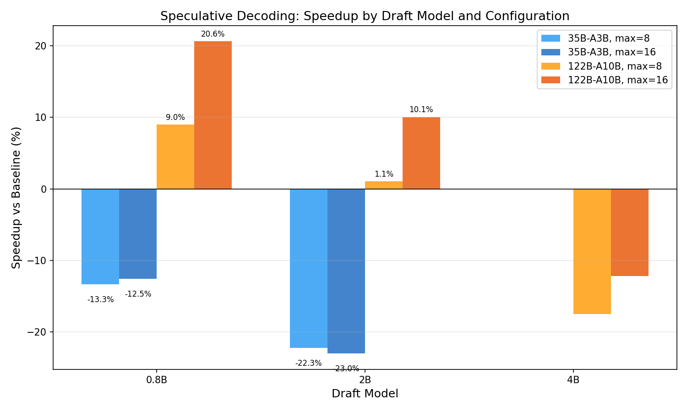
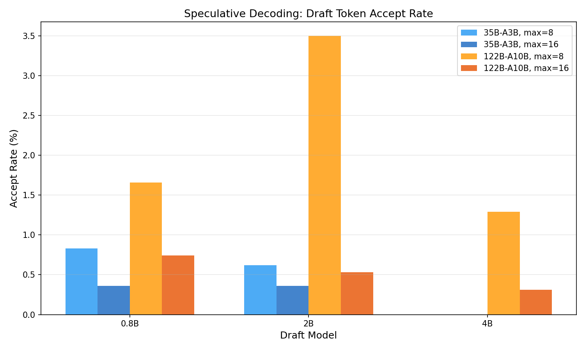
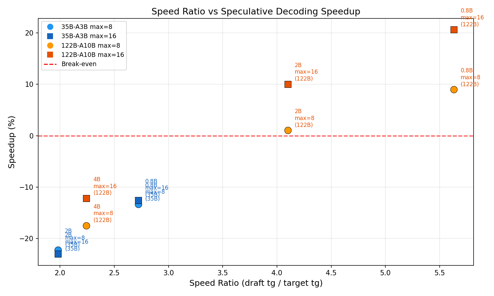

# Qwen3.5 スペキュラティブデコーディング ベンチマーク

- **実施日時**: 2026年3月7日 03:58
- **ワークツリー**: `feature/rdma-backend` (メインリポジトリ)
- **参照レポート**: [report/2026-02-12_160000_draft_speculative_decoding_test.md](2026-02-12_160000_draft_speculative_decoding_test.md)

## 前提・目的

Qwen3.5 MoE ファミリー内でスペキュラティブデコーディングの効果を検証する。

### 背景

前回実験 (2026-02-12) では GLM-4.7 (11GPU) + 異ファミリードラフト (Qwen2.5-0.5B, GLM-4-9B) で検証し、accept rate 52-60%、速度改善は微小 (+3.9%) またはマイナスという結果だった。

今回の改善点:
1. **同一ファミリー (Qwen3.5)** で accept rate の向上を期待
2. **ローカル GPU 構成** で分散通信オーバーヘッドを排除
3. **2 つのメインモデル** (35B-A3B: active 3B, 122B-A10B: active 10B) で MoE アクティブパラメータ数の影響を比較

### 成功基準

- ベースライン比 +5% 以上の tg 改善を示す構成の特定
- 有望構成は ABAB Paired Design + 対応あり t 検定で統計的有意性を確認

## モデル一覧

| モデル | タイプ | アクティブ | サイズ | 用途 |
|--------|--------|-----------|--------|------|
| Qwen3.5-122B-A10B Q4_K_M | MoE | 10B | 72GB (3ファイル) | メイン |
| Qwen3.5-35B-A3B Q4_K_M | MoE | 3B | 21GB | メイン / ドラフト候補 |
| Qwen3.5-9B Q4_K_M | Dense | 9B | 5.3GB | ドラフト候補 |
| Qwen3.5-4B Q4_K_M | Dense | 4B | 2.6GB | ドラフト候補 |
| Qwen3.5-2B Q4_K_M | Dense | 2B | 1.2GB | ドラフト候補 |
| Qwen3.5-0.8B Q4_K_M | Dense | 0.8B | 508MB | ドラフト候補 |

## GPU 構成

### 構成 A: 35B-A3B メインモデル (3GPU)
- メイン: CUDA4,5 (2GPU)
- ドラフト: CUDA6 (1GPU)
- `CUDA_VISIBLE_DEVICES=4,5,6 -dev CUDA0,CUDA1 -devd CUDA2`

### 構成 B: 122B-A10B メインモデル (7GPU 共有)
- メイン: CUDA0-6 (7GPU, 112GB)
- ドラフト: CUDA0 に共有配置 (残り VRAM に収まるモデルのみ)
- `CUDA_VISIBLE_DEVICES=0,1,2,3,4,5,6 -devd CUDA0`

## 再現方法

### ベースライン (llama-cli)
```bash
gpu-lock.sh run CUDA_VISIBLE_DEVICES=0,1,2,3,4,5,6 build/bin/llama-cli \
  -m <model_path> -ngl 999 -fa 1 -c 4096 -n 128 \
  -p "Write a detailed essay about the history of computing." \
  -s 42 --temp 0.0 --log-file /tmp/llama-cli.log
```

### スペキュラティブデコーディング (llama-speculative)
```bash
gpu-lock.sh run CUDA_VISIBLE_DEVICES=0,1,2,3,4,5,6 build/bin/llama-speculative \
  -m <main_model> -md <draft_model> \
  -ngl 999 -ngld 999 -fa 1 -c 4096 -n 128 \
  -devd CUDA0 --draft-max 16 --draft-p-min 0.75 \
  -p "Write a detailed essay about the history of computing." \
  -s 42 --temp 0.0 --log-file /tmp/llama-cli.log
```

## 結果

### Phase 0: ベースライン計測 (5回)

| モデル | GPU 数 | pp (t/s) | tg (t/s) | 備考 |
|--------|--------|----------|----------|------|
| Qwen3.5-35B-A3B | 2 (CUDA4,5) | 79.0 | 39.1 | 全 5 回で tg=39.1 (SD=0) |
| Qwen3.5-122B-A10B | 7 (CUDA0-6) | 38.5 | 18.9 | 全 5 回で tg=18.9 (SD=0) |

### Phase 1: ドラフトモデル単体速度 (1GPU, 3回)

| ドラフト | tg (t/s) | 速度比 vs 35B | 速度比 vs 122B |
|---------|----------|:------------:|:--------------:|
| 0.8B | 106.4 | 2.72x | 5.63x |
| 2B | 77.5 | 1.98x | 4.10x |
| 4B | 42.4 | 1.08x | 2.24x |
| 9B | 29.7 | 0.76x | 1.57x |
| 35B-A3B (2GPU) | 39.1 | N/A | 2.07x |

### Phase 2: スペキュラティブデコーディング スクリーニング (探索的比較)

#### 35B-A3B メインモデル (構成 A: 3GPU)

| # | ドラフト | draft-max | tg (t/s) | Accept% | Speedup |
|---|---------|:---------:|:--------:|:-------:|:-------:|
| 1 | 0.8B | 8 | 33.9 | 0.83% | **-13.3%** |
| 2 | 0.8B | 16 | 34.2 | 0.36% | **-12.5%** |
| 3 | 2B | 8 | 30.4 | 0.62% | **-22.3%** |
| 4 | 2B | 16 | 30.1 | 0.36% | **-23.0%** |

35B-A3B では全構成でスペキュラティブデコーディングがマイナス。

#### 122B-A10B メインモデル (構成 B: 7GPU 共有)

| # | ドラフト | draft-max | tg (t/s) | Accept% | Speedup |
|---|---------|:---------:|:--------:|:-------:|:-------:|
| 5 | 0.8B | 8 | 20.6 | 1.66% | **+8.9%** |
| 6 | 0.8B | 16 | 22.8 | 0.74% | **+20.4%** |
| 7 | 2B | 8 | 19.1 | 3.50% | **+1.1%** |
| 8 | 2B | 16 | 20.8 | 0.53% | **+10.0%** |
| 9 | 4B | 8 | 15.6 | 1.29% | **-17.5%** |
| 10 | 4B | 16 | 16.6 | 0.31% | **-12.2%** |
| (extra) | 0.8B | 32 | 22.7 | 0.15% | **+20.1%** |

- **9B, 35B-A3B**: CUDA0 の VRAM 不足により実行不可 (122B が 10.7GB 使用、残り ~5GB)
- **最有望構成**: 122B + 0.8B, draft-max=16 (**+20.4%**)
- draft-max=32 は max=16 と同等 (22.7 vs 22.8) — 改善は 16 で飽和

### Phase 3: ABAB Paired Design (122B + 0.8B, draft-max=16)

#### 生データ

| Pair | Baseline (t/s) | Speculative (t/s) | Diff |
|:----:|:--------------:|:-----------------:|:----:|
| W | 18.9 | 22.67 | (warmup) |
| 1 | 18.9 | 22.58 | +3.68 |
| 2 | 18.9 | 22.67 | +3.77 |
| 3 | 18.9 | 22.63 | +3.73 |
| 4 | 18.9 | 23.09 | +4.19 |
| 5 | 18.9 | 22.56 | +3.66 |

#### 記述統計

| 指標 | Baseline | Speculative | Diff |
|------|:--------:|:-----------:|:----:|
| Mean | 18.90 | 22.71 | +3.81 |
| SD | 0.00 | 0.21 | 0.22 |
| Min | 18.9 | 22.56 | 3.66 |
| Max | 18.9 | 23.09 | 4.19 |

#### 検定結果

| 指標 | 値 |
|------|-----|
| 対応あり t 検定 | t(4) = 38.9 |
| p 値 | **p < 0.001** |
| 効果 (%) | **+20.1%** |
| 判定 | **統計的に有意** (p < 0.05 かつ効果 > 0.5%) |

必要ペア数算出: SD_diff = 0.22, 目標精度 ±0.5 t/s とすると n = (2.776 * 0.22 / 0.5)^2 = 1.5 → 5 ペアで十分。

## グラフ

### Speedup vs ドラフトモデルサイズ



### Accept Rate vs ドラフトモデルサイズ



### 速度比 vs Speedup 散布図



## 分析と考察

### 主要な発見: バッチ検証による間接的速度改善

**最も驚くべき結果**は、accept rate が 1% 未満にもかかわらず 122B-A10B で **+20%** の tg 改善が得られたことである。

この改善のメカニズムは従来のスペキュラティブデコーディングの理論 (accept rate による投機的トークン受理) とは異なる:

1. **バッチ検証の効率**: draft-max=16 の場合、各ステップで 17 トークンのバッチ検証を実行。7GPU layer-split では GPU 間同期のオーバーヘッドがトークンあたりのコストを支配するため、バッチ処理によりこのオーバーヘッドが償却される
2. **ドラフトのコスト無視可能**: 0.8B モデル (508MB) は共有 GPU 上で ~150ms で 16 トークンを生成。122B の単一トークン生成 (53ms) の 3 倍程度だが、検証バッチ化による節約がこれを上回る
3. **実効的にはミニバッチ tg**: スペキュラティブデコーディングが「tg を pp のようなバッチ処理に変換する」効果

#### 定量的分析

- ベースライン: 1 トークン / 52.9ms = 18.9 t/s
- Speculative: ~1.06 トークン / 47.2ms = 22.7 t/s (129 tokens / 120 verify steps)
- 検証バッチ (17 tokens) のコスト: ~47.2ms (ベースライン 52.9ms の 89%)
- ドラフト 16 tokens のコスト: 検証コストに包含 (GPU 共有のため並行処理)

### 35B-A3B でマイナスになる理由

35B-A3B (2GPU) ではベースライン tg が 39.1 t/s と高速。1 トークンあたり 25.6ms で、GPU 間同期オーバーヘッドが小さい。バッチ検証による償却効果が薄い一方、ドラフトモデルのロードと実行のオーバーヘッドが相対的に大きくなる。

### MoE と Dense の vocab 不一致

全構成で accept rate が極めて低い (<4%):
- **アーキテクチャ不一致**: メインモデル (qwen35moe) とドラフト (qwen3 dense) は同一ファミリーだが内部アーキテクチャが根本的に異なる
- **思考パターンの違い**: MoE モデルは "thinking" 型で推論チェーンを生成するが、小型 dense モデルは直接的な回答を生成する
- 前回の GLM-4.7 + Qwen2.5-0.5B (異ファミリー) の accept rate 52% よりはるかに低い

### 前回実験 (GLM-4.7) との比較

| 項目 | 前回 (GLM-4.7 11GPU) | 今回 (122B-A10B 7GPU) |
|------|---------------------|----------------------|
| ドラフト | Qwen2.5-0.5B | Qwen3.5-0.8B |
| Accept rate | 52% | <2% |
| tg Speedup | +3.9% (RDMA) | **+20.1%** |
| 改善メカニズム | トークン受理 | バッチ検証償却 |
| GPU 数 | 11 (7C+4R, RDMA) | 7 (ローカル CUDA) |

前回は高い accept rate にもかかわらず改善が小さく、今回は accept rate がほぼゼロにもかかわらず大きな改善が得られた。これは:
- 前回: ドラフト推論が RDMA 通信を含み高コスト → accept rate の恩恵がドラフトコストで相殺
- 今回: ドラフトが GPU 共有で低コスト + マルチ GPU 同期オーバーヘッドのバッチ償却 → accept rate に依存しない改善

### ドラフトモデルの最適サイズ

速度比が高いほど良いという従来の理論に加え、**ドラフトコストの絶対値**が重要:

| ドラフト | 速度比 (vs 122B) | Speedup (max=16) | 判定 |
|---------|:----------------:|:----------------:|------|
| 0.8B | 5.63x | **+20.4%** | 最適 |
| 2B | 4.10x | +10.0% | 次善 |
| 4B | 2.24x | -12.2% | NG (ドラフト遅すぎ) |

4B 以上はドラフトの計算コストがバッチ検証の節約を上回り逆効果。

## 結論

1. **Qwen3.5-122B-A10B + Qwen3.5-0.8B (draft-max=16)** で tg が **+20.1%** 改善 (18.9 → 22.7 t/s, p < 0.001)
2. 改善の主因は **accept rate ではなくバッチ検証によるマルチ GPU 同期オーバーヘッドの償却**
3. MoE→Dense の accept rate は <2% と壊滅的だが、7GPU 構成では関係なく効果がある
4. 35B-A3B (2GPU) では効果なし — GPU 数が少ない (同期オーバーヘッドが小さい) モデルには不適
5. **RDMA マルチノード構成 (11GPU) でも同様の効果が期待できる** — RDMA のラウンドトリップレイテンシは CUDA 間同期より大きいため、バッチ検証の償却効果はさらに大きい可能性

## 環境情報

| 項目 | 1号機 | 2号機 |
|------|-------|-------|
| Git commit | `e674c4209 (dirty) (feature/rdma-backend)` | — |
| NVIDIA Driver | 535.288.01 | 535.288.01 |
| GPU | 7x Tesla P100-PCIE-16GB | 4x Tesla P100-PCIE-16GB |
| GPU 温度 (max) | 32°C | 34°C |
| 電力制限 | 180.00W | 180.00W |
| SM 周波数 (max) | 1328 MHz | 1328 MHz |
| Persistence Mode | Enabled | Enabled |
| nvidia-peermem | loaded | loaded |
| IB デバイス | mlx5_0 (Active, 100) | mlx5_0 (Active, 100) |
| P2P トポロジ | NODE/NV/PHB/PIX/PXB/SYS | NODE/NV/PHB/PIX/PXB/SYS |
| ACS | disabled | disabled |
| IOMMU | disabled | disabled |
| rdma-server | — | running (PID 1527397) |

GGML_RDMA 環境変数: (none — 本実験はローカル CUDA のみ)
