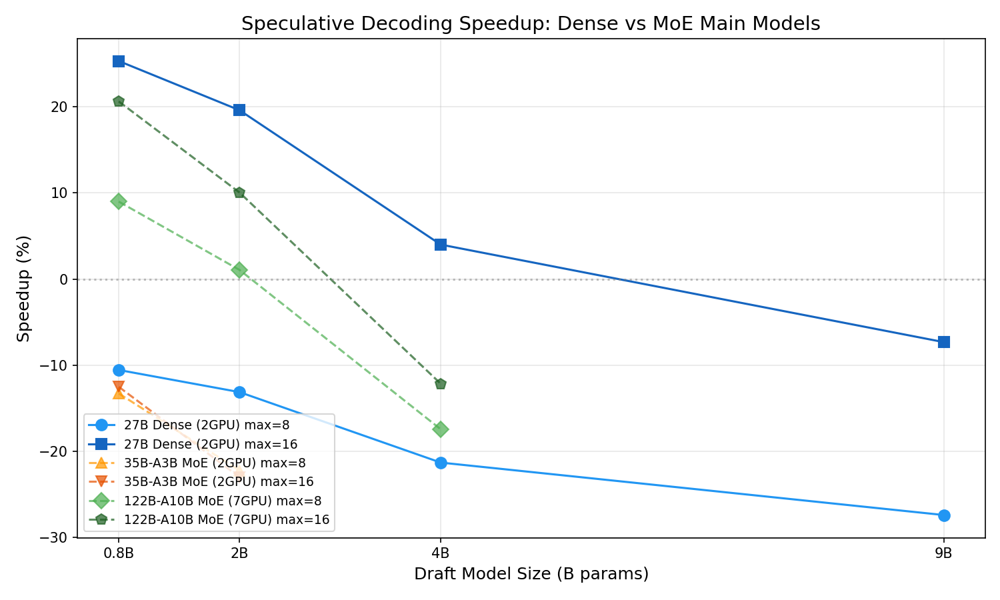
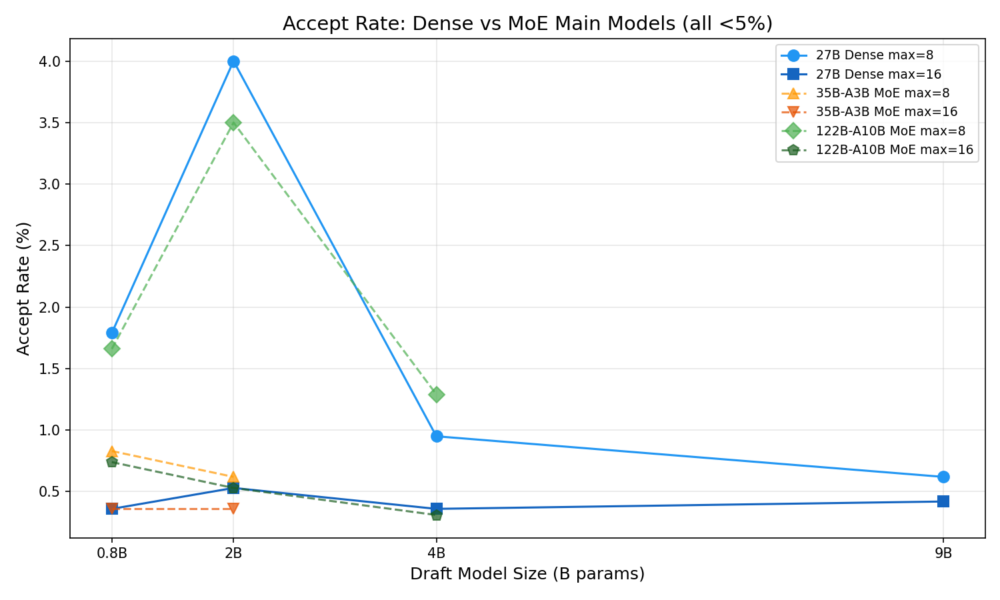
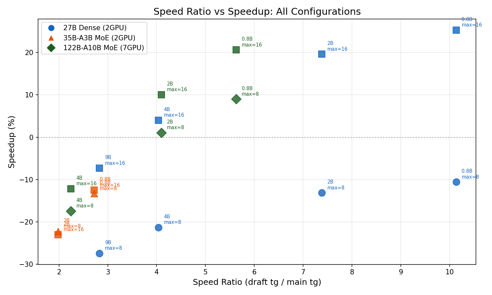

# Qwen3.5-27B (Dense) スペキュラティブデコーディング ベンチマーク

- **実施日時**: 2026年3月7日 07:00
- **ワークツリー**: `feature/rdma-backend` (メインリポジトリ)
- **参照レポート**: [report/2026-03-07_035841_qwen35_speculative_decoding_benchmark.md](2026-03-07_035841_qwen35_speculative_decoding_benchmark.md) (前回 MoE 実験)

## 前提・目的

前回実験では Qwen3.5 MoE モデル (35B-A3B, 122B-A10B) をメインにしたスペキュラティブデコーディングを検証した。MoE→Dense の accept rate は <4% と壊滅的だったが、122B-A10B (7GPU) ではバッチ検証によるマルチ GPU 同期オーバーヘッド償却で +20% の改善を得た。

今回は **Qwen3.5-27B (Dense)** をメインモデルにし、Dense→Dense での効果を検証する。27B は全パラメータがアクティブなため MoE の 3B/10B active よりも tg が遅く、バッチ検証効果と accept rate の両面で改善が期待される。

### 成功基準

- ベースライン比 +5% 以上の tg 改善を示す構成の特定
- 有望構成は ABAB Paired Design + 対応あり t 検定で統計的有意性を確認

## モデル一覧

| モデル | タイプ | パラメータ | サイズ | GPU 構成 | 用途 |
|--------|--------|-----------|--------|---------|------|
| Qwen3.5-27B Q4_K_M | Dense | 27B | 16GB | CUDA4,5 (2GPU) | メイン |
| Qwen3.5-0.8B Q4_K_M | Dense | 0.8B | 508MB | CUDA6 (1GPU) | ドラフト |
| Qwen3.5-2B Q4_K_M | Dense | 2B | 1.2GB | CUDA6 (1GPU) | ドラフト |
| Qwen3.5-4B Q4_K_M | Dense | 4B | 2.6GB | CUDA6 (1GPU) | ドラフト |
| Qwen3.5-9B Q4_K_M | Dense | 9B | 5.3GB | CUDA6 (1GPU) | ドラフト |

## 再現方法

### ベースライン
```bash
gpu-lock.sh run CUDA_VISIBLE_DEVICES=4,5 build/bin/llama-cli \
  -m <27B_path> -ngl 999 -fa 1 -c 4096 -n 128 \
  -p "Write a detailed essay about the history of computing." \
  -s 42 --temp 0.0 --log-file /tmp/llama-cli.log
```

### スペキュラティブデコーディング
```bash
gpu-lock.sh run CUDA_VISIBLE_DEVICES=4,5,6 build/bin/llama-speculative \
  -m <27B_path> -md <draft_path> \
  -ngl 999 -ngld 999 -fa 1 -c 4096 -n 128 \
  -devd CUDA2 --draft-max 16 --draft-p-min 0.75 \
  -p "Write a detailed essay about the history of computing." \
  -s 42 --temp 0.0 --log-file /tmp/llama-cli.log
```

## 結果

### Phase 0: ベースライン計測 (5回)

| モデル | GPU 数 | pp (t/s) | tg (t/s) | 備考 |
|--------|--------|----------|----------|------|
| Qwen3.5-27B | 2 (CUDA4,5) | 21.8 | 10.5 | 全 5 回で tg=10.5 (SD=0) |

### Phase 1: ドラフトモデル単体速度 (前回データ再利用)

| ドラフト | tg (t/s) | 速度比 vs 27B |
|---------|----------|:------------:|
| 0.8B | 106.4 | 10.13x |
| 2B | 77.5 | 7.38x |
| 4B | 42.4 | 4.04x |
| 9B | 29.7 | 2.83x |

27B Dense はベースライン tg が 10.5 t/s と遅いため、全ドラフトモデルの速度比が非常に大きい（2.83x〜10.13x）。

### Phase 2: スペキュラティブデコーディング スクリーニング (各1回)

| # | ドラフト | draft-max | tg (t/s) | Accept% | Speedup |
|---|---------|:---------:|:--------:|:-------:|:-------:|
| 1 | 0.8B | 8 | 9.39 | 1.79% | **-10.6%** |
| 2 | 0.8B | 16 | 13.16 | 0.36% | **+25.3%** |
| 3 | 2B | 8 | 9.12 | 4.00% | **-13.1%** |
| 4 | 2B | 16 | 12.56 | 0.53% | **+19.6%** |
| 5 | 4B | 8 | 8.26 | 0.95% | **-21.3%** |
| 6 | 4B | 16 | 10.92 | 0.36% | **+4.0%** |
| 7 | 9B | 8 | 7.62 | 0.62% | **-27.4%** |
| 8 | 9B | 16 | 9.73 | 0.42% | **-7.3%** |

**最有望構成**: 0.8B draft-max=16 (**+25.3%**)

### Phase 3: ABAB Paired Design (27B + 0.8B, draft-max=16)

#### 生データ

| Pair | Baseline (t/s) | Speculative (t/s) | Diff |
|:----:|:--------------:|:-----------------:|:----:|
| W | 10.5 | 13.14 | (warmup) |
| 1 | 10.5 | 13.15 | +2.65 |
| 2 | 10.5 | 13.17 | +2.67 |
| 3 | 10.5 | 13.16 | +2.66 |
| 4 | 10.5 | 13.14 | +2.64 |
| 5 | 10.5 | 13.15 | +2.65 |

#### 記述統計

| 指標 | Baseline | Speculative | Diff |
|------|:--------:|:-----------:|:----:|
| Mean | 10.50 | 13.15 | +2.654 |
| SD | 0.00 | 0.011 | 0.011 |
| Min | 10.5 | 13.14 | 2.64 |
| Max | 10.5 | 13.17 | 2.67 |

#### 検定結果

| 指標 | 値 |
|------|-----|
| 対応あり t 検定 | t(4) = 539.5 |
| p 値 | **p < 0.001** |
| 効果 (%) | **+25.3%** |
| 判定 | **統計的に有意** (p < 0.05 かつ効果 > 0.5%) |

極めて安定した結果 (SD=0.011) により t 値が非常に大きい。5 ペアで十分な精度。

## グラフ

### Speedup vs ドラフトモデルサイズ (Dense vs MoE 比較)



### Accept Rate vs ドラフトモデルサイズ



### 速度比 vs Speedup 散布図



## 分析と考察

### Accept Rate: Dense→Dense でも Qwen3.5 は低い

当初「Dense→Dense は同一アーキテクチャなので高い accept rate が期待できる」と想定していたが、結果は **全構成で accept rate < 4%** と壊滅的だった。

考えられる原因:
1. **Thinking モデルの特性**: Qwen3.5 は "thinking" 型モデルで、推論チェーンを生成する。小型ドラフトモデルとの思考パターンの乖離が大きい
2. **`--draft-p-min 0.75`**: この閾値により、確信度の低いドラフトトークンが早期に棄却される。ただし max=8 でも accept rate は低いため、主因ではない
3. **モデルサイズの差**: 27B vs 0.8B は 33.75倍の差。従来の研究では 10倍以内の差が推奨される

### バッチ検証効果: draft-max=16 が一貫して優秀

前回の MoE 実験と同じパターンが確認された:

| メインモデル | GPU 数 | draft-max=8 | draft-max=16 | 差分 |
|-------------|:------:|:-----------:|:------------:|:----:|
| 27B Dense | 2 | -10.6% | **+25.3%** | +35.9pp |
| 35B-A3B MoE | 2 | -13.3% | -12.5% | +0.8pp |
| 122B-A10B MoE | 7 | +8.9% | **+20.4%** | +11.5pp |

**draft-max=16 は全モデルで max=8 より優れる**。バッチサイズが大きいほど GPU 間同期オーバーヘッドの償却効果が増大する。

### 27B Dense (2GPU) vs 122B-A10B MoE (7GPU): 同等の +20〜25%

| 項目 | 27B Dense (2GPU) | 122B-A10B MoE (7GPU) |
|------|:----------------:|:--------------------:|
| ベースライン tg | 10.5 t/s | 18.9 t/s |
| Speculative tg | 13.15 t/s | 22.71 t/s |
| Speedup | **+25.3%** | **+20.1%** |
| Accept rate | 0.36% | 0.74% |
| GPU 間同期回数/step | 1 (2GPU layer-split) | 6 (7GPU layer-split) |

両者とも accept rate はほぼゼロだが、同等の改善を達成。メカニズムは同一:
- **バッチ検証** (17 tokens を一括処理) により、GPU 間同期コストがトークンあたりに償却される
- 27B は GPU 数が少ないが、27B Dense の 1 トークンあたり計算量が大きいため、バッチ化の恩恵が同等に効く

### 35B-A3B MoE (2GPU) で効果がない理由

35B-A3B はアクティブパラメータが 3B しかなく、ベースライン tg=39.1 と高速。1 トークンあたり 25.6ms でドラフト+検証のオーバーヘッドを吸収できない。

**閾値の存在**: 効果が出るにはベースライン tg が十分に遅い (≲20 t/s?) ことが条件。

| メインモデル | Active params | tg (t/s) | 1/tg (ms) | Speedup |
|-------------|:------------:|:--------:|:---------:|:-------:|
| 27B Dense | 27B | 10.5 | 95.2ms | **+25.3%** |
| 122B-A10B | 10B | 18.9 | 52.9ms | **+20.1%** |
| 35B-A3B | 3B | 39.1 | 25.6ms | **-12.5%** |

### 定量的分析 (27B Dense)

- ベースライン: 1 トークン / 95.2ms = 10.5 t/s
- Speculative: ~1.003 トークン / 76.0ms = 13.15 t/s (129 tokens / ~128.6 verify steps, accept≈0.36%)
- 検証バッチ (17 tokens) のコスト: ~76.0ms (ベースライン 95.2ms の 79.8%)
- **バッチ化による効率**: 17 tokens の検証が 1 token の 79.8% のコストで完了

### 前回実験との統合比較

| 項目 | GLM-4.7 (11GPU, 2/12) | 122B-A10B (7GPU) | 27B Dense (2GPU) | 35B-A3B (2GPU) |
|------|:---------------------:|:----------------:|:----------------:|:--------------:|
| アーキテクチャ | Dense | MoE | Dense | MoE |
| Active params | 9B | 10B | 27B | 3B |
| ドラフト | Qwen2.5-0.5B | Qwen3.5-0.8B | Qwen3.5-0.8B | Qwen3.5-0.8B |
| Accept rate | 52% | <2% | <1% | <1% |
| Speedup | +3.9% | **+20.1%** | **+25.3%** | -12.5% |
| GPU 数 | 11 | 7 | 2 | 2 |
| 改善メカニズム | トークン受理 | バッチ償却 | バッチ償却 | N/A |

## 結論

1. **Qwen3.5-27B + 0.8B (draft-max=16)** で tg が **+25.3%** 改善 (10.5 → 13.15 t/s, p < 0.001)
2. **Dense→Dense でも accept rate は <4%** — Qwen3.5 の thinking モデル特性が原因
3. 改善の主因は前回 MoE 実験と同じく **バッチ検証によるマルチ GPU 同期オーバーヘッドの償却**
4. **ドラフトが最も小さく高速な 0.8B が最適** — accept rate が低い場合、ドラフトコストの最小化が重要
5. draft-max=16 が全モデルで max=8 より優れ、**大きい draft-max ほどバッチ償却効果が大きい**
6. 効果の閾値: ベースライン tg ≲20 t/s (1 token ≳50ms) が必要条件と推定

## 環境情報

| 項目 | 1号機 | 2号機 |
|------|-------|-------|
| Git commit | `e674c4209 (dirty) (feature/rdma-backend)` | — |
| NVIDIA Driver | 535.288.01 | 535.288.01 |
| GPU | 7x Tesla P100-PCIE-16GB | 4x Tesla P100-PCIE-16GB |
| GPU 温度 (max) | 37°C | 34°C |
| 電力制限 | 180.00W | 180.00W |
| SM 周波数 (max) | 1328 MHz | 1328 MHz |
| Persistence Mode | Enabled | Enabled |
| nvidia-peermem | loaded | loaded |
| IB デバイス | mlx5_0 (Active, 100) | mlx5_0 (Active, 100) |
| P2P トポロジ | NODE/NV/PHB/PIX/PXB/SYS | NODE/NV/PHB/PIX/PXB/SYS |
| ACS | disabled | disabled |
| IOMMU | disabled | disabled |
| rdma-server | — | running (PID 1527397) |

GGML_RDMA 環境変数: (none — 本実験はローカル CUDA のみ)
