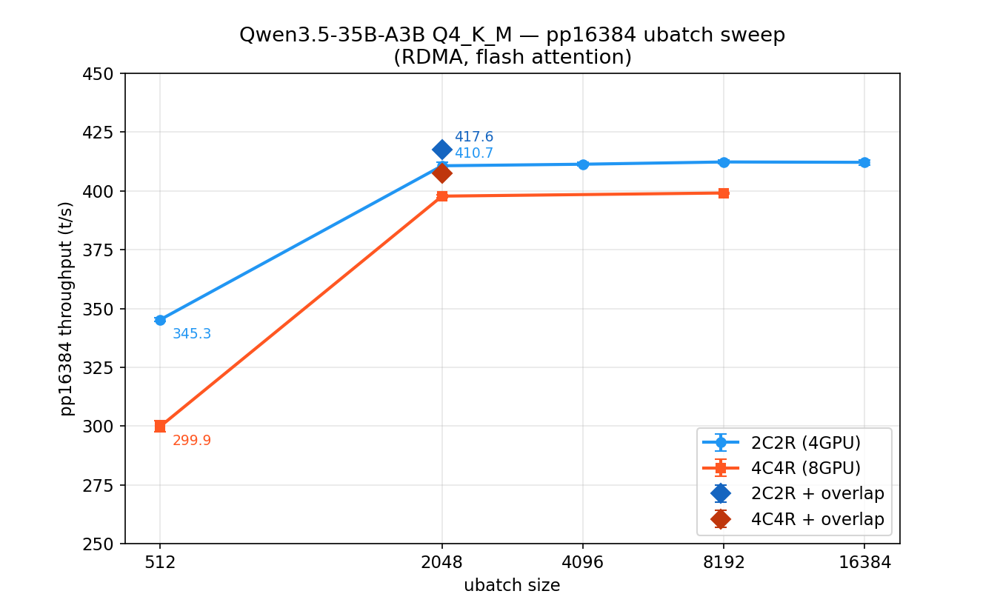
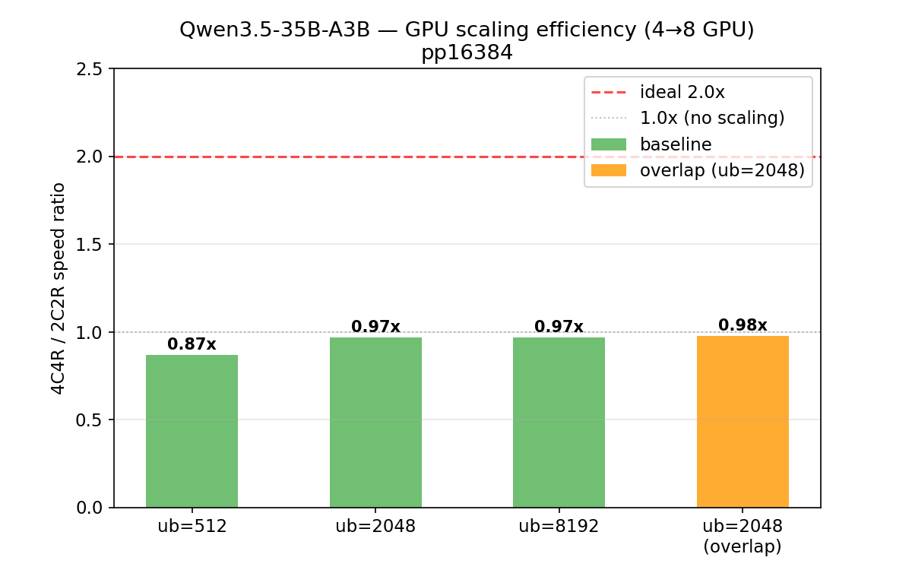

# Qwen3.5-35B-A3B pp16384 全最適化ベンチマーク

- **実施日時**: 2026年3月7日 07:46
- **ワークツリー**: `.worktree/all-202603070630`
- **ブランチ**: `bench/all-202603070630` (base: `feature/cuda-rdma-overlap` @ `64a67bf25`)

## 前提・目的

Qwen3.5-35B-A3B (MoE, 3B active / 35B total) の pp16384 性能を最大化するため、既知の最適化をすべて適用した状態で ubatch サイズスイープと CUDA/RDMA overlap の効果を測定する。

### 背景

過去の実験で判明している PP 性能に影響する最適化:

| 最適化 | 過去の効果 | 条件 |
|--------|-----------|------|
| ubatch サイズチューニング | +50-70% (pp2048-4096) | ub を pp に合わせる |
| CUDA/RDMA Overlap | +28.7% (GLM-4.7 pp2048) | 複数 ubatch 時。compute-bound では効果小 |
| Flash Attention | +10% | `-fa 1` |
| Send Ring Buffer | 基盤 | selective signaling 回復 (コード内蔵) |

### 参照レポート

- [RDMA サーバーオーバーヘッド分析](2026-03-06_091203_rdma_server_overhead_analysis.md) — Qwen3.5 が compute-bound (GPU 94.8%) であることの根拠
- [2C2R vs 4C4R GPU スケーリング](2026-03-06_205212_2c2r_vs_4c4r_gpu_scaling.md) — 4→8GPU でスケーリングしない傾向

### 検証ポイント

1. pp16384 での最適 ubatch サイズ発見
2. 4GPU → 8GPU のスケーリング効率
3. CUDA/RDMA overlap の効果 (compute-bound での確認)

## 統計手法

- **Phase A/A' (ubatch スイープ)**: 探索的比較。`-r 5` で方向性確認。統計検定なし。
- **Phase B (overlap)**: 探索的比較 (`-r 5`)。compute-bound モデルのため正式 A/B にはエスカレーションせず。

## 再現方法

### ビルド・デプロイ

```bash
git worktree add -b bench/all-202603070630 .worktree/all-202603070630 feature/cuda-rdma-overlap
bash /path/to/.worktree/all-202603070630/scripts/rdma-build.sh local
gpu-lock.sh run bash /path/to/.worktree/all-202603070630/scripts/rdma-server.sh stop
gpu-lock.sh run bash /path/to/.worktree/all-202603070630/scripts/rdma-deploy.sh
bash /path/to/.worktree/all-202603070630/scripts/rdma-server.sh start
```

### ベンチマーク実行

モデル: `/home/ubuntu/.cache/huggingface/hub/models--unsloth--Qwen3.5-35B-A3B-GGUF/snapshots/bc014a17be43adabd7066b7a86075ff935c6a4e2/Qwen3.5-35B-A3B-Q4_K_M.gguf`

**2C2R (4GPU) テンプレート**:
```bash
gpu-lock.sh run CUDA_VISIBLE_DEVICES=4,5 GGML_RDMA_SERVERS=192.168.100.2:50051 \
  .worktree/all-202603070630/build/bin/llama-bench \
  -m <model> -ngl 999 -fa 1 \
  -dev 'CUDA0/CUDA1/RDMA0[192.168.100.2:50051]/RDMA1[192.168.100.2:50051]' \
  -p 16384 -n 0 -ub <UB> -r 5 -o csv
```

**4C4R (8GPU) テンプレート**:
```bash
gpu-lock.sh run CUDA_VISIBLE_DEVICES=0,1,2,3 GGML_RDMA_SERVERS=192.168.100.2:50051 \
  .worktree/all-202603070630/build/bin/llama-bench \
  -m <model> -ngl 999 -fa 1 \
  -dev 'CUDA0/CUDA1/CUDA2/CUDA3/RDMA0[192.168.100.2:50051]/RDMA1[192.168.100.2:50051]/RDMA2[192.168.100.2:50051]/RDMA3[192.168.100.2:50051]' \
  -p 16384 -n 0 -ub <UB> -r 5 -o csv
```

**Overlap 有効化**: 環境変数 `GGML_RDMA_CUDA_OVERLAP=1 GGML_RDMA_PER_DEVICE_CONN=1` を追加。

## 結果

### Phase A: 2C2R (4GPU) ubatch サイズスイープ

| ubatch | ubatch 数 | avg (t/s) | stddev | vs ub=512 |
|-------:|----------:|----------:|-------:|----------:|
| 512 | 32 | 345.3 | ±0.81 | baseline |
| 2048 | 8 | 410.7 | ±1.38 | **+18.9%** |
| 4096 | 4 | 411.4 | ±0.75 | **+19.1%** |
| 8192 | 2 | 412.3 | ±0.78 | **+19.4%** |
| 16384 | 1 | 412.2 | ±1.13 | **+19.4%** |

**所見**: ub=512 → 2048 で +18.9% の大幅改善。ub=2048 以降は飽和 (411-412 t/s のプラトー)。OOM は全サイズで発生せず。

### Phase A': 4C4R (8GPU) ubatch サイズスイープ

| ubatch | 4C4R (t/s) | stddev | 2C2R (t/s) | 4C4R/2C2R |
|-------:|-----------:|-------:|-----------:|----------:|
| 512 | 299.9 | ±2.34 | 345.3 | **0.87x** |
| 2048 | 397.8 | ±0.58 | 410.7 | **0.97x** |
| 8192 | 399.1 | ±0.33 | 412.3 | **0.97x** |

**所見**: 4→8GPU で**負のスケーリング** — 全 ubatch サイズで 4C4R < 2C2R。pp16384 でも MoE の compute-bound 特性は変わらず、GPU 追加はオーバーヘッド増加のみ。

### Phase B: CUDA/RDMA Overlap (ub=2048)

| 構成 | baseline (t/s) | overlap (t/s) | 差分 |
|------|---------------:|--------------:|-----:|
| 2C2R | 410.7 ±1.38 | 417.6 ±0.40 | **+1.7%** |
| 4C4R | 397.8 ±0.58 | 407.5 ±0.49 | **+2.4%** |

**所見**: Overlap は小幅ながら正の効果あり (+1.7~2.4%)。Qwen3.5 は GPU 94.8% compute-bound のため大きな overlap 効果は期待できないが、残り 5% の RDMA 通信時間の一部が隠蔽されている。4C4R で効果がやや大きい (RDMA デバイス数が多い分、隠蔽可能な通信量が増加)。

### 最適構成

| 構成 | 最適 ubatch | 最適 throughput |
|------|----------:|---------------:|
| **2C2R (推奨)** | 2048 | **417.6 t/s** (overlap) |
| 4C4R | 2048 | 407.5 t/s (overlap) |

**2C2R + ub=2048 + overlap が最適** — 8GPU に拡張する利点はない。

## グラフ

### ubatch サイズ vs PP 性能



### GPU スケーリング効率



## 考察

### ubatch チューニングの効果

- pp16384 での ubatch 効果は **+19.4%** (ub=512 → 2048+)。過去の pp2048/pp4096 実験 (+50-70%) と比較すると控えめ。
- 理由: pp16384 は 32 ubatch (ub=512) でもバッチ効率が一定水準に達している。pp2048 at ub=512 は 4 ubatch しかなく、per-ubatch オーバーヘッドの影響が大きい。
- ub=2048 で飽和するため、大 ubatch の VRAM リスクを取る必要はない。

### GPU スケーリングの不在

- Qwen3.5 MoE (active 3B) は pp16384 でも 4→8GPU スケーリングなし (0.87-0.97x)。
- 原因: MoE のアクティブパラメータ (3B) が少なく、各 GPU の compute が小さい。GPU 数を増やしても per-layer dispatch オーバーヘッドが compute を上回る。
- ub=512 で特に悪い (0.87x) のは、32 ubatch × 8 device = 256 dispatch 回のオーバーヘッド蓄積。

### Overlap の小効果

- Compute-bound モデルでも overlap は +1.7-2.4% の改善。RDMA 通信が全体の 5% でも、8 ubatch 分の通信を部分的に隠蔽できている。
- 正式 A/B テストには至らないが、方向性として正。

### 予測との比較

| 項目 | 予測 | 実測 |
|------|------|------|
| ubatch 効果 | +50-70% | **+19.4%** (予測の 1/3) |
| 2C2R ub=512 | ~280 t/s | **345.3 t/s** (予測より高い) |
| 2C2R 最適 ub | ~450-550 t/s | **417.6 t/s** (予測の 76-93%) |
| 4→8GPU スケーリング | なし | **なし** (予測通り) |
| Overlap | ~0% | **+1.7-2.4%** (予測よりやや上) |

ub=512 の baseline が予想より高く、ubatch 効果の上限が低かった。結果として最適 throughput は予測範囲の下限付近。

## 環境情報

| 項目 | 1号機 | 2号機 |
|------|-------|-------|
| Git commit | `e674c4209 (dirty) (feature/rdma-backend)` | — |
| Bench commit | `64a67bf25 (bench/all-202603070630)` | — |
| NVIDIA Driver | 535.288.01 | 535.288.01 |
| GPU | 7x Tesla P100-PCIE-16GB | 4x Tesla P100-PCIE-16GB |
| GPU 温度 (max) | 34°C | 35°C |
| 電力制限 | 180.00W | 180.00W |
| SM 周波数 (max) | 1328 MHz | 1328 MHz |
| Persistence Mode | Enabled | Enabled |
| nvidia-peermem | loaded | loaded |
| IB デバイス | mlx5_0 (Active, 100) | mlx5_0 (Active, 100) |
| P2P トポロジ | NODE/NV/PHB/PIX/PXB/SYS | NODE/NV/PHB/PIX/PXB/SYS |
| ACS | disabled | disabled |
| IOMMU | disabled | disabled |
| rdma-server | — | running (PID 1538609) |
