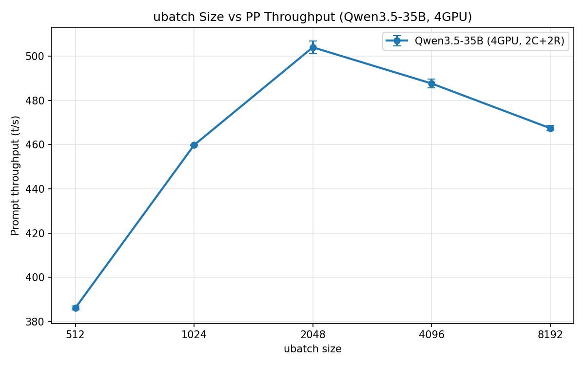
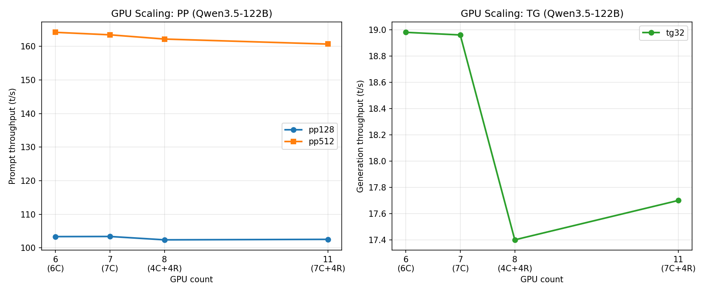
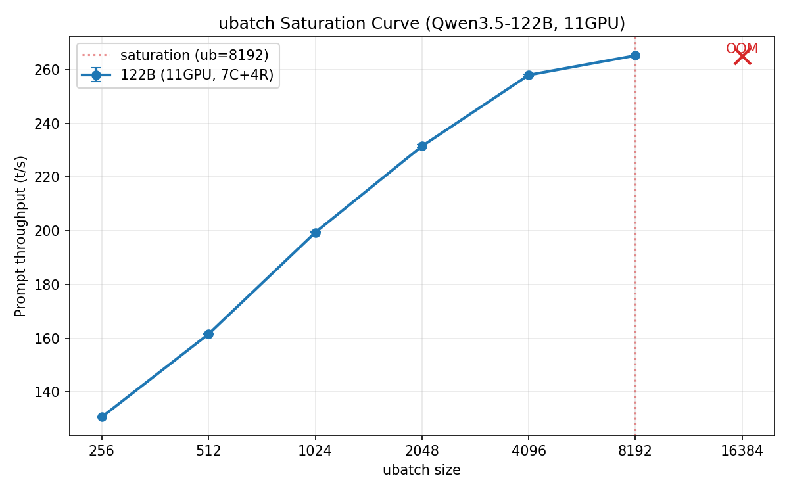
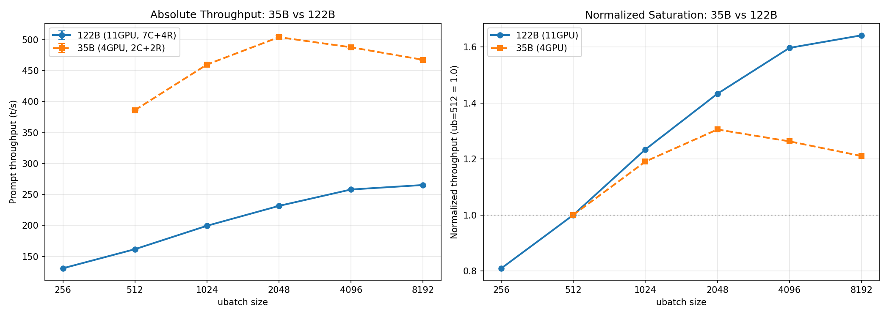

# Tier 1 ベンチマーク: ubatch飽和特性・GPUスケーリング (Qwen3.5-35B / 122B)

- **実施日時**: 2026年3月8日 06:28
- **ワークツリー**: なし (メインブランチ `feature/rdma-backend` で実行)
- **参照**: [PP性能改善探索レポート](2026-03-08_051455_pp_optimization_exploration.md) (旧計画 — 後に [チーム探求レポート](2026-03-08_055421_pp_improvement_exploration_team.md) で Tier 分類を再編)

> **注**: 本レポートの "Tier 1" は旧計画 (`pp_optimization_exploration`) の分類に基づく。チーム探求レポートでは Tier 0-B/C/D に相当する。以降の実験はチーム探求レポートの Tier 分類に従う。

## 前提・目的

PP性能改善探索の Tier 1 (コード変更なし) 実験として、以下の4項目を検証する:

1. **1-A**: Qwen3.5-35B のubatch大サイズスイープ — ubatch増大による飽和ポイントの特定
2. **1-B**: Qwen3.5-122B の11GPUベースライン — 新モデルの基本性能把握
3. **1-C**: Qwen3.5-122B のGPU数スイープ — MoEモデルでのGPUスケーリング特性
4. **1-D**: Qwen3.5-122B のubatchスイープ — 122Bでの飽和特性を35Bと比較

背景: 既存のベンチマークはデフォルトubatch (512) 中心で、大きいubatchでの飽和特性が未検証。また122B (10Bアクティブ) は35B (3Bアクティブ) より計算密度が高く、異なるスケーリング特性が期待される。

## 環境情報

| 項目 | 1号機 | 2号機 |
|------|-------|-------|
| Git commit | `e674c4209 (dirty) (feature/rdma-backend)` | — |
| NVIDIA Driver | 535.288.01 | 535.288.01 |
| GPU | 7x Tesla P100-PCIE-16GB | 4x Tesla P100-PCIE-16GB |
| GPU 温度 (max) | 27°C | 33°C |
| 電力制限 | 180.00W | 180.00W |
| SM 周波数 (max) | 1328 MHz | 1328 MHz |
| Persistence Mode | Enabled | Enabled |
| nvidia-peermem | loaded | loaded |
| IB デバイス | mlx5_0 (Active, 100) | mlx5_0 (Active, 100) |
| P2P トポロジ | NODE/NV/PHB/PIX/PXB/SYS | NODE/NV/PHB/PIX/PXB/SYS |
| ACS | disabled | disabled |
| IOMMU | disabled | disabled |
| rdma-server | — | running (PID 1573163) |

## 実験 1-A: ubatch大サイズスイープ (Qwen3.5-35B, 4GPU)

### 条件

- **モデル**: Qwen3.5-35B-A3B Q4_K_M (20.49 GiB, 3B アクティブパラメータ)
- **GPU構成**: 4GPU (CUDA4,5 + RDMA0,1 = 2C+2R)
- **共通オプション**: `-ngl 999 -fa 1 -r 3 -n 0`
- **ubatch条件**: 512, 1024, 2048, 4096, 8192 (pp = max(2048, ub))

### 再現方法

```bash
GGML_RDMA_SERVERS=192.168.100.2:50051 CUDA_VISIBLE_DEVICES=4,5 \
  build/bin/llama-bench \
  -m /home/ubuntu/.cache/huggingface/hub/models--unsloth--Qwen3.5-35B-A3B-GGUF/snapshots/bc014a17be43adabd7066b7a86075ff935c6a4e2/Qwen3.5-35B-A3B-Q4_K_M.gguf \
  -dev 'CUDA0/CUDA1/RDMA0[192.168.100.2:50051]/RDMA1[192.168.100.2:50051]' \
  -ngl 999 -fa 1 -ub <UB> -p <PP> -n 0 -r 3
```

### 結果

| ubatch | pp size | PP throughput (t/s) | 対 ub=512 |
|-------:|--------:|--------------------:|----------:|
| 512 | 2048 | 386.14 ± 0.91 | — |
| 1024 | 2048 | 459.81 ± 0.14 | +19.1% |
| 2048 | 2048 | **504.02 ± 2.95** | **+30.5%** |
| 4096 | 4096 | 487.65 ± 2.01 | +26.3% |
| 8192 | 8192 | 467.41 ± 1.19 | +21.1% |



### 分析

- **ピーク**: ub=2048 で 504.02 t/s。ub=512 比 +30.5%。
- **飽和後の低下**: ub=4096 以上では throughput が低下。ub=8192 はピーク比 -7.3%。
- **低下の原因**: pp=ub (1 ubatch) のため ubatch 間パイプラインのオーバーヘッドはない。CUDA カーネルの occupancy 低下や、KV キャッシュの大きなアテンション行列がメモリバンド幅を圧迫している可能性。
- **実用上の推奨**: ub=2048 が最適。デフォルト ub=512 から +30% の改善が見込める。

## 実験 1-B: Qwen3.5-122B ベースライン (11GPU)

### 条件

- **モデル**: Qwen3.5-122B-A10B Q4_K_M (69.22 GiB, 10B アクティブパラメータ)
- **GPU構成**: 11GPU (CUDA0-6 + RDMA0-3 = 7C+4R)
- **共通オプション**: `-ngl 999 -fa 1 -r 3`

### 動作確認

llama-cli で推論テスト:
```bash
GGML_RDMA_SERVERS=192.168.100.2:50051 LD_LIBRARY_PATH=build/bin \
  build/bin/llama-cli \
  -m /tmp/Qwen3.5-122B-A10B-Q4_K_M/Q4_K_M/Qwen3.5-122B-A10B-Q4_K_M-00001-of-00003.gguf \
  -dev 'CUDA0,CUDA1,CUDA2,CUDA3,CUDA4,CUDA5,CUDA6,RDMA0[192.168.100.2:50051],RDMA1[192.168.100.2:50051],RDMA2[192.168.100.2:50051],RDMA3[192.168.100.2:50051]' \
  -sm layer -ngl 999 -c 2048 -p 'The capital of France is' -n 50 --seed 42 -fa 1 \
  --no-warmup --single-turn --simple-io --log-file /tmp/llama-cli.log
```

正常に推論完了。フランスの首都について正しく回答。llama-cli 表示: pp=30.4 t/s, tg=17.9 t/s。

### ベンチマーク再現方法

```bash
GGML_RDMA_SERVERS=192.168.100.2:50051 \
  build/bin/llama-bench \
  -m /tmp/Qwen3.5-122B-A10B-Q4_K_M/Q4_K_M/Qwen3.5-122B-A10B-Q4_K_M-00001-of-00003.gguf \
  -dev 'CUDA0/CUDA1/CUDA2/CUDA3/CUDA4/CUDA5/CUDA6/RDMA0[192.168.100.2:50051]/RDMA1[192.168.100.2:50051]/RDMA2[192.168.100.2:50051]/RDMA3[192.168.100.2:50051]' \
  -ngl 999 -fa 1 -p 128,512,2048 -n 32 -r 3
```

### 結果

| テスト | throughput (t/s) |
|-------:|-----------------:|
| pp128 | 102.55 ± 1.10 |
| pp512 | 160.69 ± 0.71 |
| pp2048 | 161.38 ± 0.90 |
| tg32 | 17.70 ± 0.03 |

- **pp512 ≈ pp2048**: デフォルト ub=512 では pp512 以上で飽和 (ubatch 数が増えるだけで per-ubatch 性能は同じ)
- **tg32 = 17.70 t/s**: 35B の 4GPU tg32 (約 35 t/s) の約半分。122B はアクティブ 10B で 35B (3B) の 3.3 倍の計算量

### モデルサイズ比較

| モデル | 総パラメータ | アクティブ | サイズ | GPU 構成 |
|--------|----------:|--------:|------:|---------|
| Qwen3.5-35B-A3B | 34.66B | ~3B | 20.49 GiB | 4GPU (2C+2R) |
| Qwen3.5-122B-A10B | 122.11B | ~10B | 69.22 GiB | 11GPU (7C+4R) |

## 実験 1-C: GPU数スイープ (Qwen3.5-122B)

### 条件

4つのGPU構成で 122B を実行。11GPU データは実験 1-B を流用。

| GPU数 | 構成 | デバイス |
|------:|------|---------|
| 6 | 6C | CUDA0-5 |
| 7 | 7C | CUDA0-6 |
| 8 | 4C+4R | CUDA0-3 + RDMA0-3 |
| 11 | 7C+4R | CUDA0-6 + RDMA0-3 |

### 再現方法

```bash
CUDA_VISIBLE_DEVICES=0,1,2,3,4,5 build/bin/llama-bench \
  -m /tmp/Qwen3.5-122B-A10B-Q4_K_M/Q4_K_M/Qwen3.5-122B-A10B-Q4_K_M-00001-of-00003.gguf \
  -ngl 999 -fa 1 -p 128,512 -n 32 -r 3

CUDA_VISIBLE_DEVICES=0,1,2,3,4,5,6 build/bin/llama-bench \
  -m /tmp/Qwen3.5-122B-A10B-Q4_K_M/Q4_K_M/Qwen3.5-122B-A10B-Q4_K_M-00001-of-00003.gguf \
  -ngl 999 -fa 1 -p 128,512 -n 32 -r 3

GGML_RDMA_SERVERS=192.168.100.2:50051 CUDA_VISIBLE_DEVICES=0,1,2,3 build/bin/llama-bench \
  -m /tmp/Qwen3.5-122B-A10B-Q4_K_M/Q4_K_M/Qwen3.5-122B-A10B-Q4_K_M-00001-of-00003.gguf \
  -dev 'CUDA0/CUDA1/CUDA2/CUDA3/RDMA0[192.168.100.2:50051]/RDMA1[192.168.100.2:50051]/RDMA2[192.168.100.2:50051]/RDMA3[192.168.100.2:50051]' \
  -ngl 999 -fa 1 -p 128,512 -n 32 -r 3
```

### 結果

| GPU数 | 構成 | pp128 (t/s) | pp512 (t/s) | tg32 (t/s) |
|------:|------|------------:|------------:|-----------:|
| 6 | 6C | 103.37 ± 0.67 | 164.19 ± 0.80 | 18.98 ± 0.02 |
| 7 | 7C | 103.41 ± 0.93 | 163.45 ± 0.39 | 18.96 ± 0.02 |
| 8 | 4C+4R | 102.41 ± 0.87 | 162.19 ± 0.97 | 17.40 ± 0.02 |
| 11 | 7C+4R | 102.55 ± 1.10 | 160.69 ± 0.71 | 17.70 ± 0.03 |



### 分析

- **PP は GPU 数に対してほぼ完全にフラット**: 6GPU → 11GPU で pp128 は -0.8%、pp512 は -2.1%。MoE モデルのアクティブパラメータ (10B) が少ないため、6GPU 時点で既に計算飽和。
- **6C vs 7C**: 差はゼロ (pp128: +0.04%, pp512: -0.45%)。7台目の GPU は貢献していない。
- **CUDA only vs RDMA 混在**: 8GPU (4C+4R) の tg32 は 6C 比 -8.3%。RDMA のコマンドラウンドトリップレイテンシが TG を低下させる。これは 35B での既知の挙動と一致。
- **RDMA 内での GPU 追加効果**: 8GPU (4C+4R) → 11GPU (7C+4R) で tg32 が +1.7%。CUDA GPU 追加は TG を若干改善 (計算分散)。

## 実験 1-D: ubatchスイープ (Qwen3.5-122B, 11GPU)

### 条件

- **GPU構成**: 11GPU (7C+4R)
- **テスト**: pp=ub (1 ubatch), n=0, -fa 1, -r 3
- **ubatch条件**: 256, 512, 1024, 2048, 4096, 8192, 16384
- **注意**: ub > 2048 では `-b` (batch size) を ub 以上に明示設定

### 再現方法

```bash
GGML_RDMA_SERVERS=192.168.100.2:50051 build/bin/llama-bench \
  -m /tmp/Qwen3.5-122B-A10B-Q4_K_M/Q4_K_M/Qwen3.5-122B-A10B-Q4_K_M-00001-of-00003.gguf \
  -dev 'CUDA0/CUDA1/CUDA2/CUDA3/CUDA4/CUDA5/CUDA6/RDMA0[192.168.100.2:50051]/RDMA1[192.168.100.2:50051]/RDMA2[192.168.100.2:50051]/RDMA3[192.168.100.2:50051]' \
  -ngl 999 -fa 1 -b <UB> -ub <UB> -p <UB> -n 0 -r 3
```

### 結果

| ubatch | pp (t/s) | 対 ub=512 | 対前段 |
|-------:|---------:|----------:|-------:|
| 256 | 130.70 ± 0.16 | -19.1% | — |
| 512 (default) | 161.56 ± 0.26 | — | +23.6% |
| 1024 | 199.37 ± 0.16 | +23.4% | +23.4% |
| 2048 | 231.50 ± 0.50 | +43.3% | +16.1% |
| 4096 | 257.97 ± 0.37 | +59.7% | +11.4% |
| **8192** | **265.23 ± 0.21** | **+64.2%** | **+2.8%** |
| 16384 | OOM | — | — |





### 分析

- **飽和ポイント: ub=8192** — ub=4096→8192 の改善が +2.8% まで鈍化し、事実上飽和。ub=16384 は OOM で実行不可。
- **ub=256→8192 で +102.9%**: ubatch サイズによる影響が非常に大きい (2倍以上)。
- **35B vs 122B の飽和特性**:
  - 35B: ub=2048 でピーク (504 t/s)、ub=4096 以降は低下
  - 122B: ub=8192 で飽和 (265 t/s)、ub=16384 は OOM
  - 122B の飽和ポイントが 4 倍遅い理由: アクティブパラメータ 10B (35B の 3.3 倍) で per-ubatch の計算量が多く、大きい ubatch でも GPU occupancy が飽和しない
- **実用上の推奨**: 122B では ub=4096 が最適なバランス (ub=512 比 +59.7% 改善、メモリ余裕あり)。ub=8192 はさらに +2.8% だがメモリ消費が大きい。

## 考察

### 1. ubatch 飽和特性の違い (35B vs 122B)

| 特性 | 35B (3B active) | 122B (10B active) |
|------|-----------------|-------------------|
| ピーク ubatch | 2048 | 8192 |
| ub=512→ピーク 改善 | +30.5% | +64.2% |
| ub=ピーク以降 | 低下 (-7.3% at 4096) | OOM (16384) |

35B は計算密度が低く (3B active)、ub=2048 で GPU の演算能力が飽和し、それ以降は低下。122B は計算密度が高く (10B active)、ub=8192 まで改善が続く。飽和ポイントがアクティブパラメータ数にほぼ比例 (10B/3B ≈ 3.3 倍、2048×4 = 8192) するのは、GPU カーネルの行列サイズが大きいほど効率的にバッチ処理できるため。

### 2. MoE モデルの GPU スケーリング

122B は 6GPU でも 11GPU でも PP がほぼ同じ。これはMoEモデルの特徴で:
- アクティブパラメータ (10B) に対するモデルサイズ (122B) が非常に大きい
- 6GPU × 16GB = 96GB で 69.2 GiB のモデル全体を収容可能
- 追加 GPU はモデル重みの分散には貢献するが、アクティブ計算の並列化には効果が薄い

TG については CUDA only (6-7C) が RDMA 混在 (8-11GPU) より 8-9% 高速。RDMA のレイテンシオーバーヘッドが TG に影響する。

### 3. デフォルト ubatch=512 は最適でない

両モデルとも ub=512 → ub=2048 で大幅な PP 改善:
- 35B: +30.5%
- 122B: +43.3%

これは RDMA/RPC バックエンドに限らず、CUDAのみの構成でも同様の傾向が予想される。ubatch のデフォルト値を見直すか、モデルサイズに応じた自動調整が有効。

## 結論・次のステップ

### 主な発見

1. **ubatch 最適化で大幅改善** — 35B: ub=2048 で +30.5%, 122B: ub=8192 で +64.2%
2. **122B の飽和ポイント = ub=8192** — ub=4096→8192 で +2.8% (飽和)、ub=16384 は OOM
3. **飽和ポイントはアクティブパラメータ数に比例** — 35B (3B active) = ub=2048、122B (10B active) = ub=8192
4. **MoE の GPU スケーリングは PP に効果なし** — 6GPU で既に飽和。TG は RDMA レイテンシの影響を受ける
5. **122B が 11GPU RDMA クラスタで安定動作** — pp8192=265.2 t/s, tg32=17.7 t/s

### 次のステップ

- **Tier 2 実験**: CUDA/RDMA overlap の 122B 適用効果を検証
- **ubatch デフォルト変更の検討**: RDMA バックエンドで ub=2048 (35B) / ub=4096 (122B) をデフォルトにする価値がある
