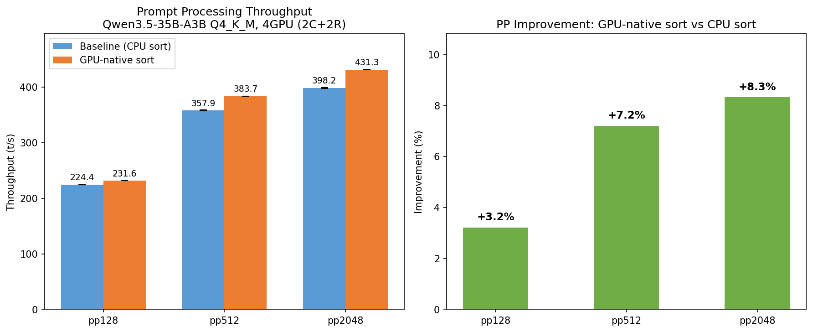

# GPU-native IDs sorting による cuBLAS フォールバック mul_mat_id 高速化

- **実施日時**: 2026年3月8日 11:04
- **ワークツリー**: `.worktree/gpu-native-sort`
- **ブランチ**: `feature/gpu-native-sort`
- **コミット**: `619061d60`

## 前提・目的

P100 (cc=6.0) は DP4A 未サポートのため MMQ パスに入れず、Ampere MMA 必須の MMF も不可。結果として `ggml_cuda_mul_mat_id()` の **cuBLAS フォールバックパス**が使われる。

このフォールバックパスでは:
1. `cudaMemcpyAsync` (D2H) + `cudaStreamSynchronize` で IDs テンソル全体を CPU にコピー
2. CPU 上で O(n_experts × n_tokens × n_expert_used) の triple-loop sort を実行
3. `cudaMemcpyAsync` (H2D) + `cudaStreamSynchronize` でソート結果を GPU に戻す

一方、MMQ/MMF パスでは `mm_ids_helper` GPU カーネル (mmid.cu) が同等の処理を **GPU 上で同期なしに** 実行している。

**施策**: フォールバックパスの CPU sort を `mm_ids_helper` に置換し、stream sync ×2 + CPU sort を排除する。

- 参照: [チーム探求レポート](2026-03-08_055421_pp_improvement_exploration_team.md) の Tier 1-A

## 実装内容

### 変更ファイル

- `ggml/src/ggml-cuda/ggml-cuda.cu`

### 変更概要

1. **`mm_ids_helper` カーネル呼び出し追加**: CPU triple-loop sort + D2H/H2D 転送 (ids テンソル全体) を GPU-native `mm_ids_helper` に置換
2. **`expert_bounds` の小サイズ D2H コピー**: `n_experts+1` 個の int32 (≈ 256 bytes) のみ CPU に転送。元の ids テンソル全体のコピー (n_tokens × n_expert_used × 4 bytes) より桁違いに小さい
3. **`invert_permutation` カーネル追加**: `mm_ids_helper` の出力 `ids_dst` (sorted→original) を `ids_from_sorted` (original→sorted) に変換する O(n) GPU 並列カーネル
4. **`tokens_per_expert` → `expert_bounds` 変換**: expert loop 内の参照を `expert_bounds_host[i+1] - expert_bounds_host[i]` に変更

### 削除されたもの

- `ids_host` (CPU ベクタ): IDs テンソル全体の D2H コピー先
- `ids_to_sorted_host`, `ids_from_sorted_host` (CPU ベクタ): CPU sort の出力
- `tokens_per_expert` (CPU ベクタ)
- `ids_buf_dev` (GPU バッファ): `ids_src1_dev` + `ids_from_sorted_dev` に分割
- 2 回の `cudaStreamSynchronize`: 1 回 (expert_bounds のみ) に削減

## 再現方法

### ビルド

```bash
git worktree add .worktree/gpu-native-sort -b feature/gpu-native-sort feature/rdma-backend
bash .worktree/gpu-native-sort/scripts/rdma-build.sh local
bash .worktree/gpu-native-sort/scripts/rdma-deploy.sh
bash .worktree/gpu-native-sort/scripts/rdma-server.sh restart
```

### 正確性テスト

```bash
gpu-lock.sh run GGML_RDMA_SERVERS=192.168.100.2:50051 CUDA_VISIBLE_DEVICES=4,5 \
  .worktree/gpu-native-sort/build/bin/llama-cli \
  -m /home/ubuntu/.cache/huggingface/hub/models--unsloth--Qwen3.5-35B-A3B-GGUF/snapshots/bc014a17be43adabd7066b7a86075ff935c6a4e2/Qwen3.5-35B-A3B-Q4_K_M.gguf \
  -dev 'CUDA0,CUDA1,RDMA0[192.168.100.2:50051],RDMA1[192.168.100.2:50051]' \
  -sm layer -ngl 999 -c 2048 -p 'The capital of France is' -n 50 --seed 42 -fa 1 \
  --no-warmup --single-turn --simple-io --log-file /tmp/llama-cli.log
```

### ベンチマーク (ABAB paired × 4)

```bash
gpu-lock.sh run GGML_RDMA_SERVERS=192.168.100.2:50051 CUDA_VISIBLE_DEVICES=4,5 \
  <binary>/llama-bench \
  -m <Q4_K_M> -dev 'CUDA0/CUDA1/RDMA0[...]/RDMA1[...]' \
  -fa 1 -p 128,512,2048 -n 32 -r 5 -ngl 999 -o csv
```

Baseline = `feature/rdma-backend` (e674c4209), Modified = `feature/gpu-native-sort` (619061d60)。
ABAB × 4 ラウンド。

## 結果

### 正確性テスト

正常な推論出力を確認 (Qwen3.5-35B-A3B Q4_K_M, 4GPU 2C+2R)。

### ベンチマーク結果

**モデル**: Qwen3.5-35B-A3B Q4_K_M (22GB)
**GPU構成**: 4GPU (2 CUDA + 2 RDMA)
**方式**: ABAB paired × 4 ラウンド (各ラウンド内 `-r 5`)

| 条件 | Baseline (t/s) | Modified (t/s) | 改善率 |
|------|:--------------:|:--------------:|:------:|
| pp128 | 224.4 ± 0.1 | 231.6 ± 0.1 | **+3.2%** |
| pp512 | 357.9 ± 0.6 | 383.7 ± 0.1 | **+7.2%** |
| pp2048 | 398.2 ± 1.0 | 431.3 ± 0.1 | **+8.3%** |
| tg32 | 35.6 ± 0.1 | 35.6 ± 0.1 | +0.2% (中立) |

### 全ラウンド詳細 (avg_ts)

| ラウンド | pp128 (A) | pp128 (B) | pp512 (A) | pp512 (B) | pp2048 (A) | pp2048 (B) | tg32 (A) | tg32 (B) |
|---------|-----------|-----------|-----------|-----------|------------|------------|----------|----------|
| 1 | 224.46 | 231.41 | 357.16 | 383.75 | 398.58 | 431.40 | 35.60 | 35.56 |
| 2 | 224.43 | 231.68 | 358.08 | 383.79 | 396.67 | 431.40 | 35.45 | 35.60 |
| 3 | 224.20 | 231.60 | 358.50 | 383.62 | 398.56 | 431.31 | 35.59 | 35.64 |
| 4 | 224.46 | 231.71 | 357.93 | 383.64 | 399.02 | 431.21 | 35.54 | 35.71 |

### グラフ



## 考察

- **改善率は pp サイズに比例**: pp128 で +3.2%、pp2048 で +8.3%。元の CPU sort は O(n_experts × n_tokens × n_expert_used) であり、token 数が増えるほど CPU sort のオーバーヘッドが大きかった
- **stddev の劇的な改善**: Modified は全 pp サイズで stddev が ±0.1 以下に低下。CPU sort のジッターが排除された
- **tg は中立**: tg32 は 1 ubatch (32 tokens) のみで、CPU sort のオーバーヘッドが元々小さいため改善なし
- **残存する sync**: `expert_bounds` の D2H コピーに 1 回の `cudaStreamSynchronize` が残る。ただし n_experts+1 個の int32 (Qwen3.5 の場合 64 experts = 260 bytes) と極めて小さく、元の ids テンソル全体 (n_tokens × n_expert_used × 4 bytes = pp2048 では 16KB) のコピー + CPU sort と比較して無視できる
- **この最適化は P100 固有ではない**: cuBLAS フォールバックパスを使う全てのアーキテクチャで有効。ただし新しい GPU では MMQ/MMF パスが使われるため、実際に恩恵があるのは P100 等の古い GPU

## 環境情報

| 項目 | 1号機 | 2号機 |
|------|-------|-------|
| Git commit | `e674c4209 (dirty) (feature/rdma-backend)` | — |
| NVIDIA Driver | 535.288.01 | 535.288.01 |
| GPU | 7x Tesla P100-PCIE-16GB | 4x Tesla P100-PCIE-16GB |
| GPU 温度 (max) | 26°C | 34°C |
| 電力制限 | 180.00W | 180.00W |
| SM 周波数 (max) | 1328 MHz | 1328 MHz |
| Persistence Mode | Enabled | Enabled |
| nvidia-peermem | loaded | loaded |
| IB デバイス | mlx5_0 (Active, 100) | mlx5_0 (Active, 100) |
| rdma-server | — | running |
