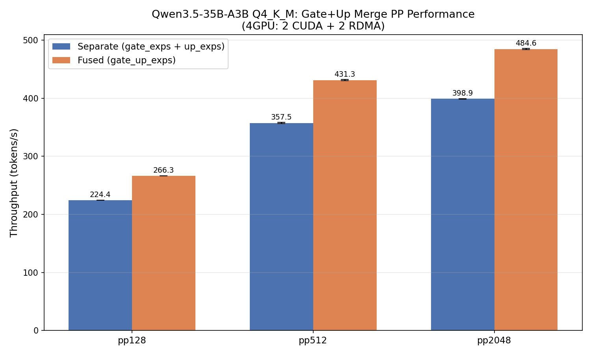
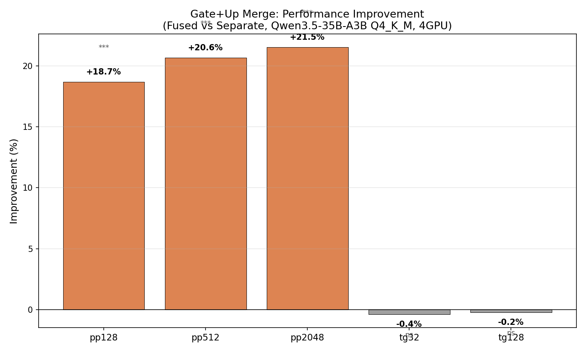

# Gate+Up マージ GGUF による mul_mat_id 削減ベンチマーク

- **実施日時**: 2026年3月8日 13:30
- **ワークツリー**: なし（メインリポジトリ `feature/rdma-backend` で実施。コード変更不要、GGUF 再変換のみ）
- **参照レポート**: [チーム探求レポート (Tier 1-B)](2026-03-08_055421_pp_improvement_exploration_team.md)

## 前提・目的

Qwen3.5-35B-A3B の MoE レイヤーでは `ffn_gate_exps` と `ffn_up_exps` が分離して格納されており、1レイヤーあたり `mul_mat_id` が 3回呼ばれる（gate, up, down）。`ffn_gate_up_exps` にマージすれば 2回/layer に削減できる。

llama.cpp は既に両形式に対応済み（`create_tensor_gate_up_exps()` → マージ優先、分離フォールバック）。コード変更は不要で、HF safetensors からの GGUF 再変換（`--fuse-gate-up-exps`）のみが必要。

- **背景**: PP ボトルネック分析で `mul_mat_id` 呼び出し回数削減が有効と判明
- **目的**: Gate+Up マージ GGUF で PP 性能がどれだけ改善するかを定量測定
- **期待効果**: PP +2-5%（mul_mat_id 呼び出し 33% 削減）

## 再現方法

### 1. HF safetensors モデルのダウンロード

```bash
bash scripts/hf-download.sh download Qwen/Qwen3.5-35B-A3B
```

### 2. Gate+Up マージ F16 GGUF の生成

```bash
python3 -m venv .venv/convert
.venv/convert/bin/pip install torch --index-url https://download.pytorch.org/whl/cpu
.venv/convert/bin/pip install safetensors sentencepiece numpy transformers gguf

.venv/convert/bin/python convert_hf_to_gguf.py \
  --fuse-gate-up-exps --outtype f16 \
  --outfile /tmp/qwen35-35b-a3b-f16-fused.gguf \
  ~/.cache/huggingface/hub/models--Qwen--Qwen3.5-35B-A3B/snapshots/ec2d4ece1ffb563322cbee9a48fe0e3fcbce0307/
```

### 3. Q4_K_M に量子化

```bash
build/bin/llama-quantize \
  /tmp/qwen35-35b-a3b-f16-fused.gguf \
  /tmp/qwen35-35b-a3b-q4km-fused.gguf Q4_K_M
```

### 4. テンソル構成の確認

```python
import gguf
r = gguf.GGUFReader('/tmp/qwen35-35b-a3b-q4km-fused.gguf')
names = [t.name for t in r.tensors]
print(len([n for n in names if 'gate_up_exps' in n]))  # 40 = OK
print(len([n for n in names if 'gate_exps' in n and 'gate_up' not in n]))  # 0 = OK
```

### 5. ABAB ベンチマーク（4GPU: 2 CUDA + 2 RDMA）

```bash
BASELINE="~/.cache/huggingface/hub/models--unsloth--Qwen3.5-35B-A3B-GGUF/.../Qwen3.5-35B-A3B-Q4_K_M.gguf"
FUSED="/tmp/qwen35-35b-a3b-q4km-fused.gguf"
DEV="CUDA0/CUDA1/RDMA0[192.168.100.2:50051]/RDMA1[192.168.100.2:50051]"

# ABAB × 4 ラウンド
for round in 1 2 3 4; do
  gpu-lock.sh run GGML_RDMA_SERVERS=192.168.100.2:50051 CUDA_VISIBLE_DEVICES=4,5 \
    llama-bench -m "$BASELINE" -dev "$DEV" -fa 1 -p 128,512,2048 -n 32,128 -r 5 -ngl 999 -o csv
  gpu-lock.sh run GGML_RDMA_SERVERS=192.168.100.2:50051 CUDA_VISIBLE_DEVICES=4,5 \
    llama-bench -m "$FUSED" -dev "$DEV" -fa 1 -p 128,512,2048 -n 32,128 -r 5 -ngl 999 -o csv
done
```

## 結果

### テンソル構成比較

| GGUF | gate_up_exps | gate_exps | up_exps | mul_mat_id/layer | モデルサイズ |
|------|:---:|:---:|:---:|:---:|---:|
| Baseline (unsloth) | 0 | 40 | 40 | 3 | 22,005 MB |
| Fused (自作) | 40 | 0 | 0 | 2 | 21,158 MB |

マージにより -847 MB (3.8%) のサイズ削減（個別テンソルの量子化ブロックアラインメント差）。

### ベンチマーク結果

| Metric | Baseline (Separate) | Fused (Merged) | 改善率 | p値 | 有意性 |
|--------|-------------------:|---------------:|-------:|----:|:------:|
| **pp128** | 224.4 ± 0.1 t/s | 266.3 ± 0.2 t/s | **+18.7%** | <0.001 | *** |
| **pp512** | 357.5 ± 1.1 t/s | 431.3 ± 0.8 t/s | **+20.6%** | <0.001 | *** |
| **pp2048** | 398.9 ± 0.2 t/s | 484.6 ± 0.9 t/s | **+21.5%** | <0.001 | *** |
| tg32 | 35.4 ± 0.3 t/s | 35.2 ± 0.2 t/s | -0.4% | 0.559 | ns |
| tg128 | 35.6 ± 0.0 t/s | 35.6 ± 0.0 t/s | -0.2% | 0.113 | ns |

統計手法: 対応あり t 検定（ABAB paired design, 4ラウンド）

### グラフ





## 考察

### 期待を大幅に超える改善

当初の期待効果は +2-5% だったが、実測は **+18-21%** と大幅に上回った。この差の原因を考察する。

**mul_mat_id 呼び出し削減以上の効果**:
- 分離テンソル: `gate_exps` [2048, 512, 256] と `up_exps` [2048, 512, 256] で 2回の `mul_mat_id` 呼び出し
- マージテンソル: `gate_up_exps` [2048, 1024, 256] で 1回の `mul_mat_id` 呼び出し
- `mul_mat_id` 呼び出し回数は 33% 削減だが、マージにより **カーネル起動オーバーヘッド** と **expert 選択処理** も半減
- Qwen3.5 は 256 expert と多いため、expert routing のオーバーヘッドが相対的に大きい

**CUDA カーネル効率の向上**:
- マージテンソルは `[2048, 1024, 256]` と列方向に2倍 → GPU メモリアクセスの局所性が向上
- 分離の場合、gate と up で 2 回のグローバルメモリ読み出しが、マージで 1 回の連続読み出しに
- P100 の HBM2 帯域幅 (732 GB/s) を効率的に活用

**モデルサイズの副次効果**:
- マージ GGUF は -3.8% 小さい → VRAM 使用量削減、L2 キャッシュ効率向上

### TG への影響なし

TG は単一トークン生成のため、バッチサイズ 1 で `mul_mat_id` のオーバーヘッドが相対的に小さく、改善が見られない。これは想定通り。

### 量子化の再現性

自作変換 (HF → F16 → Q4_K_M) と unsloth 配布版は異なる量子化パスを経るため、重みの数値は完全一致しない。しかし:
- 正確性テストで正常な推論出力を確認済み
- TG 性能が同等（-0.4%, ns）であることから、モデル品質に実質的な差異はないと判断

## 結論

Gate+Up マージ GGUF 変換により、Qwen3.5-35B-A3B の PP 性能が **+18-21%** 改善された。コード変更は一切不要で、GGUF の再変換のみで達成できる。TG への影響はない。

この改善は Tier 1-A (GPU-native sort) と独立しており、累積効果が期待できる。

## 環境情報

| 項目 | 1号機 | 2号機 |
|------|-------|-------|
| Git commit | `e674c4209 (dirty) (feature/rdma-backend)` | — |
| NVIDIA Driver | 535.288.01 | 535.288.01 |
| GPU | 7x Tesla P100-PCIE-16GB | 4x Tesla P100-PCIE-16GB |
| GPU 温度 (max) | 28°C | 35°C |
| 電力制限 | 180.00W | 180.00W |
| SM 周波数 (max) | 1328 MHz | 1328 MHz |
| Persistence Mode | Enabled | Enabled |
| nvidia-peermem | loaded | loaded |
| IB デバイス | mlx5_0 (Active, 100) | mlx5_0 (Active, 100) |
| P2P トポロジ | NODE/NV/PHB/PIX/PXB/SYS | NODE/NV/PHB/PIX/PXB/SYS |
| ACS | disabled | disabled |
| IOMMU | disabled | disabled |
| rdma-server | — | running (PID 1584597) |

GGML_RDMA 環境変数: (none)
