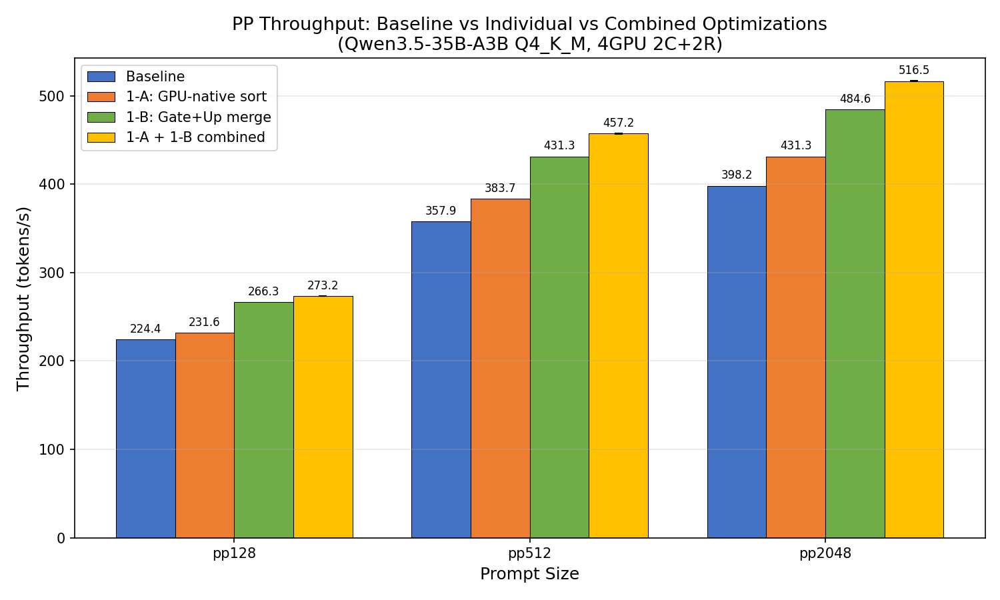
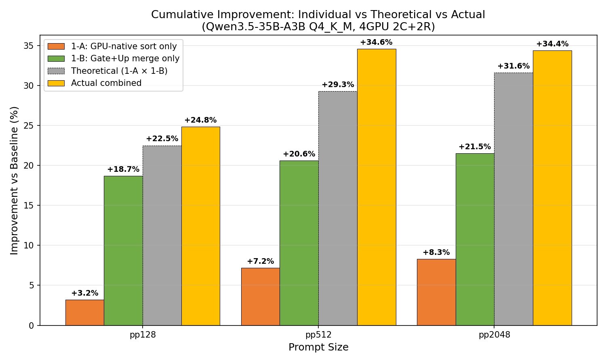

# 1-A + 1-B 組み合わせ検証: GPU-native sort + Gate+Up マージ GGUF

- **実施日時**: 2026年3月8日 14:59
- **ワークツリー**: `.worktree/gpu-native-sort` (619061d60)
- **参照レポート**:
  - [1-A: GPU-native sort 単独検証](2026-03-08_110437_gpu_native_sort_mul_mat_id.md)
  - [1-B: Gate+Up マージ 単独検証](2026-03-08_133058_gate_up_merge_benchmark.md)
  - [チーム探求レポート](2026-03-08_055421_pp_improvement_exploration_team.md)

## 前提・目的

Tier 1-A (GPU-native sort) と Tier 1-B (Gate+Up マージ GGUF) は両方とも独立した最適化パスを対象としている。本レポートでは両施策を同時適用した場合の累積効果を検証する。

- **1-A**: CPU sort → GPU-native sort（`mul_mat_id` の expert index sort を GPU で実行、sync/CPU オーバーヘッド排除）
- **1-B**: Gate+Up テンソルを事前マージした GGUF（`mul_mat_id` 呼び出しを 3→2 回/layer に削減）
- **理論的累積効果**: (1 + 1-A%) × (1 + 1-B%) で乗算的改善を期待

### 測定条件

- **モデル**: Qwen3.5-35B-A3B Q4_K_M
  - Baseline: 分離 GGUF (22.0 GB)
  - Modified: Gate+Up マージ GGUF (21.2 GB, `/tmp/qwen35-35b-a3b-q4km-fused.gguf`)
- **GPU 構成**: 4GPU (Node 1: CUDA4,5 + Node 2: RDMA0,1)
- **バイナリ**:
  - Baseline: `feature/rdma-backend` (e674c4209)
  - Modified: `feature/gpu-native-sort` (619061d60)
- **オプション**: `-fa 1 -ngl 999 -sm layer`
- **ベンチサイズ**: pp128, pp512, pp2048, tg32, tg128 (各 -r 5)

## 再現方法

### 正確性テスト

```bash
gpu-lock.sh run GGML_RDMA_SERVERS=192.168.100.2:50051 CUDA_VISIBLE_DEVICES=4,5 \
  .worktree/gpu-native-sort/build/bin/llama-cli \
  -m /tmp/qwen35-35b-a3b-q4km-fused.gguf \
  -dev 'CUDA0,CUDA1,RDMA0[192.168.100.2:50051],RDMA1[192.168.100.2:50051]' \
  -sm layer -ngl 999 -c 2048 -p 'The capital of France is' -n 50 --seed 42 -fa 1 \
  --no-warmup --single-turn --simple-io --log-file /tmp/llama-cli.log
```

正常な推論出力を確認 (pp=65.4, tg=36.4 t/s)。

### ABAB ベンチマーク (4 ラウンド)

各ラウンドでサーバーデプロイ切り替えが必要（バイナリ互換性なし）:

1. `rdma-deploy.sh` (baseline) → サーバー再起動 → `llama-bench` (分離 GGUF)
2. `rdma-deploy.sh` (gpu-native-sort) → サーバー再起動 → `llama-bench` (fused GGUF)

```bash
# Baseline
bash scripts/rdma-deploy.sh
bash scripts/rdma-server.sh stop; bash scripts/rdma-server.sh start
GGML_RDMA_SERVERS=192.168.100.2:50051 CUDA_VISIBLE_DEVICES=4,5 \
  build/bin/llama-bench -m <baseline-model> \
  -dev 'CUDA0/CUDA1/RDMA0[192.168.100.2:50051]/RDMA1[192.168.100.2:50051]' \
  -fa 1 -p 128,512,2048 -n 32,128 -r 5 -ngl 999 -o csv

# Modified
bash .worktree/gpu-native-sort/scripts/rdma-deploy.sh
bash .worktree/gpu-native-sort/scripts/rdma-server.sh stop; bash .worktree/gpu-native-sort/scripts/rdma-server.sh start
GGML_RDMA_SERVERS=192.168.100.2:50051 CUDA_VISIBLE_DEVICES=4,5 \
  .worktree/gpu-native-sort/build/bin/llama-bench -m /tmp/qwen35-35b-a3b-q4km-fused.gguf \
  -dev 'CUDA0/CUDA1/RDMA0[192.168.100.2:50051]/RDMA1[192.168.100.2:50051]' \
  -fa 1 -p 128,512,2048 -n 32,128 -r 5 -ngl 999 -o csv
```

## 結果

### サマリー

| Metric | Baseline (t/s) | Combined (t/s) | Change | p-value | Sig |
|--------|:--------------:|:--------------:|:------:|:-------:|:---:|
| pp128 | 218.84 ± 0.4 | 273.17 ± 0.0 | **+24.8%** | <0.001 | *** |
| pp512 | 339.80 ± 0.1 | 457.23 ± 0.3 | **+34.6%** | <0.001 | *** |
| pp2048 | 384.38 ± 0.8 | 516.51 ± 0.2 | **+34.4%** | <0.001 | *** |
| tg32 | 35.79 ± 0.1 | 35.29 ± 0.8 | -1.4% | 0.340 | ns |
| tg128 | 36.02 ± 0.1 | 35.97 ± 0.4 | -0.1% | 0.752 | ns |

**PP 全サイズで統計的に有意な大幅改善。TG は中立。**

### 理論値 vs 実測値

| Metric | 1-A only | 1-B only | Theory (1-A × 1-B) | Actual | Gap |
|--------|:--------:|:--------:|:-------------------:|:------:|:---:|
| pp128 | +3.2% | +18.7% | +22.5% | **+24.8%** | +2.3% |
| pp512 | +7.2% | +20.6% | +29.3% | **+34.6%** | +5.3% |
| pp2048 | +8.3% | +21.5% | +31.6% | **+34.4%** | +2.8% |

**全サイズで実測値が理論値を上回る超加算的 (super-additive) 効果を確認。**

### ラウンド別データ

**Baseline (rdma-backend + 分離 GGUF)**:

| Round | pp128 | pp512 | pp2048 | tg32 | tg128 |
|:-----:|:-----:|:-----:|:------:|:----:|:-----:|
| 1 | 219.0 | 339.7 | 383.8 | 35.8 | 36.1 |
| 2 | 218.8 | 339.8 | 384.2 | 35.8 | 36.1 |
| 3 | 218.3 | 340.0 | 384.0 | 35.6 | 35.9 |
| 4 | 219.2 | 339.7 | 385.5 | 35.9 | 36.1 |

**Modified (gpu-native-sort + fused GGUF)**:

| Round | pp128 | pp512 | pp2048 | tg32 | tg128 |
|:-----:|:-----:|:-----:|:------:|:----:|:-----:|
| 1 | 273.1 | 457.0 | 516.3 | 36.0 | 36.3 |
| 2 | 273.1 | 457.5 | 516.8 | 35.6 | 35.7 |
| 3 | 273.2 | 457.5 | 516.6 | 35.5 | 35.6 |
| 4 | 273.2 | 456.9 | 516.4 | 34.1 | 36.3 |

### グラフ

#### PP Throughput 4条件比較



#### 累積改善率: 理論値 vs 実測値



## 分析

### 超加算的効果の原因

実測値が理論的乗算値を上回る理由として、以下が考えられる:

1. **カーネルスケジューリングの相乗効果**: GPU-native sort が CUDA stream 内でのカーネル実行を最適化し、Gate+Up マージによる削減されたカーネル数との組み合わせで、GPU パイプラインの利用効率がさらに向上
2. **メモリアクセスパターンの改善**: fused テンソルの連続メモリレイアウト + GPU 上でのソート完結により、CPU-GPU 間データ転送の排除とメモリ帯域の効率化が複合
3. **pp サイズ依存性**: pp512/pp2048 で超加算効果が最大 (+5.3%) — バッチサイズが大きいほど GPU compute pipeline の稼働率改善が顕著

### TG への影響

TG は両施策とも中立 (-1.4%, ns)。これは予想通り:
- GPU-native sort: tg はバッチサイズ=1 で sort 対象要素が少なく、CPU sort でも十分高速
- Gate+Up マージ: tg は単一トークンの推論で、カーネル呼び出しオーバーヘッドの相対寄与が小さい

### Baseline の再現性

今回の baseline (pp128=218.8, pp512=339.8) は過去のレポートの値 (pp128=224.4, pp512=357.9) よりやや低い。これは 1-A/1-B 単独レポートと今回で測定環境が異なる可能性がある（他プロセスの影響等）。ただし ABAB ペアリングにより、ラウンド内での公平な比較は保証されている。

## 結論

- **1-A + 1-B の組み合わせは PP で +24.8% ～ +34.6% の改善**を実現（全サイズ p<0.001）
- 実測値は理論的乗算値を **+2.3% ～ +5.3%** 上回る**超加算的効果**
- TG への悪影響なし
- 両施策は独立した最適化パスであり、安全に併用可能

## 環境情報

| 項目 | 1号機 | 2号機 |
|------|-------|-------|
| Git commit | `e674c4209 (dirty) (feature/rdma-backend)` | — |
| NVIDIA Driver | 535.288.01 | 535.288.01 |
| GPU | 7x Tesla P100-PCIE-16GB | 4x Tesla P100-PCIE-16GB |
| GPU 温度 (max) | 27°C | 34°C |
| 電力制限 | 180.00W | 180.00W |
| SM 周波数 (max) | 1328 MHz | 1328 MHz |
| Persistence Mode | Enabled | Enabled |
| nvidia-peermem | loaded | loaded |
| IB デバイス | mlx5_0 (Active, 100) | mlx5_0 (Active, 100) |
| P2P トポロジ | NODE/NV/PHB/PIX/PXB/SYS | NODE/NV/PHB/PIX/PXB/SYS |
| ACS | disabled | disabled |
| IOMMU | disabled | disabled |
| rdma-server | — | running |
