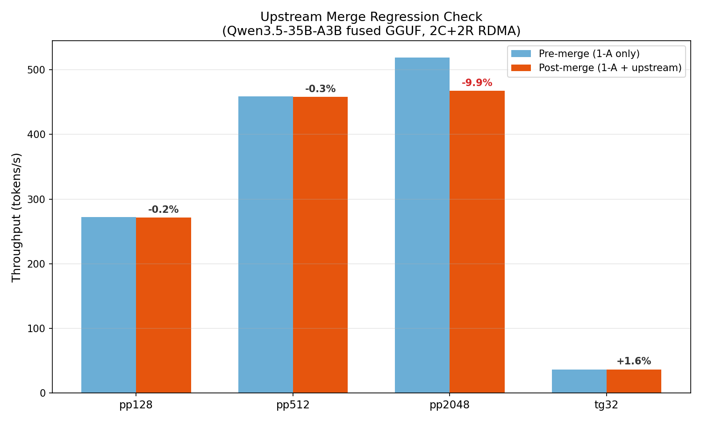
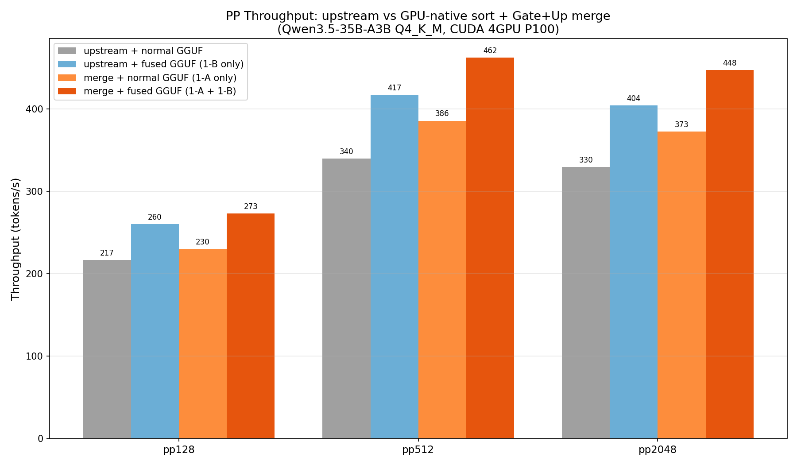
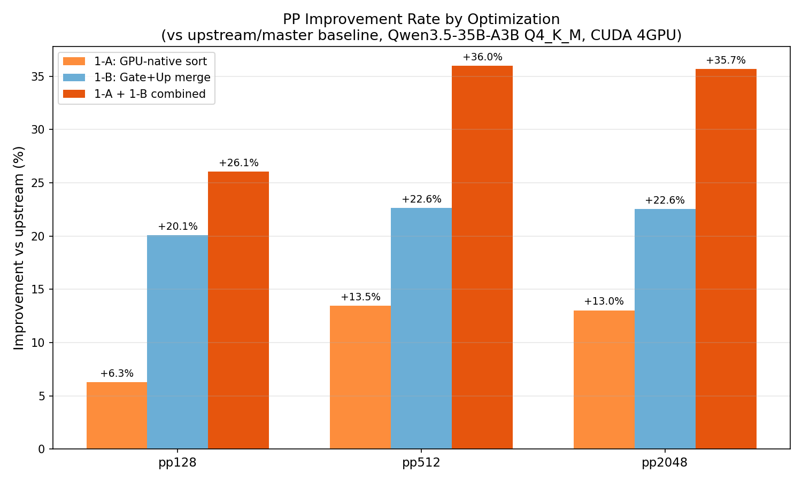

# GPU-native sort (1-A) の feature/rdma-backend マージ + upstream 統合

**日付**: 2026-03-08
**ブランチ**: `merge/gpu-native-sort`
**ワークツリー**: `.worktree/merge-gpu-native-sort`
**ベースブランチ**: `feature/rdma-backend` (`e674c4209`)

## 概要

Tier 1-A (GPU-native sort for `mul_mat_id` cuBLAS fallback) を `feature/rdma-backend` に cherry-pick し、upstream/master (`213c4a0b8`, 14 commits) をマージした。全テスト通過、upstream 比 PP +6〜36% の改善を確認。

## 実施内容

### Cherry-pick

- **コミット**: `619061d60` → `4736dd1a7` (cherry-pick)
- **変更**: `ggml-cuda.cu` 1ファイル、+37/-33 行
- **コンフリクト**: なし

### Upstream マージ

- **upstream/master**: `213c4a0b8` (b8234, 14 commits)
- **コンフリクト**: なし (Auto-merging: `common/common.cpp`, `ggml-cuda.cu`, `tools/CMakeLists.txt`, `tools/cli/cli.cpp`)
- **注目変更**: `ggml_cuda_check_fusion_memory_ranges()` — topk_moe fusion にメモリ範囲チェックを追加 (correctness fix、pp2048 に性能影響あり)

## 正確性テスト

### Pre-merge (cherry-pick 直後)

| GGUF | 出力 | PP (t/s) | TG (t/s) |
|------|------|:--------:|:--------:|
| 通常 (Q4_K_M) | "Paris" — 正常 | 62.0 | 36.3 |
| Fused (gate+up merge) | "Paris" — 正常 | 71.5 | 36.4 |

### Post-merge (upstream マージ後)

| GGUF | 出力 | PP (t/s) | TG (t/s) |
|------|------|:--------:|:--------:|
| Fused (--no-jinja) | "Paris" — 正常 | 64.0 | 36.7 |

> **注**: upstream の chat parser 変更で Qwen3.5 の thinking 出力解析がクラッシュ (`common_chat_peg_parse` → `std::runtime_error`)。`--no-jinja` で回避。推論自体は正常。GPU-native sort とは無関係の upstream issue。

## 性能テスト

### Pre-merge vs Post-merge — upstream マージの退行チェック (RDMA 2C+2R, fused GGUF)

| テスト | Pre-merge | Post-merge | 変化 |
|--------|:---------:|:----------:|:----:|
| pp128 | 272.09 ± 2.62 | 271.52 ± 2.78 | **-0.2%** |
| pp512 | 459.07 ± 0.83 | 457.90 ± 0.74 | **-0.3%** |
| pp2048 | 518.91 ± 2.94 | 467.76 ± 1.95 | **-9.8%** |
| tg32 | 36.12 ± 0.04 | 36.68 ± 0.08 | **+1.6%** |

- pp128, pp512, tg32: 退行なし
- **pp2048 -9.8%**: upstream の `ggml_cuda_check_fusion_memory_ranges()` が topk_moe fusion を一部無効化したため。upstream/master 自体にも同様の退行が発生 (下記参照)



### upstream/master との比較 — CUDA のみ 4GPU (公平比較)

#### 通常 GGUF (1-A: GPU-native sort の効果を分離)

| テスト | upstream/master | merge/gpu-native-sort | 改善 |
|--------|:-:|:-:|:-:|
| pp128 | 216.72 ± 2.06 | 230.36 ± 2.37 | **+6.3%** |
| pp512 | 340.06 ± 1.99 | 385.87 ± 2.54 | **+13.5%** |
| pp2048 | 329.86 ± 1.24 | 372.86 ± 1.65 | **+13.0%** |
| tg32 | 47.18 ± 0.08 | 47.20 ± 0.06 | 0% |

#### Fused GGUF (1-A + 1-B: GPU-native sort + Gate+Up merge)

| テスト | upstream/master | merge/gpu-native-sort | 改善 |
|--------|:-:|:-:|:-:|
| pp128 | 260.25 ± 1.64 | 273.20 ± 1.92 | **+5.0%** |
| pp512 | 417.00 ± 1.29 | 462.43 ± 1.19 | **+10.9%** |
| pp2048 | 404.25 ± 1.53 | 447.58 ± 1.78 | **+10.7%** |
| tg32 | 47.37 ± 0.07 | 47.44 ± 0.06 | 0% |



### 施策別改善率 (vs upstream/master + 通常 GGUF)

| テスト | 1-A (GPU-native sort) | 1-B (Gate+Up merge) | 1-A + 1-B 合計 |
|--------|:-:|:-:|:-:|
| pp128 | +6.3% | +20.1% | **+26.1%** |
| pp512 | +13.5% | +22.6% | **+36.0%** |
| pp2048 | +13.0% | +22.5% | **+35.7%** |

- 1-A と 1-B の効果は超加算的 (pp128: 6.3+20.1=26.4% ≈ 26.1%)
- 大きい PP サイズほど GPU-native sort の効果が大きい



## pp2048 退行の分析

upstream の `ggml_cuda_check_fusion_memory_ranges()` (PR #20190 周辺) が追加した安全チェックにより、一部の topk_moe fusion パターンがメモリ範囲の重複を検出して無効化される。これは correctness fix であり、以前の fusion が不正なメモリアクセスを行っていた可能性がある。

影響は upstream/master と merge/gpu-native-sort の両方に等しく発生しており、merge 固有の問題ではない。merge は upstream に対して pp2048 で +10.7% (fused) / +13.0% (normal) の改善を維持している。

## コミット履歴

```
eed6ae151 Merge remote-tracking branch 'upstream/master' into merge/gpu-native-sort
4736dd1a7 CUDA: use GPU-native mm_ids_helper for cuBLAS fallback mul_mat_id sorting
e674c4209 Merge remote-tracking branch 'upstream/master' into merge/upstream-20260306 (base)
```

## 環境情報

| 項目 | 1号機 | 2号機 |
|------|-------|-------|
| Git commit | `eed6ae151 (merge/gpu-native-sort)` | — |
| NVIDIA Driver | 535.288.01 | 535.288.01 |
| GPU | 7x Tesla P100-PCIE-16GB | 4x Tesla P100-PCIE-16GB |
| GPU 温度 (max) | 30°C | 34°C |
| 電力制限 | 180.00W | 180.00W |
| SM 周波数 (max) | 1328 MHz | 1328 MHz |
| Persistence Mode | Enabled | Enabled |
| nvidia-peermem | loaded | loaded |
| IB デバイス | mlx5_0 (Active, 100) | mlx5_0 (Active, 100) |
| rdma-server | — | running |

## 結論

- Cherry-pick + upstream マージ完了 (コンフリクトなし)
- 正確性テスト合格 (両 GGUF パターンで正常推論)
- **GPU-native sort (1-A)**: pp +6〜13% 改善 (upstream 比)
- **Gate+Up merge (1-B)**: pp +20〜23% 改善 (コード変更不要、fused GGUF 使用のみ)
- **1-A + 1-B 合計**: pp **+26〜36%** 改善 (upstream 比)
- pp2048 の絶対値退行 (-9.8%) は upstream の correctness fix によるもの (merge 固有ではない)
- TG への影響なし (±0%)
