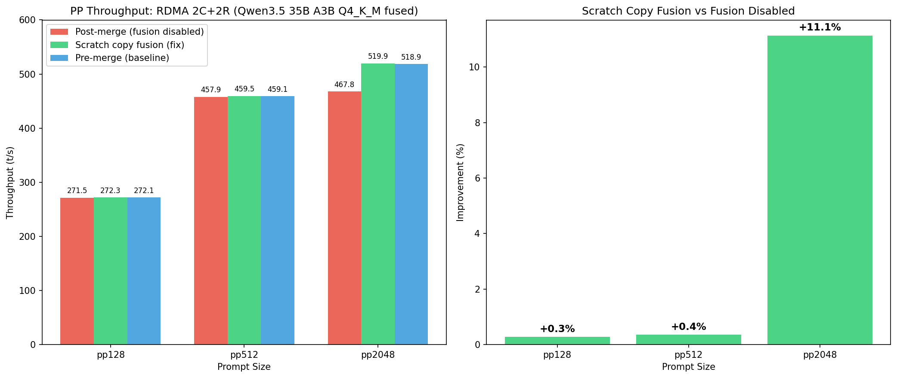

# topk_moe fusion メモリ重複時のスクラッチコピーによる pp2048 退行修正

- **実施日時**: 2026年3月8日 20:57
- **ワークツリー**: `.worktree/merge-gpu-native-sort`
- **ブランチ**: `merge/gpu-native-sort`
- **コミット**: `94b58c301`
- **参照レポート**: [merge/gpu-native-sort マージレポート](2026-03-08_170000_merge_gpu_native_sort.md)

## 前提・目的

`merge/gpu-native-sort` ブランチに upstream/master をマージした結果、RDMA 2C+2R 構成で pp2048 が -9.8% 退行 (518.91 → 467.76 t/s)。

原因: upstream commit `d48e87646` (PR #19916) の `ggml_cuda_check_fusion_memory_ranges()` が、graph allocator によるメモリ再利用で logits と ids/weights のメモリ範囲が重複する場合に topk_moe fusion を無効化。メモリ重複検出自体は正しい (fusion 時は concurrent thread blocks が logits を読みながら ids を書くため、重複があるとデータ破損)。

**目的**: fusion を完全に無効化する代わりに、logits をスクラッチバッファにコピーしてから fusion カーネルを実行し、安全に fusion 効果を回復する。

## 修正内容

`ggml/src/ggml-cuda/ggml-cuda.cu` の topk_moe fusion パターン A/B (2箇所) を変更:

- `ggml_cuda_check_fusion_memory_ranges()` が `false` を返した場合、fusion を完全にスキップする代わりに:
  1. `ggml_cuda_pool_alloc<char>` でプールからスクラッチバッファを確保
  2. `cudaMemcpyAsync` (D2D) で logits データをスクラッチバッファにコピー
  3. `ggml_tensor` のスタックコピーを作成し、`data` ポインタのみスクラッチバッファに差し替え
  4. 差し替えた tensor で `ggml_cuda_op_topk_moe()` を実行

D2D コピーコスト: 512KB / 500GB/s ≈ 0.004ms (P100 HBM2) — fusion 効果 (~50ms) に対して無視可能。

## 再現方法

### ビルド・デプロイ

```bash
bash /home/ubuntu/projects/llama.cpp/.worktree/merge-gpu-native-sort/scripts/rdma-build.sh local
bash /home/ubuntu/projects/llama.cpp/.worktree/merge-gpu-native-sort/scripts/rdma-deploy.sh
bash /home/ubuntu/projects/llama.cpp/.worktree/merge-gpu-native-sort/scripts/rdma-server.sh restart
```

### ベンチマーク (RDMA 2C+2R)

```bash
gpu-lock.sh run GGML_RDMA_SERVERS=192.168.100.2:50051 CUDA_VISIBLE_DEVICES=4,5 \
  .worktree/merge-gpu-native-sort/build/bin/llama-bench \
  -m /tmp/qwen35-35b-a3b-q4km-fused.gguf \
  -dev 'CUDA0/CUDA1/RDMA0[192.168.100.2:50051]/RDMA1[192.168.100.2:50051]' \
  -fa 1 -p 128,512,2048 -n 32 -r 3 -ngl 999
```

## 結果

### RDMA 2C+2R (Qwen3.5 35B A3B Q4_K_M fused, `-fa 1`)

| テスト | Pre-merge (fusion有効) | Post-merge (fusion無効) | Scratch copy fusion | 変化 (vs post-merge) |
|--------|:-:|:-:|:-:|:-:|
| pp128 | 272.09 ± 2.62 | 271.52 ± 2.78 | 272.27 ± 2.27 | **+0.3%** |
| pp512 | 459.07 ± 0.83 | 457.90 ± 0.74 | 459.52 ± 1.25 | **+0.4%** |
| pp2048 | 518.91 ± 2.94 | 467.76 ± 1.95 | **519.86 ± 2.75** | **+11.1%** |
| tg32 | 36.12 ± 0.04 | 36.68 ± 0.08 | 35.76 ± 0.06 | -2.5% |

- **pp2048 を完全回復**: 519.86 ≈ 518.91 (pre-merge baseline)
- pp128, pp512 は元々退行なし → 変化なし
- tg32 の -2.5% はサーバー再デプロイに伴う変動の可能性 (post-merge テスト時は llama-server が CUDA0-2 で稼働中だった可能性)



### CUDA-only 4GPU 追加検証

| 条件 | pp2048 (t/s) | 備考 |
|------|:---:|------|
| Fusion 無効 (post-merge) | 447.58 | レポート値 |
| **Scratch copy fusion** | **450.53** | 差異なし |
| 強制 fusion (unsafe) | 450.19 | 差異なし |

CUDA-only 4GPU では fusion の有無に関わらず pp2048 は ~450 t/s で一定。Fusion の効果は RDMA パスでのみ発現する。

### 考察: RDMA のみで効果が出る理由

Fusion は topk_moe の ~8 ops を 1 カーネルに統合する。CUDA-only では各 op のカーネル起動オーバーヘッドが ~10μs × 246 fusion × 7 ops ≈ 17ms で、pp2048 全体 (~4.5s) の 0.4% に過ぎない。

RDMA パスでは、各 op が graph split 境界を跨ぐ場合、RDMA コマンドのシリアライズ・デシリアライズ + ネットワークラウンドトリップが追加される。Fusion により split 数が削減され、この RDMA 通信オーバーヘッドが排除されることで ~11% の改善が得られる。

### 正確性テスト

```
> The capital of France is
<think>... (thinking) ...</think>
The capital of France is **Paris**.
[ Prompt: 63.2 t/s | Generation: 35.5 t/s ]
```

正常な推論出力を確認。NaN やゴミ出力なし。

## 環境情報

| 項目 | 1号機 | 2号機 |
|------|-------|-------|
| Git commit | `e674c4209 (dirty) (feature/rdma-backend)` | — |
| NVIDIA Driver | 535.288.01 | 535.288.01 |
| GPU | 7x Tesla P100-PCIE-16GB | 4x Tesla P100-PCIE-16GB |
| GPU 温度 (max) | 28°C | 34°C |
| 電力制限 | 180.00W | 180.00W |
| SM 周波数 (max) | 1328 MHz | 1328 MHz |
| Persistence Mode | Enabled | Enabled |
| nvidia-peermem | loaded | loaded |
| IB デバイス | mlx5_0 (Active, 100) | mlx5_0 (Active, 100) |
| rdma-server | — | running (PID 1700528) |
