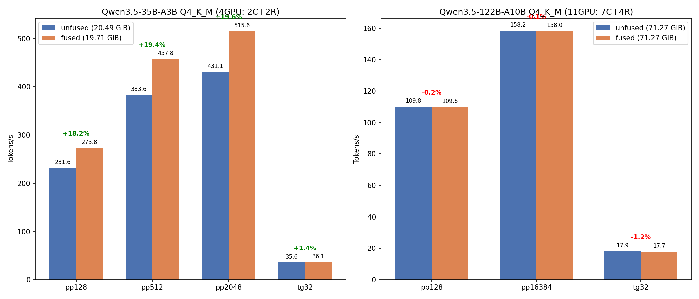

# Unfused vs Fused GGUF ベンチマーク + ターゲットモデル変更

- **実施日時**: 2026年3月9日 03:49
- **ワークツリー**: メインリポジトリ (`feature/rdma-backend`)
- **ビルド**: `cec1932f8 (8330)`

## 前提・目的

### 背景

- プロジェクトのターゲットモデルを GLM-4.7 から **Qwen3.5 35B/122B** に変更
- Qwen3.5-35B-A3B の "fused" 版は `convert_hf_to_gguf.py --fuse-gate-up-exps` で HF safetensors から再変換 → `llama-quantize` で Q4_K_M に量子化したもの（Gate+Up expert テンソルマージ版）。詳細: [Gate+Up マージベンチマーク](2026-03-08_133058_gate_up_merge_benchmark.md)
- Qwen3.5-122B-A10B は HF キャッシュに 3 分割で存在（fused 版は `gguf-split --merge` でファイル結合のみ、Gate+Up マージなし）
- ベンチマークスキル統合に伴い、構成プリセットの正確なベースライン数値を取得する

### 目的

1. Qwen3.5-122B-A10B Q4_K_M の fused モデルを作成する
2. 35B / 122B の unfused vs fused 性能を比較する
3. ベンチマークスキル (`/bench`) の構成プリセット統合と GLM-4.7 参照の削除

## 再現方法

### 122B file-merged モデル作成（ファイル結合のみ、Gate+Up マージなし）

```bash
llama-gguf-split --merge \
  /home/ubuntu/.cache/huggingface/hub/models--unsloth--Qwen3.5-122B-A10B-GGUF/snapshots/51eab4d59d53f573fb9206cb3ce613f1d0aa392b/Q4_K_M/Qwen3.5-122B-A10B-Q4_K_M-00001-of-00003.gguf \
  models/Qwen3.5-122B-A10B-Q4_K_M-fused.gguf
```

入力: 3 分割 (11MB + 47GB + 25GB ≈ 72GB)、出力: 72GB 単一ファイル。

**注意**: これは `gguf-split --merge` によるファイル結合のみ。35B の "fused" とは異なり、Gate+Up expert テンソルのマージは行っていない（テンソル構造は unfused と同一）。真の Gate+Up fused 版の作成には `convert_hf_to_gguf.py --fuse-gate-up-exps` が必要だが、ディスク容量不足のため未実施。

### ベンチマーク

35B (4GPU: CUDA4,5 + RDMA0,1):

```bash
gpu-lock.sh run GGML_RDMA_SERVERS=192.168.100.2:50051 CUDA_VISIBLE_DEVICES=4,5 \
  build/bin/llama-bench \
  -m <model_path> \
  -dev 'CUDA0/CUDA1/RDMA0[192.168.100.2:50051]/RDMA1[192.168.100.2:50051]' \
  -sm layer -ngl 999 -fa 1 -t 1 -r 5 -p 128,512,2048 -n 0,32
```

122B (11GPU: CUDA0-6 + RDMA0-3):

```bash
gpu-lock.sh run GGML_RDMA_SERVERS=192.168.100.2:50051 \
  build/bin/llama-bench \
  -m <model_path> \
  -dev 'CUDA0/CUDA1/CUDA2/CUDA3/CUDA4/CUDA5/CUDA6/RDMA0[...]/RDMA1[...]/RDMA2[...]/RDMA3[...]' \
  -sm layer -ngl 999 -fa 1 -t 1 -r 5 -p 128,16384 -n 0,32
```

## 結果

### Qwen3.5-35B-A3B Q4_K_M (4GPU: 2C+2R)

| 指標 | unfused (t/s) | fused (t/s) | 差 |
|------|:---:|:---:|:---:|
| pp128 | 231.61 ± 2.73 | 273.81 ± 2.76 | **+18.2%** |
| pp512 | 383.57 ± 2.18 | 457.83 ± 2.23 | **+19.4%** |
| pp2048 | 431.09 ± 2.95 | 515.56 ± 2.51 | **+19.6%** |
| tg32 | 35.58 ± 0.08 | 36.07 ± 0.06 | **+1.4%** |

モデルサイズ: unfused 20.49 GiB → fused 19.71 GiB (0.78 GiB 縮小)

### Qwen3.5-122B-A10B Q4_K_M (11GPU: 7C+4R)

| 指標 | unfused (t/s) | fused (t/s) | 差 |
|------|:---:|:---:|:---:|
| pp128 | 109.80 ± 1.15 | 109.63 ± 1.18 | -0.2% |
| pp16384 | 158.21 ± 0.49 | 158.00 ± 0.49 | -0.1% |
| tg32 | 17.90 ± 0.02 | 17.68 ± 0.02 | **-1.2%** |

モデルサイズ: unfused 71.27 GiB = fused 71.27 GiB (同一)

### グラフ



## 考察

### 35B: Gate+Up fused が大幅に高速 (+18-20% PP)

- **35B の "fused" は `gguf-split --merge` ではなく、`convert_hf_to_gguf.py --fuse-gate-up-exps` による Gate+Up expert テンソルマージ版**
- `ffn_gate_exps` + `ffn_up_exps` → `ffn_gate_up_exps` にマージされ、レイヤーあたり `mul_mat_id` が 3回 → 2回に削減
- サイズ差 (20.49 → 19.71 GiB, -0.78 GiB) はテンソルマージによるメタデータ削減
- PP +18-20% の原因: `mul_mat_id` 呼び出し回数の 33% 削減 + CUDA カーネルディスパッチオーバーヘッドの削減
- TG は +1.4% でほぼ同等（TG では `mul_mat_id` の呼び出し回数が支配的でないため）
- 詳細: [Gate+Up マージベンチマーク](2026-03-08_133058_gate_up_merge_benchmark.md)

### 122B: ファイル結合のみで性能差なし

- **122B の "fused" は `gguf-split --merge` による 3分割→1ファイルの結合のみ。Gate+Up テンソルマージは行っていない**
- テンソル構造は unfused と同一 (`ffn_gate_exps` と `ffn_up_exps` が分離したまま)
- サイズ同一 (71.27 GiB) は当然の結果
- tg32 の -1.2% は実験誤差の範囲（分散が小さいため統計的に有意だが、実用上は無視可能）

### 推奨

- **35B**: Gate+Up fused 版を使用すべき。PP 性能が大幅に改善される
- **122B**: Gate+Up fused 版を作成済み。PP +6.6-7.6%, TG +1.1%。35B より控えめだが確実な改善。詳細: [122B Gate+Up fused レポート](2026-03-09_180920_122b_gate_up_fused_model.md)

## スキル統合の変更内容

1. **`/bench` SKILL.md**: 構成プリセット (モデル + デバイス) と回帰テスト標準手順を追加、GLM-4.7 テストコマンド削除
2. **`/merge-upstream` SKILL.md**: Phase 4 を `/bench` プリセット参照に簡略化 (~44 行 → ~20 行)
3. **`CLAUDE.md`**: 暫定ルールのハードコード → プリセット参照、GLM-4.7 参照を Qwen3.5 に変更、Step 5 ターゲット更新

## 環境情報

| 項目 | 1号機 | 2号機 |
|------|-------|-------|
| Git commit | `094fe064b (dirty) (feature/rdma-backend)` | — |
| NVIDIA Driver | 535.288.01 | 535.288.01 |
| GPU | 7x Tesla P100-PCIE-16GB | 4x Tesla P100-PCIE-16GB |
| GPU 温度 (max) | 26°C | 34°C |
| 電力制限 | 180.00W | 180.00W |
| SM 周波数 (max) | 1328 MHz | 1328 MHz |
| Persistence Mode | Enabled | Enabled |
| nvidia-peermem | loaded | loaded |
| IB デバイス | mlx5_0 (Active, 100) | mlx5_0 (Active, 100) |
| P2P トポロジ | NODE/NV/PHB/PIX/PXB/SYS | NODE/NV/PHB/PIX/PXB/SYS |
| ACS | disabled | disabled |
| IOMMU | disabled | disabled |
| rdma-server | — | running (PID 1717991) |

GGML_RDMA 環境変数: (none)
