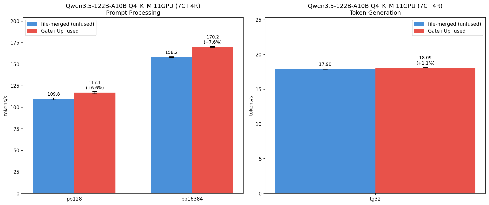

# Qwen3.5-122B-A10B Gate+Up fused モデル作成・ベンチマーク

- **実施日時**: 2026年3月9日 18:09
- **ワークツリー**: メインリポジトリ (`feature/rdma-backend`)
- **ビルド**: `cec1932f8 (8330)`

## 前提・目的

### 背景

- 35B Gate+Up fused 版は PP +18-20% の改善を実現済み ([レポート](2026-03-08_133058_gate_up_merge_benchmark.md))
- 122B は 35B と同じ Qwen3.5 MoE アーキテクチャ (256 experts, 48 blocks)
- 前回の 122B "fused" は `gguf-split --merge` によるファイル結合のみで、テンソル構造は unfused と同一だった ([レポート](2026-03-09_034923_unfused_vs_fused_benchmark.md))
- ディスク容量不足 (318GB 空き vs ~488GB ピーク必要) で断念していたが、不要モデル削除で ~648GB 確保

### 目的

1. `convert_hf_to_gguf.py --fuse-gate-up-exps` で 122B の真の Gate+Up fused 版を作成
2. 旧 file-merged 版とのベンチマーク比較
3. 35B と同等の PP 改善が得られるか検証

## 再現方法

### 1. ディスク空き確保 (~330GB 削除)

```bash
rm -rf /home/ubuntu/.cache/huggingface/hub/models--unsloth--Qwen3.5-35B-A3B-GGUF
rm -rf /home/ubuntu/.cache/huggingface/hub/models--Qwen--Qwen3.5-35B-A3B
rm -rf /home/ubuntu/.cache/huggingface/hub/models--unsloth--Qwen3.5-122B-A10B-GGUF
rm -rf /home/ubuntu/.cache/huggingface/hub/models--unsloth--Qwen3.5-{0.8B,2B,4B,9B,27B}-GGUF
rm models/Qwen3.5-122B-A10B-Q4_K_M-fused.gguf
```

### 2. HF safetensors ダウンロード (~244GB, 32分)

```bash
bash scripts/hf-download.sh download Qwen/Qwen3.5-122B-A10B
```

### 3. F16 GGUF 変換 with Gate+Up fusion (~244GB, 52分)

```bash
.venv/convert/bin/python convert_hf_to_gguf.py \
  --fuse-gate-up-exps --outtype f16 \
  --outfile /tmp/qwen122-f16-fused.gguf \
  /home/ubuntu/.cache/huggingface/hub/models--Qwen--Qwen3.5-122B-A10B/snapshots/b000b2eb18a7f4cdf3153c4215842da339e09d99/
```

### 4. safetensors 削除 → Q4_K_M 量子化 (~69GB, 25分)

```bash
rm -rf /home/ubuntu/.cache/huggingface/hub/models--Qwen--Qwen3.5-122B-A10B
build/bin/llama-quantize /tmp/qwen122-f16-fused.gguf /tmp/qwen122-q4km-fused.gguf Q4_K_M
```

### 5. 最終配置

```bash
rm /tmp/qwen122-f16-fused.gguf
mv /tmp/qwen122-q4km-fused.gguf models/Qwen3.5-122B-A10B-Q4_K_M-fused.gguf
```

### 6. ベンチマーク (11GPU: 7C+4R)

```bash
gpu-lock.sh run GGML_RDMA_SERVERS=192.168.100.2:50051 \
  build/bin/llama-bench \
  -m models/Qwen3.5-122B-A10B-Q4_K_M-fused.gguf \
  -dev 'CUDA0/CUDA1/CUDA2/CUDA3/CUDA4/CUDA5/CUDA6/RDMA0[192.168.100.2:50051]/RDMA1[192.168.100.2:50051]/RDMA2[192.168.100.2:50051]/RDMA3[192.168.100.2:50051]' \
  -sm layer -ngl 999 -fa 1 -t 1 -r 5 -p 128,16384 -n 0,32
```

## テンソル構造検証

```
gate_up_exps (fused): 48
gate_exps (separate): 0
up_exps (separate): 0
Total tensors: 831
PASS: Gate+Up fusion verified
```

全 48 ブロックで `ffn_gate_up_exps.weight` (shape: {3072, 2048, 256}, Q4_K) が存在。分離テンソル (`ffn_gate_exps`, `ffn_up_exps`) は 0。

モデルサイズ: F16 232986 MiB (16.01 BPW) → Q4_K_M 70760 MiB (4.86 BPW)。旧 file-merged 版 (71.27 GiB) より 2.17 GiB 縮小。

## 結果

### 122B Gate+Up fused vs file-merged (11GPU: 7C+4R)

file-merged ベースラインは [前回レポート](2026-03-09_034923_unfused_vs_fused_benchmark.md) の数値を使用（旧モデルは削除済み）。

| 指標 | file-merged (t/s) | Gate+Up fused (t/s) | 差 |
|------|:---:|:---:|:---:|
| pp128 | 109.80 ± 1.15 | 117.06 ± 1.32 | **+6.6%** |
| pp16384 | 158.21 ± 0.49 | 170.17 ± 0.54 | **+7.6%** |
| tg32 | 17.90 ± 0.02 | 18.09 ± 0.01 | **+1.1%** |

### 35B との比較

| モデル | GPU構成 | pp128 改善 | pp大 改善 | tg32 改善 |
|--------|---------|:---:|:---:|:---:|
| 35B (4GPU: 2C+2R) | CUDA4,5+RDMA0,1 | +18.2% | +19.4-19.6% | +1.4% |
| 122B (11GPU: 7C+4R) | CUDA0-6+RDMA0-3 | +6.6% | +7.6% | +1.1% |

### グラフ



## 考察

### PP 改善が 35B より控えめな理由

35B では +18-20% だった PP 改善が、122B では +6.6-7.6% に留まった。これは以下の理由による:

1. **RDMA 通信比率の増大**: 122B は 11GPU (7C+4R) で分散するため、4 台の RDMA デバイスへの通信オーバーヘッドが全体時間に占める割合が大きい。Gate+Up fusion は GPU compute を削減するが、RDMA 通信時間は不変のため、相対的な改善率が薄まる

2. **Layer-split の直列実行**: 11GPU の layer split では各デバイスが逐次処理される。RDMA デバイスの通信待ちが compute 削減分を部分的に相殺する

3. **Expert 分散**: 122B は 256 experts を 11GPU に分散。各 GPU の `mul_mat_id` 対象 expert 数が少なく、fusion による 1 回あたりの削減効果が小さい

### TG はほぼ同等

TG +1.1% は 35B の +1.4% と同等で、Gate+Up fusion が TG にはほぼ影響しないことを再確認。TG では `mul_mat_id` の呼び出し回数よりも RDMA ラウンドトリップ遅延が支配的。

### 総合評価

- Gate+Up fusion は 122B でも PP を確実に改善 (+6.6-7.6%)
- 改善率は compute-bound 度合いに依存: 4GPU (35B) > 11GPU (122B)
- 122B Gate+Up fused 版を標準モデルとして採用

## 環境情報

| 項目 | 1号機 | 2号機 |
|------|-------|-------|
| Git commit | `094fe064b (dirty) (feature/rdma-backend)` | — |
| NVIDIA Driver | 535.288.01 | 535.288.01 |
| GPU | 7x Tesla P100-PCIE-16GB | 4x Tesla P100-PCIE-16GB |
| GPU 温度 (max) | 29°C | 35°C |
| 電力制限 | 180.00W | 180.00W |
| SM 周波数 (max) | 1328 MHz | 1328 MHz |
| Persistence Mode | Enabled | Enabled |
| nvidia-peermem | loaded | loaded |
| IB デバイス | mlx5_0 (Active, 100) | mlx5_0 (Active, 100) |
| P2P トポロジ | NODE/NV/PHB/PIX/PXB/SYS | NODE/NV/PHB/PIX/PXB/SYS |
| ACS | disabled | disabled |
| IOMMU | disabled | disabled |
| rdma-server | — | running (PID 1717991) |

GGML_RDMA 環境変数: (none)
