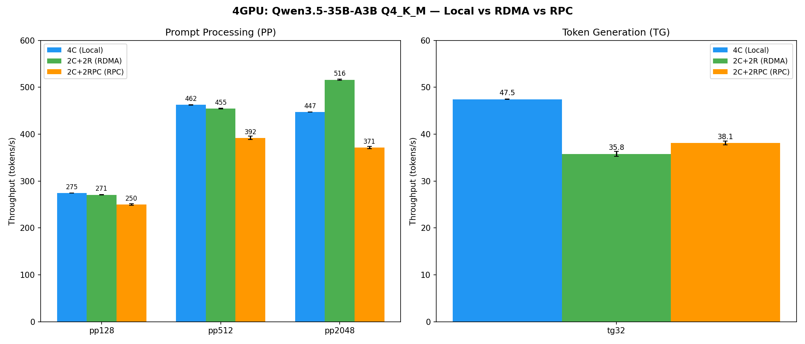
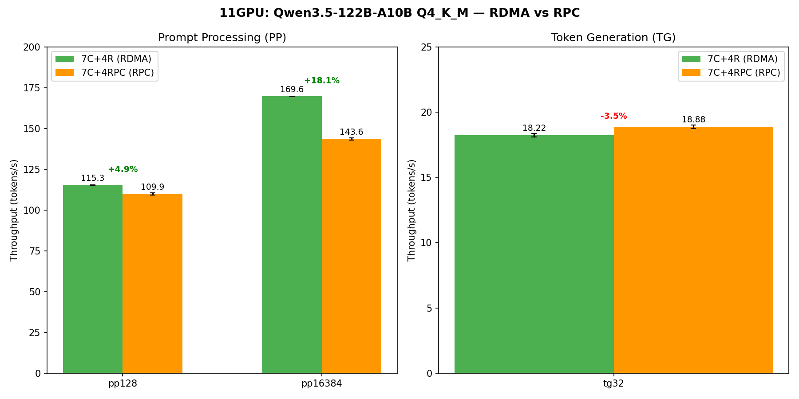
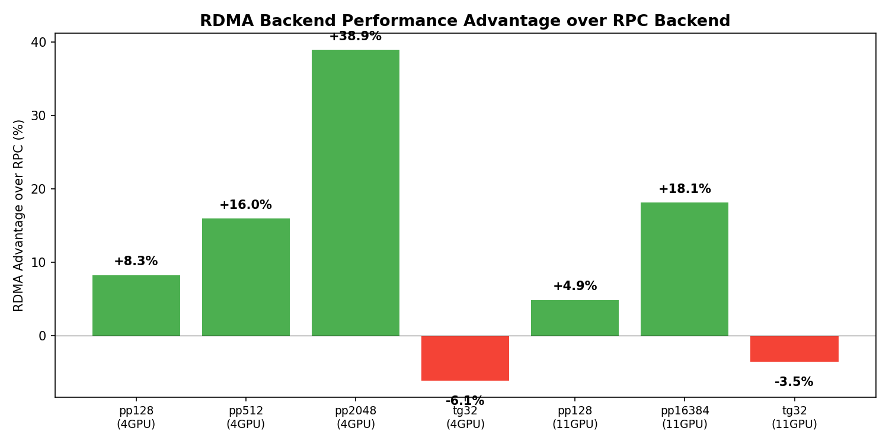

# Upstream RPC vs RDMA バックエンド性能比較ベンチマーク

- **実施日時**: 2026年3月10日 06:03–07:05 (JST)
- **ワークツリー**: `.worktree/upstream-master` (RPC), メインリポジトリ (RDMA)

## 前提・目的

upstream llama.cpp の RPC バックエンドと feature/rdma-backend の RDMA バックエンドの性能を定量比較する。
同一ハードウェア・モデル・GPU 構成で、リモート GPU アクセスの通信バックエンドの違いによる性能差を測定する。

- **背景**: RDMA バックエンドは RPC バックエンドの代替として開発された。TCP/IP スタックをバイパスする RDMA の低レイテンシ・高帯域が、推論性能にどの程度寄与するかを確認する
- **目的**: PP (prompt processing) と TG (token generation) の両方で RDMA vs RPC の性能差を定量化する
- **前提条件**: 1号機 (7×P100) と 2号機 (4×P100) が 100Gb InfiniBand で接続済み。GPUDirect RDMA (nvidia-peermem) 有効

## バージョン情報

| 項目 | RDMA | RPC (upstream) |
|------|------|----------------|
| Commit | `f5e9d0071` (feature/rdma-backend) | `23fbfcb1a` (upstream/master) |
| Build # | 8360 | 8262 |
| バックエンド | CUDA + RDMA | CUDA + RPC |

## 実験設計

- **手法**: ABAB 交互設計 × 5ラウンド（条件間の時間効果を排除）
- **統計**: 対応ありt検定（paired t-test, N=5）
- **有意水準**: *** p<0.001, ** p<0.01, * p<0.05, ns p≥0.05
- 共通パラメータ: `-sm layer -ngl 999 -fa 1 -t 1 -r 1`

## Phase 1: 4GPU ベンチマーク (Qwen3.5-35B-A3B)

**モデル**: Qwen3.5-35B-A3B Q4_K_M Gate+Up fused (19.71 GiB)

### 条件

| 条件 | 構成 | ローカルGPU | リモートGPU | バイナリ |
|------|------|------------|------------|---------|
| 4C | ローカル4GPU | CUDA 3,4,5,6 | なし | RDMA build |
| 2C+2R | RDMA 4GPU | CUDA 4,5 | RDMA 0,1 | RDMA build |
| 2C+2RPC | RPC 4GPU | CUDA 4,5 | RPC 50052,50053 | upstream build |

### 結果

| 指標 | 4C (Local) | RDMA (2C+2R) | RPC (2C+2RPC) | RDMA vs RPC | p-value |
|------|-----------|-------------|--------------|-------------|---------|
| pp128 | 274.64 | 270.80 | 250.09 | **+8.3%*** | <0.001 |
| pp512 | 462.38 | 454.72 | 392.10 | **+16.0%*** | <0.001 |
| pp2048 | 447.37 | **516.03** | 371.45 | **+38.9%*** | <0.001 |
| tg32 | 47.45 | 35.80 | 38.12 | **-6.1%** | 0.003 |



### 分析

**PP (Prompt Processing)**: RDMA が全 PP サイズで RPC を大幅に上回る。pp2048 では **+38.9%** と最大の差。pp サイズが大きくなるほど RDMA の優位性が拡大する。

**pp2048 でローカル 4C を超える現象**: RDMA の pp2048 (516.03 t/s) がローカル 4C (447.37 t/s) を **+15.3%** 上回る。これは PCIe トポロジ分散効果による — ローカル 4C は CUDA3-6 が同一 PCIe スイッチ (PIX) 上で帯域を共有するが、2C+2R は Node 1 と Node 2 の独立したメモリサブシステムに分散されるため PCIe 競合が軽減される。

**TG (Token Generation)**: RDMA の tg32 (35.80 t/s) は RPC (38.12 t/s) に対して **-6.1%** 劣る。これは RDMA コマンドのラウンドトリップレイテンシが原因。ただしローカル 4C (47.45 t/s) と比較すると、RDMA (-24.6%) も RPC (-19.7%) も大幅に低下しており、リモート通信のレイテンシが TG の律速要因であることがわかる。RPC の TG 優位は、TCP 上の send/recv が RDMA verb の polling + signaling よりも TG の小さいデータ転送に効率的であることを示唆する。

## Phase 2: 11GPU ベンチマーク (Qwen3.5-122B-A10B)

**モデル**: Qwen3.5-122B-A10B Q4_K_M Gate+Up fused (69.12 GiB)
**パラメータ**: `-p 128,16384 -n 0,32`

### 条件

| 条件 | 構成 | ローカルGPU | リモートGPU |
|------|------|------------|------------|
| 7C+4R | RDMA 11GPU | CUDA 0-6 | RDMA 0-3 |
| 7C+4RPC | RPC 11GPU | CUDA 0-6 | RPC 50052-50055 |

### 結果

| 指標 | RDMA (7C+4R) | RPC (7C+4RPC) | RDMA vs RPC | p-value |
|------|-------------|--------------|-------------|---------|
| pp128 | 115.30 | 109.93 | **+4.9%*** | <0.001 |
| pp16384 | 169.60 | 143.59 | **+18.1%*** | <0.001 |
| tg32 | 18.22 | 18.88 | **-3.5%** | 0.003 |



### 分析

**PP**: RDMA が pp128 で +4.9%、pp16384 で **+18.1%** の優位。4GPU と同様に pp サイズ増加で RDMA の優位性が拡大する傾向。

**TG**: RPC が tg32 で +3.5% 優位。4GPU (6.1%) より差が縮小しているのは、122B モデルの計算量増加により通信レイテンシの影響が相対的に減少するため。

## 総合比較



| シナリオ | RDMA vs RPC | 統計的有意 |
|---------|-------------|-----------|
| 4GPU pp128 | +8.3% | *** |
| 4GPU pp512 | +16.0% | *** |
| 4GPU pp2048 | +38.9% | *** |
| 4GPU tg32 | -6.1% | ** |
| 11GPU pp128 | +4.9% | *** |
| 11GPU pp16384 | +18.1% | *** |
| 11GPU tg32 | -3.5% | ** |

### 傾向

1. **PP は RDMA が一貫して優位**: 全 PP サイズ・GPU 構成で RDMA > RPC。pp サイズ増加で差が拡大（+8.3% → +38.9%）
2. **TG は RPC がわずかに優位**: 全 TG テストで RPC > RDMA（-3.5%〜-6.1%）。ただし差は比較的小さい
3. **大バッチほど RDMA 有利**: 転送データ量が増えると RDMA のゼロコピー・カーネルバイパスの恩恵が顕著に
4. **GPU 数増加で PP 差は縮小**: 4GPU +8.3% → 11GPU +4.9%（pp128 比較）。計算量増加で通信比率が低下

### PP vs TG の違いの根本原因

- **PP**: 大量のテンソルデータ転送 → RDMA の高帯域・ゼロコピーが効く
- **TG**: 小量の逐次データ転送 → コマンドレイテンシが律速。RDMA verb の polling/signaling オーバーヘッドが TCP の send/recv に対してわずかに不利

## 再現方法

### 1. upstream ビルド (RPC)

```bash
git -C .worktree/upstream-master checkout upstream/master
rm -rf .worktree/upstream-master/build
cmake -B .worktree/upstream-master/build -S .worktree/upstream-master \
  -DGGML_RPC=ON -DGGML_CUDA=ON -DCMAKE_CUDA_ARCHITECTURES=60 -DCMAKE_BUILD_TYPE=Release
cmake --build .worktree/upstream-master/build -j16
```

### 2. Node 2 への upstream デプロイ

```bash
ssh 192.168.100.2 "rm -rf /home/ubuntu/projects/llama.cpp-upstream"
rsync -a .worktree/upstream-master/ 192.168.100.2:/home/ubuntu/projects/llama.cpp-upstream/
ssh 192.168.100.2 "rm -rf /home/ubuntu/projects/llama.cpp-upstream/build && \
  cmake -B /home/ubuntu/projects/llama.cpp-upstream/build \
    -S /home/ubuntu/projects/llama.cpp-upstream \
    -DGGML_RPC=ON -DGGML_CUDA=ON -DCMAKE_CUDA_ARCHITECTURES=60 -DCMAKE_BUILD_TYPE=Release && \
  cmake --build /home/ubuntu/projects/llama.cpp-upstream/build -j16"
```

### 3. RDMA ベンチマーク (4GPU)

```bash
gpu-lock.sh run GGML_RDMA_SERVERS=192.168.100.2:50051 CUDA_VISIBLE_DEVICES=4,5 \
  build/bin/llama-bench \
  -m models/Qwen3.5-35B-A3B-Q4_K_M-fused.gguf \
  -dev 'CUDA0/CUDA1/RDMA0[192.168.100.2:50051]/RDMA1[192.168.100.2:50051]' \
  -sm layer -ngl 999 -fa 1 -t 1 -r 1 -p 128,512,2048 -n 0,32 -o csv
```

### 4. RPC ベンチマーク (4GPU)

```bash
ssh 192.168.100.2 "CUDA_VISIBLE_DEVICES=0 nohup /home/ubuntu/projects/llama.cpp-upstream/build/bin/rpc-server -H 0.0.0.0 -p 50052 &"
ssh 192.168.100.2 "CUDA_VISIBLE_DEVICES=1 nohup /home/ubuntu/projects/llama.cpp-upstream/build/bin/rpc-server -H 0.0.0.0 -p 50053 &"

gpu-lock.sh run CUDA_VISIBLE_DEVICES=4,5 \
  .worktree/upstream-master/build/bin/llama-bench \
  -m models/Qwen3.5-35B-A3B-Q4_K_M-fused.gguf \
  --rpc 192.168.100.2:50052,192.168.100.2:50053 \
  -sm layer -ngl 999 -fa 1 -t 1 -r 1 -p 128,512,2048 -n 0,32 -o csv
```

## Raw Data

### 4GPU — pp128 (t/s)

| Round | 4C | RDMA | RPC |
|-------|-----|------|-----|
| 1 | 274.71 | 271.15 | 248.78 |
| 2 | 274.87 | 271.55 | 252.16 |
| 3 | 274.38 | 271.18 | 251.13 |
| 4 | 274.62 | 270.10 | 247.69 |
| 5 | 274.60 | 270.00 | 250.67 |
| **Mean** | **274.64** | **270.80** | **250.09** |

### 4GPU — pp512 (t/s)

| Round | 4C | RDMA | RPC |
|-------|-----|------|-----|
| 1 | 462.60 | 456.42 | 389.96 |
| 2 | 462.46 | 454.65 | 397.58 |
| 3 | 462.40 | 453.98 | 391.31 |
| 4 | 462.24 | 454.28 | 394.65 |
| 5 | 462.21 | 454.28 | 386.97 |
| **Mean** | **462.38** | **454.72** | **392.10** |

### 4GPU — pp2048 (t/s)

| Round | 4C | RDMA | RPC |
|-------|-----|------|-----|
| 1 | 447.63 | 517.84 | 372.39 |
| 2 | 447.61 | 515.66 | 373.21 |
| 3 | 447.37 | 515.58 | 371.19 |
| 4 | 447.13 | 515.27 | 373.21 |
| 5 | 447.08 | 515.80 | 367.26 |
| **Mean** | **447.37** | **516.03** | **371.45** |

### 4GPU — tg32 (t/s)

| Round | 4C | RDMA | RPC |
|-------|-----|------|-----|
| 1 | 47.49 | 36.30 | 38.07 |
| 2 | 47.48 | 36.21 | 38.62 |
| 3 | 47.41 | 35.03 | 38.23 |
| 4 | 47.43 | 35.37 | 38.28 |
| 5 | 47.45 | 36.08 | 37.41 |
| **Mean** | **47.45** | **35.80** | **38.12** |

### 11GPU — pp128 (t/s)

| Round | RDMA | RPC |
|-------|------|-----|
| 1 | 115.33 | 108.66 |
| 2 | 115.44 | 109.80 |
| 3 | 115.31 | 110.35 |
| 4 | 115.22 | 110.70 |
| 5 | 115.20 | 110.12 |
| **Mean** | **115.30** | **109.93** |

### 11GPU — pp16384 (t/s)

| Round | RDMA | RPC |
|-------|------|-----|
| 1 | 169.34 | 144.61 |
| 2 | 169.54 | 143.78 |
| 3 | 169.70 | 143.03 |
| 4 | 169.64 | 143.71 |
| 5 | 169.76 | 142.80 |
| **Mean** | **169.60** | **143.59** |

### 11GPU — tg32 (t/s)

| Round | RDMA | RPC |
|-------|------|-----|
| 1 | 18.35 | 19.05 |
| 2 | 18.32 | 18.83 |
| 3 | 18.33 | 18.68 |
| 4 | 18.03 | 18.85 |
| 5 | 18.05 | 18.97 |
| **Mean** | **18.22** | **18.88** |

## 環境情報

| 項目 | 1号機 | 2号機 |
|------|-------|-------|
| Git commit | `f5e9d0071 (dirty) (feature/rdma-backend)` | — |
| NVIDIA Driver | 535.288.01 | 535.288.01 |
| GPU | 7x Tesla P100-PCIE-16GB | 4x Tesla P100-PCIE-16GB |
| GPU 温度 (max) | 26°C | 33°C |
| 電力制限 | 180.00W | 180.00W |
| SM 周波数 (max) | 1328 MHz | 1328 MHz |
| Persistence Mode | Disabled | Enabled |
| nvidia-peermem | loaded | loaded |
| IB デバイス | mlx5_0 (Active, 100) | mlx5_0 (Active, 100) |
| P2P トポロジ | NODE/NV/PHB/PIX/PXB/SYS | NODE/NV/PHB/PIX/PXB/SYS |
| ACS | disabled | disabled |
| IOMMU | disabled | disabled |
| rdma-server | — | running (PID 1763382) |

GGML_RDMA 環境変数: (none)

## 結論

RDMA バックエンドは Prompt Processing で一貫して RPC を上回り、大きなバッチサイズ (pp2048, pp16384) では **+18〜39%** の大幅な性能優位を示す。
Token Generation では RPC がわずかに優位 (-3.5〜-6.1%) だが、差は比較的小さい。

推論ワークロード全体として見ると、PP は多くの計算を伴うバッチ処理であり実用的な影響が大きいため、RDMA バックエンドは RPC バックエンドの有力な代替手段である。
